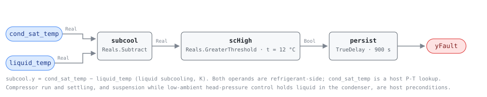

## Description

Overcharge is refrigerant the circuit has no room for. The surplus backs up into
the outlet end of the condenser, turning surface that should be condensing into
extra subcooling area, and the liquid line leaves colder relative to its own
condensing saturation temperature — subcooling rises, which is what this rule
reads. NIST SP 1087 imposed 10%, 20% and 30% overcharge on a TXV-equipped
machine in cooling and measured subcooling, condensing temperature and discharge
temperature all rising together while superheat did not move at all. On a
packaged rooftop unit the fault is service-induced almost by definition: the
machine leaves the factory charged, carries no field line set to justify an
adder, and so any surplus arrived on a service visit. It is cheap in energy —
1.1-3.4% of EER at 20% overcharge — and expensive in compressor life.

## Detection Logic

```
liquid_subcooling = cond_sat_temp − liquid_temp

yFault = liquid_subcooling > subcooling_high_band,
         sustained continuously for alarm_delay
```

Block graph (`rule.cxf.jsonld`):



One subtraction, one comparison, one timer — HP-0005's graph on packaged-unit
points and a shorter window. `liquid_subcooling` is computed in-graph rather
than bound as a point: the dictionary defines subcooling as exactly this
difference and both operands are already boundary inputs.

There is deliberately no superheat term and no evaluability output. Compressor
state, stage changes and head-pressure control are host preconditions, and the
last of those is the one that bites on a rooftop: a low-ambient control holding
liquid in the condenser reproduces this signature on a correctly charged unit.

The comparison is strict, so a unit exactly on the band reads healthy. `persist`
requires 15 continuous minutes and `delayOnInit = true` holds that window across
a controller restart. Everything here is a difference, so head pressure alone
never fires it: high lift with normal subcooling is RTU-0007's finding.

## Possible Diagnoses

1. Charge added on a no-cooling call whose real fault was air-side. The rooftop
   failure path: a loaded filter or a fouled condenser presents as a pressure
   complaint, gauges go on, gas goes in, and the original fault is still there
   underneath the overcharge. Read RTU-0002 and RTU-0007 over the same period
   before touching the charge
2. Charged by pressure rather than by weight, or topped up for several summers
   with no leak ever found. A factory-charged packaged unit's target is the
   nameplate weight, and with no field line set there is no length adder to
   justify a deviation from it — the split-system excuse does not exist here
3. Liquid-line restriction: a plugged filter-drier, a kinked line, or a clogged
   metering-device screen backs refrigerant up ahead of the restriction and
   raises subcooling identically. The source separates the two by condensing
   temperature falling and superheat rising, neither of which this rule reads
4. Non-condensable gas from a short or skipped evacuation — raises head pressure
   and subcooling together; confirm off-cycle against standstill pressure and
   ambient saturation, which is why the source excluded it from its online method
5. Not a charge fault at all: a P-T lookup running the wrong refrigerant, an
   uninsulated liquid-line probe sitting in the condenser airstream, or
   low-ambient head-pressure control doing its job. Rule these out first — they
   cost nothing and one of them alarms every cool morning

## Energy Impact

EFFICIENCY_LOSS, MEDIUM confidence, PROXY_ESTIMATION. Overcharge was the fault
EER tolerated best of the six the source imposed: 20% too much refrigerant cost
1.1-3.4% of EER across four operating conditions, and a 5% hit took 32-42%
overcharge. `waste_kw ≈ eer_penalty × compressor_kw`, with `compressor_kw`
supplied by the host as RTU-0002 does for `rtu_kw`. PROXY and MEDIUM because the
rule measures a temperature difference and borrows the penalty from lab results
on a residential machine. The case for fixing it is only partly the meter:
excess charge raises head pressure and discharge temperature and pushes liquid
toward the compressor, a reliability cost this rule cannot size.

## Emissions Impact

Scope 2, PROXY_EMISSIONS, MEDIUM confidence; on the order of 50-400 kg CO₂e/yr
for a commercial packaged unit, scaling with tonnage and cooling hours —
HP-0005's basis, and an order below RTU-0002's 300-2,000 kg because this fault's
efficiency penalty is small. The waste is compressor electricity, so the
avoided-emissions basis is the marginal operating emissions rate (MOER). The
larger climate term is off that meter: the surplus must be recovered rather than
vented, and R-410A, still the bulk of the installed rooftop fleet, has a GWP
above 2,000 against roughly 470-675 for the R-454B and R-32 machines replacing
it.

## Deviations

- **A fixed nominal band replaces the source's regressed reference model — the
  central simplification, carried from HP-0005.** The source predicts each
  feature from a third-order polynomial in outdoor drybulb, indoor drybulb and
  indoor dew point and tests the residual against a measured noise band. No CDL
  block expresses that regression, so this card tests an absolute subcooling the
  way charging practice states one. RTU-0002 names the same substitution.
- **`subcooling_high_band` is a commissioning placeholder, and on a packaged
  unit there may be no chart to read it off.** Fixed-orifice and piston metering
  are still common on small rooftops, and their manufacturer charging procedure
  targets superheat, not subcooling — so the commissioner takes the band from
  this unit's own known-good operation rather than from a published target. It
  fails silently in both directions: set low, every hot afternoon alarms; set
  high, nothing ever does.
- **No superheat conjunct, for a different reason than HP-0005's.** On a TXV the
  valve holds superheat against the fault and the source records it unchanged at
  every level tested. On a fixed-orifice unit overcharge does move superheat
  down — but metering type is not a point in this dictionary, so a superheat
  conjunct would make the rule fire on part of the fleet only. Subcooling rises
  under both, and RTU-0008 is where superheat carries the discriminating
  information.
- **`alarm_delay` is 900 s, half the 1800 s HP-0005 and RTU-0008 both use.** The
  window has to fit inside a run cycle, and with the 10-minute settling gate
  ahead of it 15 minutes already demands 25 minutes of continuous compressor
  operation — on a cycling rooftop unit this is a loaded-afternoon detector. The
  measurand affords the shorter window where RTU-0008's does not: subcooling
  responds to inventory and settles in minutes, while the superheat half of the
  undercharge pattern hunts with the metering device, which is what that card's
  30 minutes is spent outlasting. A host wanting coverage on shorter cycles
  lowers it further and buys transient exposure with the difference.
- **The compressor gate stays a host precondition, unlike RTU-0007's in-graph
  `yRuntimeOk`, and the reason is the failure direction.** Ungated readings on
  this measurement point away from the alarm: off-cycle the high side equalises
  and subcooling collapses toward zero, and just after a shutdown the falling
  saturation temperature under a still-hot liquid line drives it negative
  (`ungated_off_cycle_stays_silent`). A missed gate here costs coverage. On
  RTU-0007 it points the other way — a compressor still building head pressure
  reads as a restricted condenser — which is why that card had to hold its gate
  in the graph.
- **The gate that actually matters on a rooftop cannot be expressed at all.**
  Low-ambient head-pressure control holds liquid in the condenser deliberately
  and sustains 15 K of subcooling on a correct charge; no point in this
  dictionary reports condenser fan state or head-pressure control mode, so the
  precondition is prose and the vectors pin the consequence
  (`low_ambient_head_pressure_control_alarms_as_designed`) rather than hide it.
- **No evaluability output.** The source's 0.5 °C two-phase test is satisfied by
  construction by any subcooling large enough to trip this rule, so the flag
  would be true whenever `yFault` is and false only where "not overcharged" is a
  sound verdict rather than NO_EVAL. Publishing it would invite hosts to discard
  a correct answer.
- **RTU-0007 is `related`, not `suppressed_by`, in either direction.** A
  condenser restriction raises condensing pressure and can widen subcooling with
  it, so the two cards can fire together — but they are referenced differently:
  RTU-0007 measures an air-side split against that unit's own per-stage,
  per-OAT fit, while this card reads an absolute refrigerant-side inventory.
  Neither may silence the other, for two reasons: RTU-0007 is retrofit-gated on
  a condenser leaving-air sensor most rooftops lack, so a suppression edge would
  break silently wherever it is unbound; and overcharge on a fouled condenser is
  a real and common combination, exactly the case Hu et al. (2021) warn
  single-fault-fitted diagnosis misreads. The pair is the diagnosis (see Notes).
- **Strict `>` at the band.** CDL `Reals` has no `GreaterEqual`, so a unit
  exactly on the band reads healthy where a technician would call it high —
  measure-zero on a real-valued signal, and both sides are pinned, one of them
  bit-exact.
- `persist.delayOnInit = true` against the CDL default `false`, the library's
  standing choice: a unit already overcharged at controller start waits out the
  full 15 minutes rather than alarming on the first tick.
- **Single-fault provenance.** The source's chart is fit from singly imposed
  faults, and the virtual-charge lineage this card borrows its measurement from
  (Li & Braun 2009; Kim & Braun 2020) is calibrated the same way. One boolean on
  one feature inherits no ranking error, but read the diagnosis list as a family
  whenever a second fault is plausible.
- **The playbook carries no charge step for this fault yet.** Its nearest
  content is Step 2.1.2 — check subcooling and superheat against manufacturer
  specs — filed under short-cycling, and its Applies-To row does not list this
  rule. Both edits belong to the playbook's owner, not to this card; the Notes
  below state the field procedure in the meantime.
- Severity 3, `category: EFFICIENCY_LOSS` and `clusters: []` are authored — the
  reference chapter has no card for this fault. `method: rule` describes this
  graph, not the source, whose own diagnosis is a probabilistic classifier over
  regressed residuals. No published test vectors exist; every scenario in
  `vectors.json` is authored from the equation and replayed against the pinned
  engine rev.

## Notes

Take the service history before the gauges: the surplus came from a visit, and
the visit usually had another reason. Read RTU-0007 and RTU-0002 over the same
window — if the condenser split is also wide, the coil is the trigger and the
charge is what a previous tech did about it, so clean and re-measure before
recovering anything. RTU-0007 silent with this card firing puts the surplus in
the inventory: charge, a restriction, or non-condensables. RTU-0008 alongside is
a contradiction rather than a machine both over- and undercharged — suspect the
P-T lookup. Resolve to the nameplate weight with the recovered refrigerant
weighed, and rule out the liquid-line restriction first: pulling charge out of a
unit with a plugged drier makes it worse.
