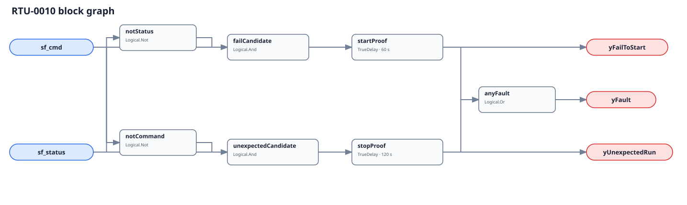

## Description

This rule checks whether the RTU supply fan did what its final Boolean command
requested. Commanded on without independent proof is a fail-to-start; proven on
without command is unexpected operation. The direction identifies the mismatch,
not its cause, and neither diagnostic output is an evaluability gate.

## Detection Logic

```
fail_to_start  = sf_cmd AND NOT sf_status
unexpected_run = NOT sf_cmd AND sf_status

yFailToStart   = fail_to_start sustained for start_proof_time
yUnexpectedRun = unexpected_run sustained for stop_proof_time
yFault         = yFailToStart OR yUnexpectedRun
```



Each direction has its own `TrueDelay(delayOnInit=true)`. Agreement clears both
lanes immediately. A direct mismatch reversal clears the old diagnostic and
starts the other timer from zero; elapsed time never transfers between lanes.

## Possible Diagnoses

1. Motor, contactor, belt, fan wheel, VFD, overload, or disconnect failure.
2. Smoke, freeze, high-static, heat-exchanger, or OEM safety interlock.
3. Failed or misconfigured current, airflow, speed, or auxiliary proof.
4. Post-heat fan delay or purge omitted from the final command binding.
5. Unauthorized local/manual operation, welded contactor, or second owner.

## Energy Impact

The effect is direction-dependent. Unexpected operation can waste measured
electrical energy during the mismatch. Fail-to-start is primarily availability,
comfort, and diagnostic-coverage loss; these two booleans cannot price it.

## Emissions Impact

Scope 2 is proxy-only for unexpected operation: multiply independently measured
device kW by mismatch hours and an appropriate operating emissions factor. Do
not claim avoided energy or emissions for fail-to-start without another model.

## Deviations

- **Both timers are adopted commissioning values.** No cited source establishes
  universal RTU supply fan proof windows. Configure them independently around
  the actual sequence, proof device, sampling, and network latency.
- **The command is final and device-scoped.** An upstream enable, demand, or
  fleet request can disagree with status while downstream logic works correctly.
- **Status is independent proof.** Command echo makes the graph tautological;
  proof type determines whether electrical operation, rotation, or delivery was
  actually demonstrated.
- **No whole-rule suppression is encoded.** Fail-to-start can invalidate another
  rule's running premise, but unexpected operation may leave that rule physically
  meaningful; current metadata cannot suppress by direction.
- **`delayOnInit=true` is explicit on both lanes.** Evaluator restart into an
  existing mismatch must serve the full configured proof time.
- **No empirical FPR or TPR is claimed.** Current simulation telemetry cannot
  provide both an independent final command and field-like proof for this device.
- **The stop allowance is 120 s, twice the 60 s start allowance, to accommodate
  mechanical coast and proof dropout.** A controlled post-heat run must keep the final
  sf_cmd true; the timer does not legalize an upstream binding. Both values remain
  site-tuned placeholders, not portable source values.
- **A purge or smoke-control run is raw unexpected operation unless it is included in
  sf_cmd.** The host excludes that state; the graph does not encode an upstream mode
  gate.

## Notes

Fail-to-start contests the running or airflow premise of RTU-0001 through RTU-0006 and
can distort RTU-0008/0009 refrigerant evidence. Unexpected run does not invalidate those
rules automatically, so the relationship remains informational rather than a whole-rule
suppression.
