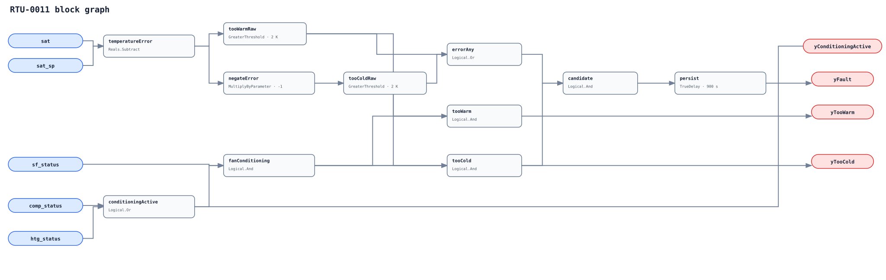

## Description

This rule reports an RTU whose discharge temperature remains materially
outside its final active target while the supply fan and mechanical heating
or cooling are proven active. Warm/cold outputs identify the observed direction,
not the failed component or commanded mode.

## Detection Logic

```
error               = sat - sat_sp
conditioning_active = comp_status OR htg_status
running_conditioning = sf_status AND conditioning_active
too_warm            = error > tracking_error
too_cold            = -error > tracking_error

yConditioningActive = conditioning_active
yTooWarm = running_conditioning AND too_warm
yTooCold = running_conditioning AND too_cold
yFault = running_conditioning AND (too_warm OR too_cold),
         sustained for sustained_duration
```



Comparisons are strict and direction flags are immediate. One
`TrueDelay(delayOnInit=true)` follows the warm/cold OR, so a direct sampled
direction handoff preserves age while any in-band or non-running tick resets it.

## Possible Diagnoses

1. Active setpoint misbound, stale, overridden, or not delivered locally
2. Insufficient heating/cooling capacity, failed stage, or abnormal cycling
3. Low supply airflow, dirty filter/coil, or failed fan proof
4. Economizer or outdoor-air damper introducing the wrong air condition
5. Refrigerant charge, condenser airflow, compressor, or heat-section fault
6. Sensor bias or normal OEM limit/transition omitted from host gating

## Energy Impact

A tracking fault may increase compressor, heating, or fan runtime and can
miss temperature or humidity targets. The sign alone does not establish
waste; no energy is inferred from temperature error without a causal model.

## Emissions Impact

Scope 1 and/or 2, qualitative. Quantify only after isolating the cause and
measuring affected fuel or electrical input against a defensible baseline.

## Deviations

- **The 2 K / 900 s pair is adopted library logic.** The sources support SAT
  tracking as a diagnostic, not portable packaged-unit thresholds.
- **Confidence is MEDIUM rather than the brief's proposed HIGH.** Cycling DX,
  active-setpoint semantics, airflow, OEM limits, and transitions require
  commissioned host gates before the same signature is causal.
- **Mechanical status is an OR, not a mode table.** Heating-only, cooling-only,
  or both-active raw states are detectable; the host validates the actual mode.
- **Direction handoff preserves persistence.** A sampled warm-to-cold transition
  remains continuously out of band; an actual in-band sample resets the timer.
- **Proof faults remain related, not suppressors.** Current metadata cannot
  suppress tracking only for RTU-0010's fail-to-start direction.
- **No empirical FPR or TPR is claimed.** The current harness lacks a defensible
  final active RTU SAT setpoint plus aligned mechanical-status mapping.
