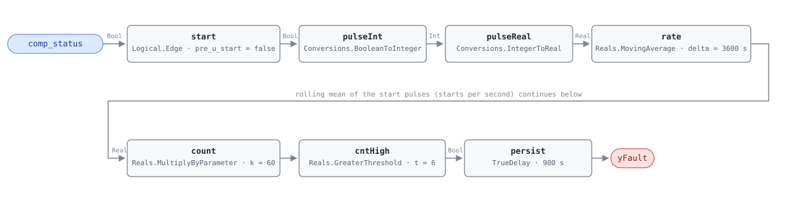

## Description

A compressor that starts ten times an hour is not following load. Load does
not move that fast, and the refrigeration circuit cannot keep up with the
question being asked of it: every start draws locked-rotor current through
windings that have not cooled, restarts against a head pressure that has not
equalized, and pumps oil out of the sump faster than the return line brings it
back. The efficiency loss is real but modest — the reference puts it at 3–5%,
the cost of running the first minutes of every cycle before the coil reaches
steady state. The mechanical damage is the part that costs money: a compressor
worn out early is $2,000–$8,000 of equipment plus the days the space spends
uncooled, which is why this card is PROTECTIVE rather than an efficiency rule.

Short-cycling is a symptom, not a root cause, and the six diagnoses below sit
at very different depths. One is a controller setting changed from a laptop in
a minute; one is a sizing decision made years ago that no setting can undo; the
other four are hardware — charge, capacitor, coil, contactor — and need someone
on the roof with gauges. What the rule reports is that the compressor is being
asked to start too often; the service call decides why.

## Detection Logic

```
start  = rising edge of comp_status                       one tick wide
count  = MovingAverage(start, count_window) × count_scale  starts in the trailing hour
yFault = count > max_starts_per_hour, sustained continuously for alarm_delay
```

Block graph (`rule.cxf.jsonld`):



`start` is the only block that touches the run status, and all it asks is
whether the compressor just came on: `Logical.Edge` emits `u ∧ ¬pre(u)`, one
tick wide, on every OFF→ON transition. Stops are not counted and neither are
run durations. `pulseInt` and `pulseReal` carry that boolean into the real
domain, where the arithmetic lives.

`rate` is where the counting happens, and it is worth being precise about how.
`Reals.MovingAverage` is a continuous-time integral mean: it accumulates `u·dt`
and divides by the window. A one-tick pulse of height 1.0 encloses exactly one
tick interval of area, so `n` starts inside the trailing hour give
`rate = n · dt / count_window`. Multiplying by `count_scale = count_window / dt`
= 3600/60 = 60 recovers `n` itself. That is the whole trick, borrowed intact
from AHU-FC-004, and its cost is that `count_scale` is coupled to the host's
tick interval — see Deviations, where the coupling is tighter here than it was
there.

`cntHigh` applies the strict threshold, so exactly six starts an hour reads
clear and seven alarms; on a signal that can only take integer values in steady
state, that boundary is unambiguous rather than a measure-zero technicality.
`persist` then requires the count to stay above the ceiling for 15 minutes,
which on a unit already cycling hard is between two and three more starts —
long enough that a defrost sequence or a one-off pressure trip does not report,
short enough that a compressor tearing itself apart is not left running for an
hour first.

## Possible Diagnoses

1. Thermostat or controller differential set too small — the unit satisfies the
   call within a minute or two and restarts as soon as the space drifts back
2. Equipment oversized for the load, which is the same picture with nothing to
   adjust: at part load the unit can only meet the call by cycling
3. Low refrigerant charge — suction pressure falls to the cutout on every cycle
   and the low-pressure switch does the cycling for you
4. Defective run capacitor, so the compressor stalls on start and drops out on
   thermal overload before it has run long enough to matter
5. Iced or fouled evaporator coil starving the suction side (RTU-FC-051 sees
   the same coil from the airside)
6. Control board or contactor fault chattering the compressor output

## Energy Impact

PROTECTIVE, MEDIUM confidence, QUALITATIVE_ONLY. The rule sees one boolean and
cannot price a start, so there is no waste term to compute from its inputs.
The reference gives two figures of very different character: a 3–5% efficiency
loss while the cycling continues, and $2,000–$8,000 of avoided compressor
replacement. The first is small and continuous, the second is large and
probabilistic, and the second is why this fault is severity 2. Confidence is
MEDIUM: the mechanism is not in doubt and the sources (Albayati et al. 2023;
Ebrahimifakhar et al. 2020) are field studies of packaged-unit faults, but the
efficiency figure depends on cycle length, ambient conditions, and how far the
coil gets from steady state, none of which this rule measures. Cooling-dominant
in climate sensitivity — the compressor is the cooling machine, and on a heat
pump the same fault carries into heating (see HP-FC-050, when that family
exists).

## Emissions Impact

Scope 2, QUALITATIVE_EMISSIONS, MEDIUM confidence. AHU-FC-001 set the
convention that a PROTECTIVE fault with no emitting stream takes scope "N/A";
this card does not qualify for that, because the 3–5% efficiency loss is
electricity actually drawn by a compressor and so lands squarely in purchased
power. It is still qualitative — the same unknowns that keep the energy
estimate qualitative apply — and the larger emissions term is indirect anyway:
a compressor replaced years early carries the embodied carbon of a new
compressor plus its refrigerant charge. Avoided-emissions basis: N/A.

## Deviations

- **This rule needs a faster tick than the rest of the library, and the reason
  is Nyquist.** A start is only visible if the compressor is seen OFF on one
  tick and ON on the next, so the fastest cycling a host can observe is one
  start per two ticks: `1800/dt` starts per hour. At the library's usual 300 s
  tick that ceiling is exactly 6/h — the threshold itself — and the rule could
  never fire, no matter how hard the unit cycled. The default `count_scale` is
  therefore 60.0 (a 60 s tick) rather than AHU-FC-004's 12.0, and the vectors
  run at `step_s = 60`. Combined with the ring floor below, a legal deployment
  has `57.2 s ≤ dt < 300 s`; 60 s is the recommended value and the only one
  these vectors have exercised.
- **`count_scale` is coupled to the host's tick interval, and the failure is
  silent.** `k = count_window / dt`, so a host ticking every 120 s must set
  `count_scale` to 30.0. Left at 60.0 it would report double the true count and
  alarm on four starts an hour. This is AHU-FC-004's deployment constraint
  verbatim, and the same warning applies: a mis-set `count_scale` produces a
  plausible-looking number, not an error.
- **Minimum tick interval, from the moving average's ring.** Each
  `MovingAverage` instance keeps a fixed 64-checkpoint ring and drops the
  oldest in-window sample past that (one warning per instance). The retained
  window holds `count_window/dt + 1` checkpoints, so staying inside the ring
  needs `dt ≥ 3600/63` ≈ **57.2 s**. (AHU-FC-004 quotes the same constraint as
  `delta/64` = 56.25 s, which omits the boundary checkpoint; at both cards'
  actual tick intervals the difference does not bite.) At the default 60 s tick
  the window holds 61 checkpoints, three short of the ring.
- **`min_run_time` is not in the graph.** The reference lists it as a tunable
  (5 min) but its printed equation is `comp_starts_per_hour >
  max_starts_per_hour` and nothing else, and all three of its published vectors
  are decidable on starts alone. A per-cycle minimum-run-time channel would
  need cycle-duration measurement the equation does not ask for, and the
  starts-per-hour ceiling subsumes the protective intent anyway: ten 2-minute
  runs is both a min-run-time violation and 10 starts an hour. A host that
  wants the stricter per-cycle test can add a companion rule; this one keeps
  the reference's equation.
- **Rolling count built from a moving average, because the block set has no
  windowed counter.** `Integers.OnCounter` counts monotonically from a reset
  and has no window, so "starts in the trailing hour" would need the host to
  drive an hourly reset — which turns a rolling count into a tumbling one and
  makes the verdict depend on where the hour boundary fell. AHU-FC-004's
  reasoning, and the same trade.
- **Startup artifact (a): a spurious first-tick pulse, which costs nothing.**
  `Logical.Edge` compares `u` against `pre_u_start` on the first tick, so a
  unit whose compressor is already running when the rule loads registers a
  start at t = 0. It does not reach the count: the moving average integrates
  `u·dt`, and `dt` is zero on the first tick, so the pulse encloses no area
  (`startup_pulse_is_inert`). `start.pre_u_start` is written explicitly as
  `false` in the CXF rather than left to the engine default (which is also
  `false`) and is deliberately not exposed as a card parameter, since nothing
  it can do survives past tick 0.
- **Startup artifact (b): the first hour reads as a rate, and here it can
  reach a verdict.** While `t < count_window` the moving average divides by
  elapsed time rather than by the window, so two starts in the first three
  minutes read as 40/h — the pace, extrapolated. In AHU-FC-004 that artifact
  was harmless because `alarm_delay` equalled `count_window` and
  `delayOnInit = true` blocked any assertion until the window had filled. Here
  `alarm_delay` is 15 minutes against a 1-hour window, so the extrapolated rate
  can hold `cntHigh` true long enough to assert: `warmup_rate_asserts` shows
  `yFault` going true at t = 960 s on the strength of two starts, then clearing
  at t = 1200 s as the divisor grows. The host NO_EVAL precondition for the
  first `count_window` is what keeps that off an operator's screen, and it is
  not optional in this card.
- **Strict `>` on a discrete count.** `max_starts_per_hour` is compared with
  `Reals.GreaterThreshold`, so exactly six starts an hour is clear and seven
  alarms — the reference's `> max_starts_per_hour` read literally. The
  arithmetic is exact at the boundary: `60.0 × (6 × 60 / 3600)` evaluates to
  precisely 6.0 in IEEE-754, so `six_starts_per_hour_stays_clear` is a real
  boundary pin and not a near-miss.
- **The counting window is half-open.** `rate` compares the accumulated
  integral now against its value one `count_window` ago, so a start exactly
  `count_window` old has just left the window. Nothing in the reference speaks
  to this; it matters only for a unit sitting right on the threshold, and it
  errs toward silence.
- **The reference tags this fault for both RTU and HP.** This card is the
  RTU-family instance (AHU-FC-059 precedent). The heat-pump sibling the
  reference names, HP-FC-050, would restate the same graph against a heat-pump
  compressor status and would need to say something about defrost cycles, which
  are starts that mean nothing is wrong.
- **Test vectors: the reference's three, plus seven of our own.** The published
  vectors (3 starts/h clear, 10 starts/h fault, single long run clear) are
  transcribed as `three_starts_per_hour`, `short_cycling_ten_per_hour`, and
  `single_long_run`. The rest — both boundary pins, the two startup artifacts,
  the recovery case, and two transients — are authored here. Every assertion
  edge was derived by replaying the graph at the pinned engine rev rather than
  by closed-form arithmetic; the moving average's warm-up and decay
  trajectories do not match hand-computed sample statistics.
- **How long a crossing survives is `count_window` minus the span of the starts
  that caused it.** After the window has filled, the count falls back to the
  ceiling when the oldest qualifying start ages out. Seven starts packed into
  ten minutes therefore hold `cntHigh` for nearly a full hour and always alarm,
  while seven spread evenly across 54 minutes hold it for 300 s and never do
  (`spread_burst_clears_before_delay`) — same starts per hour, opposite
  verdicts, and the difference is not visible in the printed equation. Inside
  the warm-up window the decay is continuous instead
  (`startup_spike_clears`, 480 s of `cntHigh` from a single start). Both are
  properties of the rolling counter; what the rule reports is cycling sustained
  above the ceiling, not every excursion through it.
- Severity 2 (high), phase 2, method `rule`, and the tunable defaults are the
  reference's chapter 11 card; its §5.8.3 index corroborates and carries no
  severity column. `g36: null` — this is a PNNL/research-derived rule, not a
  G36 §5.16.14 clause.
- Operating states are declared, not gated: the reference marks the fault
  applicable in every active mode, and the graph has nothing to exclude.
- `persist.delayOnInit = true` (Modelica/CDL default is `false`), the library's
  standing choice: a count already above the ceiling at load waits out the full
  15 minutes instead of alarming on the first tick after a controller restart.

## Notes

Remediation follows the [rtu-compressor-refrigerant](../../../playbooks/rtu-compressor-refrigerant.md)
playbook: thermostat differential first, then charge, then the run capacitor,
with the confirm-resolution target being fewer than 6 starts/hr at 5-minute
minimum on-time over 48 hours. Every path there ends at a technician with
gauges on the unit or a controller differential to widen. The one remote check
worth doing before the truck roll is diagnosis 1:
pull up the space temperature and the cooling call alongside `comp_status`, and
if the call is being satisfied within a minute or two of every start, widen the
differential and see whether the count comes down.

Bind `comp_status` per compressor, as the RTU point dictionary requires. An OR
across two circuits undercounts: `Logical.Edge` fires when the OR goes
false→true, so a lag-compressor start while the lead is already running never
moves the signal, and a two-stage unit whose lead runs continuously can cycle
its lag circuit all afternoon and read as healthy. Two instances of this rule,
one per circuit, is the correct deployment.

`related: [RTU-FC-051]` is the evaporator-coil link, and it runs both ways. A
fouled or iced coil starves the suction side and cycles the compressor on low
pressure (diagnosis 5), so the two firing together points at the coil rather
than at the controls; this rule firing alone points at the thermostat
differential or the charge.
