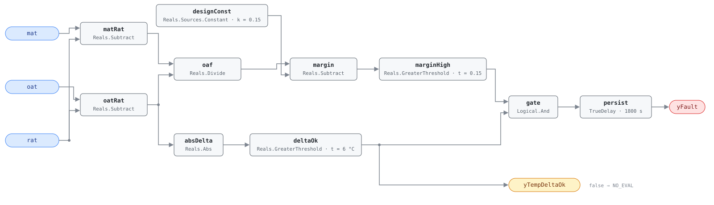

## Description

The unit is drawing well over its design minimum outdoor air at an hour when it
has no business economizing. Every extra cubic metre arrives at outdoor
temperature and has to be dragged to supply temperature by the gas heat or the
compressors, and none of it buys ventilation the code did not already have.
Nothing about it is uncomfortable — the space stays on setpoint, the unit simply
runs harder — so the defect survives until someone reads the fuel bill. Packaged
units make it common: economizer, minimum-position setting and dampers all live
in one weather-exposed cabinet, and Cowan's 2004 survey found at least one
economizer fault on 54% of units. The outdoor air fraction is inferred from the
mixing-box energy balance rather than measured, which is what makes the
diagnostic cheap — three temperatures, no airflow station — and also what makes
it conditional, hence the explicit evaluability output.

## Detection Logic

```
oaf          = (mat − rat) / (oat − rat)
yTempDeltaOk = |oat − rat| > min_delta                  (false ⇒ host reports NO_EVAL)
yFault       = (oaf − design_min_oa_fraction > oa_excess_margin) AND yTempDeltaOk,
               sustained for alarm_delay
```

Block graph (`rule.cxf.jsonld`):



The fraction core is AHU-FC-055's, unchanged, bound to the RTU point dictionary.
`gate` is what makes the unguarded division safe: CDL `Divide` follows IEEE-754,
so `oat = rat` yields ±∞ or NaN and a near-zero denominator amplifies ordinary
sensor noise into a fraction of any magnitude. NaN compares false everywhere, and
±∞ or a noise-inflated finite fraction can raise `marginHigh` but cannot pass
`gate`, because a denominator small enough to misbehave is by construction one
below `min_delta`. Garbage arithmetic can only make the rule report itself
unevaluable. `yTempDeltaOk` leaves the block as well as feeding the gate, so a
host that reads it learns the difference between "not faulted" and "cannot
tell". Both comparisons are strict: a fraction sitting exactly at
`design_min_oa_fraction + oa_excess_margin` is not a fault, and a temperature
difference of exactly `min_delta` is not evaluable. The quotient is signed
consistently on both sides of the year — winter makes both differences negative,
summer both positive — so no seasonal branch is needed. `persist` requires 30
continuous minutes, riding out a damper stroke and the mixing transient after a
stage change; recovery is immediate, and `delayOnInit = true` holds the window
across a restart.

## Possible Diagnoses

1. OA damper minimum position set too high
2. OA damper not closing to the commanded minimum
3. Damper blade seals deteriorated
4. Economizer lockout not engaging

## Energy Impact

EXCESS_CONSUMPTION, HIGH confidence, DIRECT_MEASUREMENT. The waste is computable
from live data: `excess_oa_kw = (actual_oaf − design_min_oa_fraction) × airflow
× cp × |oat − rat|`, with the excess fraction already on the wire as
`oaf − designConst.k`. Correcting minimum ventilation is worth 2–10% of the
unit's thermal energy, the upper half of that range in heating-dominant climates
where the outdoor-to-return difference is largest for months at a time. The
reference maps the fault to PNNL EEM-17 (demand control ventilation) and EEM-23
(RTU advanced controls); this rule screens both, since a unit that cannot hold
its design fraction will not benefit from either until the mechanical problem is
fixed.

## Emissions Impact

Scope 1 + 2, DIRECT_EMISSIONS, HIGH confidence; typically 300–2,500 kg CO₂e/yr
for the excess ventilation load. The split follows the season and the unit:
winter excess burns scope 1 gas at the furnace section, summer excess draws
scope 2 electricity at the compressors, and on an all-electric packaged unit the
whole exchange collapses to scope 2. Avoided-emissions basis: marginal operating
emissions rate (MOER).

## Deviations

- **`min_delta` default adopted, not transcribed.** The reference states the
  fraction is computed only when `|OAT − RAT| > min_delta` but omits the
  parameter from its tunables table. This card adopts 6.0 °C, matching
  AHU-FC-055, AHU-FC-064 and RTU-FC-055 so every rule running this quotient
  agrees on when it is meaningful (PNNL-27338 uses 5 °F for the same
  computation). A site that retunes one should retune all of them.
- **The reference's `economizer_should_be_inactive(oat, mode)` term is not in
  the block graph.** Economizer state is an operating state, not a measurement,
  and this library keeps state gating host-side (precedent: AHU-FC-055, whose
  reference card carries the same term). A host that evaluates this rule while
  the unit is economizing gets a sustained fault, and it is the host's bug;
  `mode` is not a canonical RTU point in any case.
- **Design fraction as a constant, excess as a threshold.** The reference writes
  `oa_fraction > (design_min_oa_fraction + oa_excess_margin)`, which implemented
  literally would sum the two tunables into one threshold and stop a host
  retuning either alone. Feeding the design fraction in as
  `Reals.Sources.Constant.k` keeps both as independent `set_param` paths with no
  sign flips. Algebraically identical.
- **Evaluability is an output, not just a precondition.** The `min_delta` test
  is computable from this rule's own inputs, so SCHEMA.md requires exposing it
  as `yTempDeltaOk`. False `yFault` under false `yTempDeltaOk` means "unknown",
  not "healthy", and the host must treat it that way.
- **Both comparisons are strict** (`>`). The reference does not specify boundary
  behavior and CDL `Reals` offers no `GreaterEqual`, so the choice is made
  rather than inherited; the disagreement with an inclusive reading has measure
  zero on a real temperature signal and errs toward silence.
- The reference publishes no worked vectors for this fault, so every scenario in
  `vectors.json` is authored from the equation, following AHU-FC-055's suite
  shape.
- `persist.delayOnInit = true` (Modelica/CDL default is `false`), the library's
  standing choice: an excess already present at load waits out the full 30
  minutes instead of alarming on the first tick after a restart.

## Notes

`suppressed_by: [AHU-FC-062]` is transcribed from the reference and points
across equipment families on purpose: AHU-FC-062's graph consumes nothing but
`mat`, `oat` and `rat`, so the host instantiates it against this RTU's own three
points. Deploy the pair together — a MAT sensor reading 4.5 °C low in −5 °C
weather turns a compliant 0.15 fraction into 0.32 and manufactures this fault
out of nothing, and on a milder day with a 10 °C spread under 2 °C of bias does
the same.

RTU-FC-055 is this rule's mirror on the same three temperatures: this one alarms
more than 0.15 above design, that one more than 0.05 below. The margins are
deliberately asymmetric — excess air costs money, deficient air costs air
quality — and neither can fire while the other does. If the fraction is
genuinely high, command the OA damper to minimum and watch mixed air: it should
climb toward return temperature within minutes, and if it does not the problem
is mechanical (the [economizer-failure](../../../playbooks/economizer-failure.md)
playbook's on-site steps). Check the minimum position setpoint first — the most
common cause is a number dialled up during a ventilation complaint, and that is
a $0 fix.
