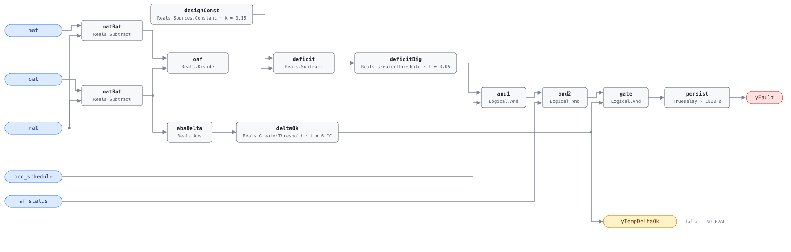

## Description

The unit is not delivering the outdoor air its occupants are owed: the building
is occupied, the fan is running, and the mixing-box energy balance puts the
outdoor share of the supply below the design minimum by more than the allowance.
Unlike every other fault on this quotient the finding is a health one — ASHRAE
62.1 sets the minimum for a reason, and a unit that misses it accumulates CO₂,
humidity and whatever else the space generates — which is why the reference
rates it severity 2 against its excess-air twin's 3. Nothing about
under-ventilation announces itself: the space holds temperature better than it
should, and the energy signature runs the wrong way, so a bill review will never
find it. The fraction is inferred from three temperatures rather than measured,
which makes the diagnostic cheap and makes it conditional — hence the explicit
evaluability output.

## Detection Logic

```
oaf          = (mat − rat) / (oat − rat)
yTempDeltaOk = |oat − rat| > min_delta                  (false ⇒ host reports NO_EVAL)
yFault       = (design_min_oa_fraction − oaf > oa_deficit_margin)
               AND occ_schedule AND sf_status AND yTempDeltaOk,
               sustained for alarm_delay
```

Block graph (`rule.cxf.jsonld`):



The fraction core is RTU-FC-054's, unchanged; `deficit` subtracts the other way
round so the test is a positive gap against a positive threshold — the same
identity read from the other side, since `oaf < design − margin` exactly when
`design − oaf > margin`. Occupancy and fan status are conjoined in-graph and
participate in the persistence: the 30-minute clock starts when the last
conjunct becomes true, so a deficit that predates occupancy is timed from the
start of the occupied period, not from the start of the deficit. `gate` is what
makes the unguarded division safe. CDL `Divide` follows IEEE-754, so `oat = rat`
yields ±∞ or NaN and a near-zero denominator amplifies sensor noise into a
fraction of any magnitude; NaN compares false everywhere, and −∞ or a
noise-inflated finite fraction can raise `deficitBig` but cannot pass `gate`,
because a denominator small enough to misbehave is by construction one below
`min_delta`. Garbage arithmetic can only make the rule report itself
unevaluable. Both comparisons are strict: a fraction sitting exactly at
`design_min_oa_fraction − oa_deficit_margin` is not a fault, and a difference of
exactly `min_delta` is not evaluable. `persist` requires 30 continuous minutes,
riding out a damper stroke and a purge cycle; recovery is immediate, and
`delayOnInit = true` holds the window across a restart.

## Possible Diagnoses

1. OA damper stuck closed or nearly closed
2. OA damper minimum position set too low
3. OA intake blocked — debris, snow, or ice
4. Exhaust fan creating negative building pressure

## Energy Impact

COMFORT_ENERGY, MEDIUM confidence, QUALITATIVE_ONLY, mapped to PNNL EEM-06 (OA
damper faults). The reference publishes no savings range or runtime formula
because there is nothing to compute: under-ventilation is not waste. A unit
conditioning 5% outdoor air instead of 15% spends less on that air than it
should, and correcting the damper raises the heating and cooling load rather
than lowering it.

**A host that accumulates energy savings across the fault library must exclude
this rule explicitly.** AHU-FC-006 carries the same warning for its low branch;
this rule is that branch made reachable, so it matters more here. The number
worth carrying runs the other way — the ventilation the occupants did not get —
and the rule has the fraction for it (`deficit.y`) but not the airflow to turn
it into cubic metres.

## Emissions Impact

Scope 1 or 2 depending on how the unit heats, QUALITATIVE_EMISSIONS, MEDIUM
confidence. The reference's figure is 50–300 kg CO₂e/yr with IAQ primary and
emissions secondary; the sign is negative, in that fixing the fault raises
emissions slightly by restoring the ventilation load the unit was supposed to
carry. No avoided-emissions basis applies, and none is claimed.

## Deviations

- **`min_delta` default adopted, not transcribed.** The reference states the
  fraction is computed only when `|OAT − RAT| > min_delta` but omits the
  parameter from its tunables table. This card adopts 6.0 °C, the value
  RTU-FC-054, AHU-FC-055 and AHU-FC-064 use, so every rule running this quotient
  agrees on when it is meaningful (PNNL-27338 uses 5 °F for the same
  computation). A site that retunes one should retune all of them.
- **The deficit is computed as a positive gap.** The reference writes
  `oa_fraction < (design_min_oa_fraction − oa_deficit_margin)`, which
  implemented literally folds the two tunables into one threshold and stops a
  host retuning either alone. Subtracting the fraction from a
  `Reals.Sources.Constant` keeps both as independent `set_param` paths, keeps
  every parameter non-negative, and is algebraically identical.
- **Occupancy and fan status are in the graph, unlike RTU-FC-054's economizer
  term.** `occ_schedule` and `sf_status` are canonical RTU points with measured
  or host-published values, so the reference's `in_occupied_schedule AND
  sf_status = ON` transcribes directly rather than needing a mode enumeration
  the point dictionary does not carry (precedents: AHU-FC-052, AHU-FC-064). What
  stays host-side is the schedule's provenance — time zone, calendar, holidays.
- **Evaluability is an output, not just a precondition.** The `min_delta` test
  is computable from this rule's own inputs, so SCHEMA.md requires exposing it
  as `yTempDeltaOk`. False `yFault` under false `yTempDeltaOk` means "unknown",
  not "healthy", and on a health fault that distinction is the whole point.
- **Both comparisons are strict** (`>`). The reference does not specify boundary
  behavior and CDL `Reals` offers no `GreaterEqual`. One caveat on the deficit
  edge: the nominal alarm point — a fraction of exactly 0.10 against a 0.15
  design and a 0.05 margin — is not representable in binary, and the computed
  gap lands two ulps below the double nearest 0.05, so it reads healthy. Decimal
  arithmetic gives the same verdict through the strict `>`, so the rounding
  hides nothing; a host binding coarsely quantized temperatures should still not
  read anything into a fraction sitting on the threshold.
- The reference publishes no worked vectors for this fault, so every scenario in
  `vectors.json` is authored from the equation.
- `persist.delayOnInit = true` (Modelica/CDL default is `false`), the library's
  standing choice: a deficit already present at load waits out the full 30
  minutes instead of alarming on the first tick after a restart.

## Notes

This rule catches what AHU-FC-006 cannot. FC#6 tests the same quotient
symmetrically against a 0.30 tolerance, so with `%OAmin` at 0.15 its low-side
alarm point is a fraction below −0.15 — which no physical mixing box can
produce, so a damper welded shut reads healthy there. Here the alarm point is a
fraction below 0.10 and the same shut damper alarms. The two are complementary:
FC#6 polices deviation from a G36 minimum-OA state in either direction with a
band sized to suppress false alarms, and this is the dedicated under-ventilation
alarm. A site that wants a real ventilation-deficit alarm deploys this one.

A negative inferred fraction reads as a large deficit and alarms. With honest
sensors that is a genuine finding — a shut damper plus heat picked up before the
sensor. With a lying `mat` it is not a ventilation finding at all, which is what
the `suppressed_by: [AHU-FC-062]` contract exists to silence: AHU-FC-062's graph
consumes nothing but `mat`, `oat` and `rat`, so the host instantiates it against
this RTU's own three points and deploys the pair together. When both are active
the sensor is the story and the fraction is noise.

Field-verify before dispatching a damper repair: a CO₂ reading in the space, or
a smoke pencil at the intake, measures the thing that matters and costs an
afternoon. If the fraction is genuinely low, command the damper open and watch
mixed air move toward outdoor — no movement means actuator, linkage, or a
blocked intake ([economizer-failure](../../../playbooks/economizer-failure.md)
playbook), movement means the sequence never commanded minimum position and the
fix is at a desk. Check the intake screen first in a climate that gets snow.
