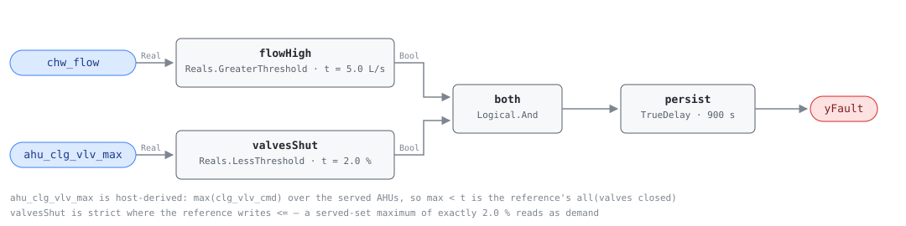

## Description

Water is moving and nothing is asking for it. Every cooling coil on the loop is
commanded shut, so the chilled water comes back at the temperature it left and
the pump energy that pushed it around the building turns into heat in the water
it was supposed to cool; a chiller still enabled holds its evaporator and its
controls alive for a load that is not there. Neither side can see the fault
alone — the plant knows flow and nothing about demand, the AHUs know their
valves are shut and nothing about the loop — which is why it is a
cross-equipment rule. The waste is a base load with no comfort complaint and no
plant alarm behind it: a 15 kW distribution pump left running through a shoulder
season is around 65 MWh nobody notices.

## Detection Logic

```
flow_high   = chw_flow > no_demand_flow_threshold
valves_shut = ahu_clg_vlv_max < valve_closed_threshold

yFault = (flow_high AND valves_shut) sustained continuously for alarm_delay
```

Block graph (`rule.cxf.jsonld`):



The demand conjunct is where the reference and a block graph have to be
reconciled. The reference writes `all(clg_vlv_cmd <= valve_closed_threshold for
ahu in served_ahus)`, a quantifier over a set whose width is a site property,
and CXF has no variable-width input. The host supplies `ahu_clg_vlv_max`
instead, and `max < t` is exactly `all < t` — an identity, not an
approximation. What moves is the obligation to span every cooling load on the
loop, which is what the preconditions spend their length on.

Both comparisons are single-sided and strict. `flow_high` is strict in the
reference too; `valves_shut` is not — the reference writes `<=` and CDL `Reals`
has no `LessEqual` — so a served-set maximum sitting at exactly 2.0% reads as
demand rather than as closed, an error of one part in fifty of a valve command
in the direction of silence.

`persist` is a `TrueDelay` asserting at exactly `T + delayTime`, so the
realized test is "flow with no demand for strictly more than `alarm_delay`" at
tick resolution, and any interruption discards the elapsed time rather than
pausing it. `delayOnInit = true` (CDL default `false`) makes a loop already
circulating at engine start wait out the full 15 minutes.

## Possible Diagnoses

The reference's four, in its order:

1. CHW pump running unnecessarily — enabled by a schedule, a hand switch, or a
   start command nobody revoked
2. Leaking cooling coil valve(s) — a valve commanded shut that does not seat
   passes water continuously; AHU-0014 sees the same defect from the air side
3. Bypass valve stuck open — a minimum-flow or pressure-bypass valve that never
   closed, keeping the loop circulating whatever the coils do
4. Control sequence not shutting down the CHW loop — no logic stops the pumps
   when demand goes away, so the plant runs whenever it is enabled

## Energy Impact

CRITICAL_WASTE, HIGH confidence, DIRECT_MEASUREMENT — the reference's profile.
The affected subsystem is the distribution pump plus chiller standby, and the
savings figure is 100% of both while the condition holds, because the load
being served is zero by construction. `waste_kw = chw_pump_kw +
chiller_standby_kw` is the reference's runtime term and both quantities are the
host's; this rule reads a flow meter and a valve aggregate and never sees a kW,
so DIRECT_MEASUREMENT holds only as far as the host's pump metering does.
Climate sensitivity is Both — a loop left circulating in winter wastes as much
as one left circulating in summer.

## Emissions Impact

Scope 2, DIRECT_EMISSIONS, HIGH confidence; the reference's typical range is
1,500-10,000 kg CO₂e/yr for the pump plus chiller standby, on a marginal
operating emissions rate (MOER) basis. All of it is electricity, and the
marginal basis is the right one because the waste is dispatchable — it stops
the moment someone stops the pump.

## Deviations

- **The reference's `all(...)` quantifier becomes one host-derived aggregate.**
  `max < t` is exactly `all < t`, so the substitution is an identity; it is
  needed because the reference's required points list a per-AHU `clg_vlv_cmd`
  and a CXF block has a fixed number of inputs. Precedent is CHW-0003's
  `chw_valve_max`, and the point dictionary carries the same warning: a maximum
  over a subset of the served loads is worse than no rule.
- **`<=` becomes a strict `<`.** CDL `Reals` has no `LessEqual`, so
  `valve_closed_threshold` is applied as `LessThreshold` with `t = 2.0` and a
  served-set maximum of exactly 2.0% reads as demand where the reference would
  call it closed. The library's standing convention is to pin the threshold at
  the boundary and take the strict form; the direction is the conservative one
  for a waste rule.
- **`no_demand_flow_threshold` ships as a placeholder, not a default.** The
  reference gives `10% of design`, a fitting rule rather than a number, and a
  CXF `S231:value` is one double in one unit. The shipped 5.0 L/s is 10% of a
  50 L/s design loop and **is not a site value**: too low and the rule alarms on
  the leakage every loop has, too high and a pump at minimum speed never trips
  it. Same precedent as VAV-0001's `ventilation_requirement`.
- **The valve aggregate is built from commands, not feedback**, unlike
  CHW-0003's. The question here is what the control system is requesting, and
  it is also what keeps diagnoses 2 and 3 visible: a leaking or stuck-open valve
  reads 0% on the command while it passes water; bind feedback and the same
  valve reads 20%, the demand conjunct blocks, and the rule goes quiet on the
  case it was written to catch.
- **No schedule or occupancy gate.** The reference puts none in this equation
  and the omission is right — flow with no demand costs the same at 2 pm as at
  2 am. SYS-0003 and SYS-0004 are the chapter's schedule-gated rules.
- **`AlarmDelay = 15 min` becomes `persist.delayTime = 900 s` with
  `delayOnInit = true`** (CDL default `false`), the library's standing choice:
  a loop already circulating with no demand at controller restart waits out the
  full 15 minutes rather than alarming on the first tick.
- **`TrueDelay` asserts at exactly `T + delayTime`,** verified against the
  engine at the pin rather than assumed, so the realized test is "strictly more
  than `alarm_delay`" at tick resolution.
- **Playbook binding.** Primary is `unnecessary-plant-operation`, CLU-07's
  declared slug; `stuck-actuator` stays bound as the secondary procedure for
  diagnoses 2 and 3.
- Operating states and preconditions are declared in frontmatter for host
  enforcement rather than encoded in the block graph, per the library's design
  stance.

## Notes

Read the finding as a question about the pump before it is a question about a
valve: if the pump is commanded on, the fault is diagnosis 1 or 4 and the work
is in the BAS; if the pump is off and the meter still reads flow, diagnoses 2
and 3 are what remain. PMP-0002 (deadheading) often fires on the same hour.

SYS-0002 is the mirror, and a site with one usually has both — CLU-07 exists
for that pairing, with this rule as the trigger. A plant tripping CHW-0004 at
the same time is not showing two independent problems: flow with no load is the
cleanest possible case of low delta-T syndrome.
