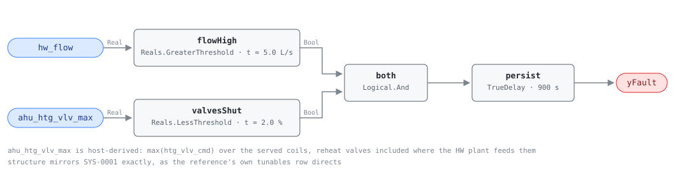

## Description

The heating loop is circulating and no coil is asking for heat. Hot water leaves
the plant, travels the building, and returns at close to the temperature it
left, so the pump energy moves water that delivers nothing and the distribution
losses along the way are paid for out of fuel; a boiler still enabled holds a
hot jacket and a set of controls alive for a load that does not exist. This is
the heating mirror of SYS-0001, and the reference writes it that way — "same
structure as SYS-050" in place of a tunables table. What differs is scale and
season: a HW loop carries far less water for the same capacity (its design
delta-T is two to three times a chilled loop's), the standby term is fuel rather
than electricity, and a heating plant left circulating through a summer produces
no complaint, no alarm and no comfort signature until someone reads the flow
meter.

## Detection Logic

```
flow_high   = hw_flow > no_demand_flow_threshold
valves_shut = ahu_htg_vlv_max < valve_closed_threshold

yFault = (flow_high AND valves_shut) sustained continuously for alarm_delay
```

Block graph (`rule.cxf.jsonld`):



`ahu_htg_vlv_max` carries the reference's `all(htg_vlv_cmd <=
valve_closed_threshold for ahu in served_ahus)` quantifier as a host-computed
maximum, because CXF has no variable-width input and the served set is a site
property. `max < t` is exactly `all < t`, so the substitution is an identity;
what moves is the obligation. On a heating loop that obligation is heavier than
on the CHW side, because the served set usually includes zone reheat valves the
plant controller has never heard of — see preconditions.

`valves_shut` is strict where the reference writes `<=` (CDL `Reals` has no
`LessEqual`), so a served-set maximum of exactly 2.0% reads as demand and blocks
the fault. `flow_high` is strict in the reference too and needed no change.

`persist` is a `TrueDelay` asserting at exactly `T + delayTime`, so the realized
test is "flow with no demand for strictly more than `alarm_delay`" at tick
resolution, and a dip discards the elapsed time rather than pausing it.
`delayOnInit = true` (CDL default `false`) makes a loop already circulating at
engine start wait out the full 15 minutes.

## Possible Diagnoses

The reference's three, in its order:

1. HW pump running unnecessarily — enabled by a schedule, a hand switch, or a
   start command nobody revoked; on a heating plant this is frequently seasonal
2. Leaking heating coil valve(s) — a valve commanded shut that does not seat
   passes hot water continuously, putting heat into supply air that then has to
   be cooled back down; AHU-0015 sees it from the air side
3. Bypass valve stuck open — a minimum-flow or pressure-bypass valve that never
   closed, keeping the loop circulating whatever the coils do

The reference lists no control-sequence item here, unlike its CHW card. In
practice a loop with no logic to stop the pumps when demand goes away shows up
under diagnosis 1, every hour, by design.

## Energy Impact

CRITICAL_WASTE, HIGH confidence, DIRECT_MEASUREMENT — the reference's profile.
The affected subsystem is the distribution pump plus boiler standby, and the
savings figure is 100% of both while the condition holds, because the load being
served is zero by construction. `waste_kw = hw_pump_kw + boiler_standby_kw` is
the reference's runtime term and both quantities are the host's. The halves are
different kinds of energy: pump power is electricity, usually metered or
reported by the drive; boiler standby is fuel — jacket and flue losses plus the
short cycles that hold temperature — which on most plants is a
nameplate-and-efficiency estimate, so DIRECT_MEASUREMENT holds only as far as
the host's instrumentation does. Climate sensitivity is Both, per the reference.

## Emissions Impact

Scope 1 + 2, DIRECT_EMISSIONS, HIGH confidence; the reference's typical range is
1,500-10,000 kg CO₂e/yr for the pump plus boiler standby, on a "Static Scope 1 +
MOER" basis. The split follows the two subsystems: fuel burned to hold a boiler
warm is Scope 1 on a static factor, pump electricity is Scope 2 on the marginal
rate for the hour. An electric or heat-pump boiler moves the whole quantity into
Scope 2 and onto MOER.

## Deviations

- **The reference's `all(...)` quantifier becomes one host-derived aggregate.**
  `max < t` is exactly `all < t`, so the substitution is an identity; it is
  needed because the reference's required points list a per-AHU `htg_vlv_cmd`
  and a CXF block has a fixed number of inputs. Precedent is CHW-0003's
  `chw_valve_max`; the dictionary entry for `ahu_htg_vlv_max` carries the
  instruction that reheat valves belong in the set where the plant feeds them.
- **`<=` becomes a strict `<`.** CDL `Reals` has no `LessEqual`, so
  `valve_closed_threshold` is applied as `LessThreshold` with `t = 2.0` and a
  served-set maximum of exactly 2.0% reads as demand where the reference would
  call it closed. Standing library convention: pin the threshold at the boundary
  and take the strict form, which is the conservative direction for a waste rule.
- **`no_demand_flow_threshold` ships as a placeholder, and the mirror makes it
  worse here.** The reference gives SYS-0001 `10% of design` and gives this
  fault "same structure as SYS-050", so the tunable is inherited along with its
  problem. The shipped 5.0 L/s is a CHW-scale figure: a hot water loop at an 11 K
  design delta-T moves about 22 L/s per MW, so 5.0 L/s is 10% of design only near
  2.3 MW and exceeds the entire design flow of a small plant — which fails
  silent. **Fit it per loop before deployment.** Precedent: VAV-0001's
  `ventilation_requirement`.
- **The valve aggregate is built from commands, not feedback**, following the
  reference's own point (`htg_vlv_cmd`). The command states what the control
  system is asking for, which is what "no heating demand" means, and it is what
  keeps diagnoses 2 and 3 visible: a leaking or stuck-open valve reads 0% on the
  command while it passes water; bind feedback and it reads 20%, the demand
  conjunct blocks, and the rule goes quiet on two of its three diagnoses.
- **Three diagnoses, not SYS-0001's four.** The reference drops "control
  sequence not shutting down the loop" from this card's list, and the list is
  transcribed rather than harmonised with the CHW card.
- **No schedule, occupancy, or OAT gate.** The reference puts none in this
  equation, and the weather-based version of the fault is HW-0003 (plant
  operating above the OAT lockout), a separate rule with its own point and
  threshold. Nothing here consumes `oat` or `occ_scheduled`.
- **`AlarmDelay = 15 min` becomes `persist.delayTime = 900 s` with
  `delayOnInit = true`** (CDL default `false`), the library's standing choice: a
  loop already circulating with no demand at controller restart waits out the
  full 15 minutes rather than alarming on the first tick.
- **`TrueDelay` asserts at exactly `T + delayTime`,** verified against the engine
  at the pin rather than assumed, so the realized test is "strictly more than
  `alarm_delay`" at tick resolution.
- **Playbook binding.** Primary is `unnecessary-plant-operation`, CLU-07's
  declared slug; `stuck-actuator` stays bound for the valve half of the diagnoses
  and `hot-water-plant-faults` for the plant half (boiler OAT lockout, DHW
  exclusion).
- Operating states and preconditions are declared in frontmatter for host
  enforcement rather than encoded in the block graph, per the library's design
  stance.

## Notes

Settle the domestic hot water question before dispatching anything. On a
combined plant this rule fires every summer hour, right about the numbers and
wrong about the building, and the check is a drawing rather than a trend: does
this loop feed a service water heat exchanger. If it does, the binding is the
defect — a heating-only loop or a host-side gate, not a work order.

After that the finding is a question about the pump before it is a question
about a valve. Pump commanded on is diagnosis 1 and BAS work, often a seasonal
changeover nobody performed; pump off with flow on the meter leaves diagnoses 2
and 3. Pull HW-0003 alongside: it asks whether the plant is running above its
OAT lockout, this rule asks whether anything is calling for heat, and a site
that trips both has no demand-side shutdown at all. Check the chilled water side
too — CLU-07's trigger is SYS-0001, and the sequence gap is usually written
once and copied.
