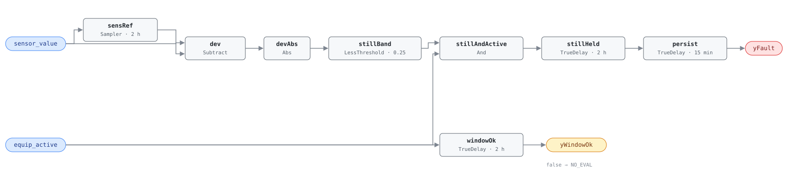

## Description

A transmitter that has stopped reporting change is the quietest failure in a
building. Nothing alarms, no zone complains, the trend line is beautifully
smooth, and every rule downstream keeps producing verdicts from a number that
stopped being a measurement weeks ago. A frozen sensing element, a controller
holding last-known-good, a point re-served from cache after a dead subscription
— all three present identically: zero variance under a load that should be
producing some. The reason to write the rule is Dey & Dong (2016): a Bayesian
layer sits over APAR precisely because a satisfied equipment rule cannot
separate coil fouling from a temperature-sensor bias after the fact, and the
cheaper answer is to detect the sensor case directly and drop it from the
candidate set first. It is library-authored — the HVAC FDD Reference specifies
no flatline rule in any chapter — and it binds **role points**, whose real
identities live in the host's instance configuration.

**The `adjudicates` contract.** While `yFault` is active, `sensor_value` is
invalid: the host must return NO_EVAL for every rule on this equipment instance
that consumes it, deriving that set by intersecting each card's `points` with
`adjudicates.points`. `equip_active` is consumed but deliberately not
adjudicated. `yWindowOk` is a separate gate: while it is false the verdict is
NO_EVAL, never a healthy sensor.

## Detection Logic

```
baseline   = Sampler(sensor_value, flatline_window)   (re-arms once per window)
still      = |sensor_value − baseline| < flatline_band

yWindowOk  = equip_active held continuously for flatline_window
                                            (false ⇒ host reports NO_EVAL)
yFault     = (still AND equip_active) held continuously for flatline_window,
             then sustained a further alarm_delay
```

Block graph (`rule.cxf.jsonld`):



Eight blocks. `sensRef` is a `Discrete.Sampler` on the window period, so the
comparison is always against where the reading sat at the start of the current
window; `stillBand` is strict, so a deviation of exactly `flatline_band` reads
as *moving*. The activity gate sits inside the dwell rather than after it —
`equip_active` is one leg of `stillAndActive`, so `flatline_window` is a window
of *running* time and a plant that stops discards the elapsed time rather than
pausing it. `windowOk` is not an echo of that input: it asserts only once the
equipment has run continuously for a full window, the shortest run this rule can
form any verdict from, so a true `yFault` implies a true `yWindowOk` and not the
reverse.

Both thresholds are per-binding and the shipped pair is a worked example for
`sensor_value := sat`, `equip_active := sf_status`: 0.25 °C sits above the 0.1 °C
quantum most BAS report a duct temperature at and well below the one to three
degrees a controlled supply-air temperature travels in two hours, and 7200 s
fits inside a single occupied period. Every other binding needs its own two
numbers — Deviations works the arithmetic on which direction each mis-tuning
fails.

`persist` (15 min) is the only knob a host should touch for reporting reasons;
`flatline_window` binds the sampler period and both dwell timers at once,
because they express one quantity. All three `TrueDelay`s assert at exactly
`T + delayTime` and carry `delayOnInit = true` (CDL default `false`).

## Possible Diagnoses

Library-authored; no published diagnosis list exists for this shape.

1. Failed sensing element — a thermistor or RTD opened or shorted into a fixed
   reading, a transducer whose diaphragm has seized. The only repair that is a part
2. Failed or saturated A/D channel — the element is fine, the input is not;
   distinguishable on site by moving the sensor to a spare input
3. A controller holding last-known-good — many BAS substitute the previous value
   on a read failure rather than flagging the point
4. A point re-served from cache after a lost subscription — the host is supposed
   to catch this as a delivery fault before the rule sees it
5. A manual override or hand mode left on the point — costs nothing to check and
   is the most common finding on a new deployment
6. A sensor installed where nothing happens — a duct probe in a dead leg, a well
   without paste, a space sensor behind a closed door. The repair is relocation
7. Genuinely stable process — the false-positive case: a tight loop on a light
   load can sit still for two hours. Raise `flatline_window`, never `flatline_band`

## Energy Impact

PROTECTIVE, LOW confidence, QUALITATIVE_ONLY. There is no waste term — a frozen
transmitter burns nothing — and the cost is the diagnostic coverage of every
rule that reads it, realized as energy only through the faults it hides.
AHU-0028 set the convention this card follows: the value of a sensor gate
belongs to the rules it gates. The fan-out is the number that matters and it is
per-instance, computed by the host from the `points` lists every card already
carries. Confidence is LOW for two honest reasons: diagnoses 6 and 7 cannot be
separated from a stuck transmitter by this graph, and a deployment that has not
retuned the thresholds is comparing against a supply-air temperature's numbers.

## Emissions Impact

Scope 1 or 2 depending on what the adjudicated point serves,
QUALITATIVE_EMISSIONS, LOW confidence. Same argument as the energy claim: no
direct term, and the avoided emissions belong to whichever rules were restored
to service when the sensor was repaired. AHU-0028's `1|2` assignment is the
precedent, for the same reason — a bad temperature can be hiding a gas-fired
heating fault or an electric cooling one, and the rule does not know which.

## Deviations

- **Library-authored, not a transcription.** No chapter of the reference
  specifies a flatline rule, so there is no algorithm to deviate from. The ID,
  name, severity 3 and `method: rule` are `faults/sys/README.md`'s; everything
  else is argued here on the accepted design plus Yang et al. (2008) and Liao et
  al. (2021).
- **The stance, in brief.** Delivery quality — arrival, `PointStatus`, gaps —
  stays host-side and is untouched by this rule; physical plausibility (the
  sample arrived clean and is wrong) is a property of the signal and a fault of a
  piece of equipment, because a sensor is equipment. AHU-0028 and RTU-0003
  are the precedent.
- **The rule depends on host delivery quality and cannot substitute for it.**
  This keeps the layering acyclic and is the one way a deployment can make the
  card lie: fed a value held over from a dead subscription, the rule reports
  flatline — right about the number it was given, wrong about the transmitter.
- **`adjudicates: {points: [sensor_value], verdict: invalid_while_active}`.**
  The verdict names one sensor rather than SYS-0005's pair. `equip_active` is
  not adjudicated: the rule says nothing about whether the run status is telling
  the truth. The fan-out is deliberately not enumerated, so it stays complete as
  rules are added — AHU-0028's hand-written `suppresses` list is the
  counter-example that motivated the field.
- **`suppresses: []` and `suppressed_by: []`, and the second is normative.** An
  equipment fault silencing the sensor rule that invalidates it is a cycle with a
  wrong answer at both ends. The two fields are not interchangeable: `suppresses`
  says the silenced verdict is true but redundant, `adjudicates` says the
  consuming verdicts are meaningless and their rolling state should be reset.
  Whose job that reset is remains open.
- **The evaluability output is a dwell rather than an echo.** A passthrough of a
  boolean boundary input carries no information the host does not have
  (HW-0005's `yMildWeather` deviation is explicit), so `yWindowOk` is
  `equip_active` held for a full `flatline_window`.
- **Both thresholds ship as per-binding placeholders in the bound point's
  units,** the VAV-0001 convention. The counter-example that makes it bite:
  bound to a duct static pressure, 0.25 Pa is *below* the noise floor of every
  transducer on the market, so `still` is never true and the rule sits silent
  forever — that binding wants something nearer 5 Pa. The failure directions are
  not symmetric: a band too small produces silent misses, a band too large turns
  a slowly moving healthy sensor into a flatline finding, and only the second is
  visible from the alarm list.
- **`flatline_window = 7200 s` is ADOPTED, and short by this family's
  standards.** AHU-0023 uses seven days for the same sampler-and-dwell
  structure; copying it would be wrong because the window is *continuous running
  time* and a scheduled air handler never runs for a week, because every
  unreported hour blinds everything downstream, and because above roughly four
  hours the window exceeds the uninterrupted run of ordinary scheduled plant. The
  floor is diagnosis 7 at about an hour.
- **`Discrete.Sampler`, not `Reals.MovingAverage`, and not `Reals.Derivative`.**
  Engine-verified at the pin. `MovingAverage`'s fixed 64-checkpoint ring imposes
  a minimum tick of `window/64` (112.5 s here) and degrades silently when a
  deployment ticks faster; AHU-0023 rejected it for the same reason.
  `Reals.Derivative` is forbidden in this family outright — its `k` and `T` are
  input pins, and its implicit-Euler discretisation biases a ramp by `(1 + dt/T)`,
  reporting twice the actual slope at a 300 s tick with `T = 300 s`.
- **`Discrete.Sampler` emits the live input on its first tick,** so there is no
  startup artifact of the kind `Discrete.UnitDelay` produces with `y_start = 0`
  (that is SYS-0010's problem). This is pinned by an arrival time rather than
  asserted: the alarm lands at `flatline_window + alarm_delay` from t = 0, which
  is only reachable if the first baseline was the live reading.
- **The sampler grid is anchored to absolute model time, not to controller
  start:** the first sample instant is `floor(t_start/period)·period`, so a rule
  loaded at t = 137 s with a two-hour period takes its first grid instant at
  t = 0. It does not change the verdict, but a deployment's tick must divide
  `flatline_window`.
- **The baseline re-arms every window, with two consequences.** At each sample
  instant the block emits the live input, so the deviation is exactly zero on
  that tick however hard the signal is moving — a burst of apparent stillness
  that cannot mature, since the dwell needs a full window. And a sensor that
  freezes partway through a window is not detected until the *next* re-arm
  re-baselines onto its stuck value, so worst-case time to alarm from the moment
  of failure is `2 × flatline_window + alarm_delay`.
- **A slow drift reads as a flatline.** Any reading moving slower than
  `flatline_band` per `flatline_window` satisfies the test. That is a sensor
  finding either way, but the *name* is wrong and this rule cannot supply the
  right one — naming drift is SYS-0005's job, and a host running both should
  read a simultaneous SYS-0009 and SYS-0005 as drift, not two faults.
- **Strict `<` on the band.** CDL `Reals` has no `LessEqual` and the
  disagreement is measure-zero on a real-valued signal, so the comparison errs
  toward silence. Edge cases use dyadic values (14.0 against 14.25) so the
  difference is exactly 0.25 in IEEE-754: 14.2 − 14.0 is *not* 0.2 in double
  precision, and a naively written edge test would pin the wrong side of its own
  threshold.
- **`delayOnInit = true` on all three `TrueDelay`s** (CDL default `false`), the
  library's standing choice: a restart onto an already-frozen sensor waits out
  the full window, and `windowOk` refuses to claim a window it did not observe.
  Each asserts at exactly `T + delayTime`, so every realized test is "strictly
  more than" its delay at tick resolution.
- **`alarm_delay` is a separate parameter from `flatline_window` on purpose.**
  The two answer different questions: `flatline_window` is a physical claim about
  how long the bound process can legitimately sit still and it also sets the
  baseline's re-arm period, so it cannot be shortened for alarm hygiene without
  changing what the rule measures. `alarm_delay` is the knob that moves freely.
- **`clusters: []`, flagged not edited.** CLU-09 (Sensor Integrity Failure) is
  where this card belongs, and if the FC-100 family lands its trigger is arguably
  one of these rules with AHU-0028 demoted to member.
  `clusters/clusters.json` is a single-writer file, as is
  `playbooks/sensor-drift.md`, whose four steps already apply to this finding.
- **`category: PROTECTIVE`, departing from the two precedent sensor gates.**
  AHU-0028 and RTU-0003 are both `COMFORT_ENERGY` and consistency is the
  honest counter-argument; it is declined because the alternative misdescribes
  the card — there is no comfort effect and no energy term, and what the rule
  delivers is avoided false findings and preserved diagnostic coverage. Severity
  stays 3: the fan-out is the host's consequence of the verdict, not a property
  of the finding.
- Operating states and preconditions are declared in frontmatter for host
  enforcement rather than encoded in the block graph, per the library's design
  stance.

## Notes

Read `yWindowOk` before `yFault`, and read `adjudicates` before doing anything
with either. A true `yFault` is not an instruction to dispatch a technician and
stop — it is an instruction to stop believing every other finding on that
equipment that touches the bound point, and the second half is worth more.

Check the cheap causes first: diagnoses 3, 4 and 5 account for most of what this
rule finds on a new deployment, cost nothing to check from a desk, and are
configuration rather than hardware. Then look at where the sensor is before
assuming it is broken — diagnosis 6 survives recalibration, because a probe in a
dead leg reports a real temperature of a place where nothing happens and passes
every bench test. The tell is a reading that is plausible and static while its
neighbours move.

Tune the window, never the band, when the rule is too talkative. Raising
`flatline_band` pulls genuinely drifting sensors into the finding, making the
report noisier and less specific at once; raising `flatline_window` costs only
detection latency, and this family has latency to spare. See the
[sensor-drift](../../../playbooks/sensor-drift.md) playbook for the verification
and service workflow.
