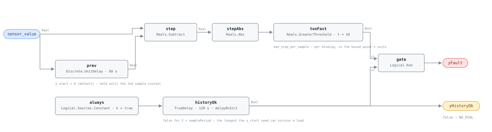

## Description

Every measured process in a building has mass behind it. Air is dragged past a
probe that takes half a minute to come to temperature, water carries the thermal
inertia of the pipe, a zone's CO₂ concentration is the integral of people
breathing into a volume. Each puts a ceiling on how far a reading can move
between two samples, and that ceiling belongs to the physics rather than to the
equipment: it does not change when the fan stops. A reading that clears it did
not come from the process — it came from a failing element, an intermittent
termination, a transmitter that changed range, or a point now serving a
different number than it used to. It is the only rule in the family whose fault
is momentary: flatline accuses a sensor of standing still for hours and pair
bias accuses two of disagreeing for a shift, while a spike happens on one sample
and is gone. That fact drives every timing decision below, and it is why this is
the one card in the library with no persistence timer on its fault path. The
stance is AHU-0028's and RTU-0003's: delivery quality stays host-owned,
physical plausibility is a fault of a piece of equipment, because a sensor is
equipment.

**The `adjudicates` contract.** While `yFault` is true, `sensor_value` is
invalid: the host must return NO_EVAL for every rule on this equipment instance
that consumes it, deriving that set from the other cards' own `points` lists so
it stays complete as rules are added. The verdict is `invalid_while_active`
rather than `ambiguous` because attribution is not in doubt — one point went
somewhere it could not have gone. Read `yHistoryOk` first: while it is false the
verdict is NO_EVAL, never a healthy sensor.

## Detection Logic

```
step        = |sensor_value − UnitDelay(sensor_value, sample_period)|
yHistoryOk  = true from history_warmup after load    (false ⇒ host reports NO_EVAL)
yFault      = step > max_step_per_sample  AND  yHistoryOk
```

Block graph (`rule.cxf.jsonld`):



Seven blocks in two strands. The upper strand is the measurement, ending in a
strict `Reals.GreaterThreshold`: a step landing exactly on `max_step_per_sample`
reads clear. The lower strand is a startup inhibit — a constant `true` through a
`TrueDelay` with `delayOnInit = true`, false for the first `history_warmup`
after load and true forever after — which is also the `yHistoryOk` output.

**The delay line's warmup is a fabricated spike, masked deliberately.**
`Discrete.UnitDelay` seeds its state from `y_start` and emits it until the
*second* sample instant, so at the CDL default of 0.0 the first computed step on
a 22 °C duct is `|22 − 0| = 22` — more than twice the bound, on every load and
every restart. The gate is two sample periods wide because that is the longest
the seed can survive; it costs one real sample of blindness when a load happens
to be grid-aligned.

**`yFault` is one or two ticks wide by design.** A single-sample outlier
violates the bound twice, going out and coming back; a level shift that stays —
a units change, a rescaled transmitter — violates it exactly once, because the
next sample is compared against the shifted value. There is no latch and no
accumulated timer: each event is judged on its own tick, and any dwell is the
host's to add.

**The worked example: `sensor_value := sat` at a 60 s tick,** which is the
shipped `max_step_per_sample = 10.0` and no other binding. Coil-leaving air can
fall 8-10 K within a minute of a large stage cutting in, and a duct probe in a
2.5 m/s stream filters that with a 30-60 s time constant, so one 60 s sample
carries 60-85% of a true step: the largest genuine one-minute excursion reaching
the reading is of order 6-8 K. Ten sits above every transient the plant can
produce and below the 15 K per minute that is not a temperature at all. Nothing
about that argument survives a change of binding or of `sample_period` — a 300 s
sample admits the entire stage transient — so re-derive the bound from the
physics rather than multiplying this one.

## Possible Diagnoses

Library-authored; nothing published fixes a cause list for a step bound.

1. A failing sensing element — an intermittent thermistor or RTD, a cracked
   lead, a probe that opens when the duct vibrates. Isolated outliers between
   long stretches of good data, which is the two-tick case
2. Loose, corroded or wet terminations, or a signal pair sharing conduit with a
   switching inductive load — the spikes correlate with that equipment's cycles
   rather than with the sensed process
3. A transmitter or A/D channel that changed range or scaling — a 4-20 mA
   transmitter re-ranged during service, a jumper moved, an input reconfigured
   from 10 k to 1 k. A level shift, one tick wide
4. A units change nobody announced — a point re-served in °F on a °C-declared
   binding. Also one tick wide, and this is the only rule in the library that
   notices
5. A point rebound to a different physical sensor by a controller download or a
   BAS integration edit — the reading is honest and is no longer the sensor the
   rest of the rules think they are reading
6. A host-side delivery artifact in the costume of a sensor fault — a value
   re-served from cache when comms came back, a bad interpolation, a slipped
   poll. Not a sensor fault at all
7. A correct reading and a wrong threshold — diagnose this first if the alarms
   cluster on stage changes and mode transitions

## Energy Impact

COMFORT_ENERGY, MEDIUM confidence, QUALITATIVE_ONLY. There is no direct waste
term: a spiking sensor burns nothing, and its cost is entirely in what reads it
— a controller that takes one 40 K outlier as real and slams a valve, an
economizer that changes mode on a phantom reading, the diagnostic rules that
then miss a real fault or invent one. PNNL EEM-01 (sensor recalibration) puts
the recoverable range at 0-5% of site energy across an entire sensor population
at roughly 15% prevalence, which is the honest ceiling for the whole family.
Confidence is MEDIUM rather than LOW, a deliberate departure from AHU-0028 and
RTU-0003: those compare several sensors and cannot say which is wrong, while
this one reads a single point and its finding is unambiguous by construction. It
is not HIGH because the threshold ships as a placeholder and because the host's
delivery layer can manufacture the identical step (diagnosis 6).

## Emissions Impact

QUALITATIVE_EMISSIONS, MEDIUM confidence; no direct emissions, because a reading
neither burns fuel nor draws power. Scope is `1|2` for the same reason
AHU-0028 records it that way: it depends on which subsystem the bad number
distorts. A spiking supply-air temperature that provokes preheat lands in Scope
1; one that provokes mechanical cooling or drops an economizer out of service
lands in Scope 2, and the same sensor can do both in different seasons.
Avoided-emissions basis: N/A.

## Deviations

- **No persistence timer on the fault path, and that decision is the card.**
  Every other rule document here drives `yFault` from a `TrueDelay`, because
  they detect conditions that persist. A spike does not, and the timer would
  delete findings rather than merely be redundant: at the pin `TrueDelay` emits
  false on a rising edge and true on the next tick the input still holds, so
  *any* positive `delayTime` up to one tick means "two consecutive violating
  samples" — keeping the single-sample outlier and silently deleting the entire
  level-shift class (units change, re-ranged transmitter, rebound point), which
  between them is the most common thing this rule finds. Zero is not available
  either: `positive_duration` clamps at 0 and the init branch honours
  `delayOnInit` only when `delayTime > 0`, so a zero-delay timer would pass the
  warmup artifact straight through. The timer therefore moves to the startup
  inhibit. What the library gives up is debounce, and that is host policy.
- **The warmup gate is two sample periods wide because the seed can survive
  two.** `Discrete.UnitDelay` promotes staged→held only at sample instants and
  its grid is anchored to absolute model time, so a load landing *between*
  instants stages nothing, the next instant promotes seed→seed, and the first
  real sample does not appear until the instant after that. A one-period gate is
  correct only for grid-aligned loads and lets a fabricated 22 K step through on
  every other one — a fault the rule invents on a restart nobody chose the timing
  of. The cost when the load *is* aligned is one real sample of blindness.
- **`y_start` is left at the CDL default of 0.0.** Seeding it to a plausible
  mid-scale reading would also hide the artifact, but it buries a block-level
  fact instead of documenting it and turns a graph constant into a per-point site
  value that buys no diagnostic power.
- **`sample_period` and `history_warmup` are two card parameters carrying one
  decision, and the linter cannot enforce the ratio.** The multi-path `cxf: [...]`
  form AHU-0023 uses is unavailable, because the two block parameters take
  different *values* (`samplePeriod` and `2 × samplePeriod`) and that form sets
  every listed path to the same number. So the invariant `history_warmup = 2 ×
  sample_period` is stated in both descriptions, in `preconditions`, and here: a
  host that retunes the sample period and forgets the gate gets a rule that
  fabricates a spike on some fraction of its restarts. Same class of
  coupled-parameter hazard as HP-0001's slope and intercept.
- **`sample_period` must equal the host's tick interval.** `UnitDelay`'s grid is
  anchored to absolute model time and it holds between instants, so the emitted
  value is between one and two periods old — the lookback age runs over
  `[P, 2P)`. When `P` equals the tick that collapses to exactly one tick and the
  rule means what the equation looks like; when it does not, the rule means "an
  excursion exceeding the bound somewhere within one to two sample periods", a
  defensible test but a different one, with a per-window magnitude for a
  threshold and a warmup gate `2P/tick` ticks wide. The arithmetic is read from
  the engine at the pin and deliberately not vector-pinned, since pinning it
  would require shipping the configuration this card tells hosts not to use.
- **`Reals.Derivative` is not used, and could not be.** It is the block the
  equation suggests and it is wrong on the engine's own arithmetic: its `k` and
  `T` are `RealInput` connectors rather than parameters, its filter discretizes
  to `k·s·(1 + dt/T)` for a ramp of slope `s` (twice the actual slope at a 300 s
  tick with `T = 300 s`; holding the error under 5% needs `T ≥ 20·dt`, a hundred
  minutes of lag in a spike detector), and its step response ignores `dt`, so the
  same 5 K jump reads identically whether it took 60 s or 600 s.
- **Strict `>`.** CDL `Reals` has no `GreaterEqual`, so a step of exactly
  `max_step_per_sample` reads clear, which errs toward silence. Sites whose BAS
  quantises the bound point coarsely will land on the boundary often enough to
  notice, and should set the threshold between two quantisation levels.
- **`Reals.Abs` discards the sign and the card does not try to recover it.** A
  signal-conditioning failure that rails low and one that rails high are the same
  finding here; splitting them would double the graph to distinguish two cases
  that lead to the same work order.
- **No `equip_active` conjunct, which is where this rule parts company with
  SYS-0009.** Flatline needs the gate, because a still reading on idle
  equipment is the correct answer. A spike needs none for the mirror reason: the
  ceiling is set by the mass of the process, not by whether anything drives it,
  and an idle system moves *slower*, so the running case is the permissive one. A
  gate would also cost a second binding obligation on a family whose binding cost
  is already the main argument against it.
- **`max_step_per_sample` ships as a per-binding placeholder,** the VAV-0001
  arrangement in a stronger form: here even the *dimension* is unknown until
  binding. The number is defended above for one binding and no other. Set it 3×
  too high and the rule never fires; 3× too low and it alarms on every stage
  change the plant makes. `points/sys.points.json` states this in
  `sensor_value`'s own notes.
- **The rule cannot see drift, ramps, or anything that stays under the bound.**
  Five consecutive 5 K steps carry a reading from 22 to 47 °C — physically absurd
  in a duct, and silent, because each individual step is legal. A step bound sees
  steps. Slow monotone drift is structurally invisible to this rule and to
  SYS-0009 alike, which is the argument for SYS-0005 being a third shape
  rather than a variation on these two.
- **`adjudicates` cards must not be suppressible, so `suppressed_by` is empty
  and must stay empty:** if an equipment fault could silence the sensor rule that
  invalidates it, the suppression graph has a cycle with a wrong answer at both
  ends. `suppresses` is empty for a different reason — the fan-out of an
  adjudicated point is derived by the host from other cards' `points` lists, not
  hand-written here, which is the entire argument for keying the field to the
  point. AHU-0028's fourteen-entry `suppresses` list is the counter-example:
  correct today, silently incomplete the first time someone authors an AHU rule
  that reads `mat`.
- **Severity 3 and COMFORT_ENERGY follow AHU-0028 and RTU-0003 rather than
  the fan-out argument.** Severity 3 is `faults/sys/README.md`'s index value and
  is not this card's to change. PROTECTIVE is declined on evidence: in this
  library it means avoided physical damage (PMP-0001's dry-running seal,
  RTU-0001's short-cycled compressor), and stretching it to cover avoided false
  alarms would make one category mean two unrelated things. Note SYS-0009 takes
  the opposite call, so the family is split and reconciling it is library-wide.
- **`clusters: []`, and CLU-09 is the open question.** `clusters/clusters.json`
  gives CLU-09 the trigger `AHU-0028` and lists SYS-0005 and SYS-0006 as
  members; with the FC-100 family landing, the trigger is arguably one of the sys
  rules and 062 becomes a member. That is a single-writer file, so this card
  declares nothing and this bullet is the flag.
- **[`sensor-drift`](../../../playbooks/sensor-drift.md) is the right playbook
  and does not yet name this rule;** adding SYS-0009 and SYS-0010 to its
  Applies-To row is the playbook owner's edit. Step 1's portable-reference
  comparison and step 3's recalibrate-or-replace both transfer. Step 2's BAS
  offset does not: an offset corrects a bias and does nothing for a sensor that
  jumps.
- **Role-point binding breaks the library's canonical-name convention, on
  purpose.** The host's instance configuration records which real point
  `sensor_value` is, and that same record resolves `adjudicates.points`, so the
  binding is a required artifact of the design rather than an extra one.
  SCHEMA.md's points contract carries the exception; the alternative — thirty
  copies of this graph, one per point-and-family pair — is thirty chances to
  drift apart with no cross-card diff check to catch it.
- Operating states and preconditions are declared in frontmatter for host
  enforcement rather than encoded in the block graph, per the library's design
  stance.

## Notes

Read `yHistoryOk` first. It is false for two sample periods after the rule
loads, and in that window a false `yFault` is silence rather than a clean bill of
health. On a host that reloads rules on every configuration change that window
recurs.

When this rule fires, look at the trend before dispatching anyone, because the
shape of the event names the cause faster than any test does. Isolated single
samples between long stretches of clean data are an intermittent connection or a
failing element — chase terminations, and note whether the spikes line up with a
compressor or a lighting contactor rather than with the sensed process. A single
step that never comes back is usually not a sensor failure at all: it is a
re-ranged transmitter, a units change, or a point rebound during a controller
download, and the fix is a configuration edit. Check what changed in the BAS
that day before touching the sensor.

Then check the tick. Alarms that cluster on stage changes and mode transitions
rather than falling at random usually mean `max_step_per_sample` was inherited
from another binding or survived a change to `sample_period` untouched. The
threshold is a physical claim about one sensor measuring one process at one
sample interval, and it does not travel — not between points, not between
equipment types, not between tick rates.

Know what this rule cannot do. It sees steps, so it is blind to the drift most
sensor work is actually about: a transmitter losing a degree a month never
violates a step bound. SYS-0009 covers the opposite extreme, a reading that
stopped moving at all. The middle needs a second sensor to compare against,
which is SYS-0005's job and the reason this family has three shapes.
