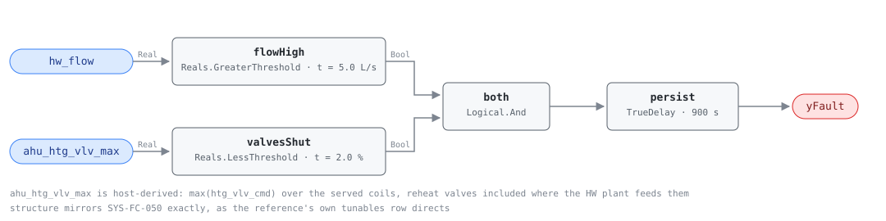

## Description

The heating loop is circulating and no coil is asking for heat. Hot water
leaves the plant, travels the building, and returns at close to the temperature
it left, so the pump energy is spent moving water that delivers nothing and the
distribution losses along the way are paid for out of fuel. A boiler still
enabled behind it holds a jacket of hot water and a set of controls alive for a
load that does not exist.

This is the heating mirror of SYS-FC-050 and the reference writes it that way,
down to "same structure as SYS-050" in place of a tunables table. The physics
that differ are worth knowing anyway. A hot water loop carries less water for
the same capacity, because its design delta-T is two to three times a chilled
loop's, so the flow threshold that reads "circulating" on a CHW plant is far
above the whole design flow of a modest HW plant. The standby term is fuel
rather than electricity, which is why the reference moves this card's emissions
into Scope 1 + 2 while the CHW card stays at Scope 2. And the season does the
hiding: a heating plant left circulating through a summer produces no
complaint, no alarm and no comfort signature at all, which is how it survives
until someone looks at the flow meter.

Where a reheat building differs from an air-handler-only one is in how rare the
condition is. A VAV building with hydronic reheat has some zone calling for
heat during most occupied hours, so a genuine no-demand window is a
shoulder-season night or a summer day — and that is exactly the window where an
unshut-down loop runs for months.

## Detection Logic

```
flow_high   = hw_flow > no_demand_flow_threshold
valves_shut = ahu_htg_vlv_max < valve_closed_threshold

yFault = (flow_high AND valves_shut) sustained continuously for alarm_delay
```

Block graph (`rule.cxf.jsonld`):



Four blocks, identical in structure to SYS-FC-050: `flowHigh` decodes the
meter, `valvesShut` decodes demand, `both` requires them at once, and `persist`
holds the pair for the reference's 15-minute `AlarmDelay`.

`ahu_htg_vlv_max` carries the reference's `all(ahu.htg_vlv_cmd <=
valve_closed_threshold for ahu in served_ahus)` quantifier as a host-computed
maximum, because CXF has no variable-width input and the served set is a site
property. A maximum below the closed threshold is exactly every member below
it, so the substitution is an identity; what it moves is the obligation, from
the rule to the host's aggregate. On a heating loop that obligation is heavier
than on the CHW side, since the served set usually includes zone reheat valves
that the plant's own controller has never heard of.
`one_open_valve_holds_the_aggregate_up` states the consequence of missing them:
one valve at 8% is a plant serving a load, and an aggregate blind to that valve
would report a fault.

`valves_shut` is strict where the reference writes `<=` — CDL `Reals` has no
`LessEqual` — so a served-set maximum of exactly 2.0% reads as demand and
blocks the fault. `flow_high` is strict in the reference too, so it needed no
change. All four sides are pinned by vectors.

`persist` is a `TrueDelay` that asserts at exactly `T + delayTime`, so the
realized test is "flow with no demand for strictly more than `alarm_delay`" at
tick resolution, and a dip discards the elapsed time rather than pausing it.
Three vectors cover that behavior: both sides of the maturity edge and the
reopen-then-shut case that restarts the clock.

## Possible Diagnoses

The reference's three, in its order:

1. HW pump running unnecessarily — the pump is enabled by a schedule, a hand
   switch, or a start command nobody revoked. On a heating plant this is
   frequently seasonal: the loop was started in October and never stopped
2. Leaking heating coil valve(s): a valve commanded shut that does not seat
   passes hot water continuously, which on top of the pump waste puts heat into
   supply air that then has to be cooled back down. AHU-FC-015 sees the same
   defect from the air side, as a temperature rise across a coil that is
   supposed to be inactive
3. Bypass valve stuck open — a minimum-flow or pressure-bypass valve that never
   closed, keeping the loop circulating whatever the coils do

The reference lists no control-sequence item here, unlike its CHW card, and
this card does not add one. In practice the sequence gap is the same defect
seen from the plant side and shows up under diagnosis 1: a loop with no logic
to stop the pumps when demand goes away is a pump running unnecessarily, every
hour, by design.

## Energy Impact

CRITICAL_WASTE, HIGH confidence, DIRECT_MEASUREMENT — the reference's own
profile, transcribed. The affected subsystem is the distribution pump plus
boiler standby, and the savings figure is 100% of both while the condition
holds, because the load being served is zero by construction: that is what the
second conjunct establishes.

`waste_kw = hw_pump_kw + boiler_standby_kw` is the reference's runtime term.
Both quantities are the host's — this rule reads a flow meter and a valve
aggregate and never sees a kW — and the two halves are not the same kind of
energy. Pump power is electricity and is usually metered or reported by the
drive. Boiler standby is fuel: jacket and flue losses on a hot vessel plus the
short cycles that keep it there, which is a nameplate-and-efficiency estimate
on most plants rather than a measurement, and the label DIRECT_MEASUREMENT
holds only as far as the host's instrumentation does. Climate sensitivity is
Both, per the reference.

## Emissions Impact

Scope 1 + 2, DIRECT_EMISSIONS, HIGH confidence; the reference's typical range
is 1,500-10,000 kg CO₂e/yr for the pump plus boiler standby, on a "Static
Scope 1 + MOER" basis. The split follows the two subsystems: the fuel burned to
hold a boiler warm is Scope 1 and takes a static emissions factor, the pump
electricity is Scope 2 and takes the marginal operating rate for the hour it
was spent. A plant on an electric or heat-pump boiler moves the whole quantity
into Scope 2 and onto MOER.

## Deviations

- **The reference's `all(...)` quantifier becomes one host-derived aggregate.**
  `ahu_htg_vlv_max` is the maximum heating valve command across the served
  coils, and `max < t` is exactly `all < t`, so the substitution is an identity
  rather than an approximation. It is needed because the reference's required
  points list a per-AHU `htg_vlv_cmd`, the served set is a site property, and a
  CXF block has a fixed number of inputs. Precedent is CHW-FC-052's
  `chw_valve_max`; the point dictionary's entry for `ahu_htg_vlv_max` carries
  the instruction that reheat valves belong in the set where the HW plant feeds
  zone reheat.
- **`<=` becomes a strict `<`.** CDL `Reals` has no `LessEqual`, so
  `valve_closed_threshold` is applied as `LessThreshold` with `t = 2.0`: a
  served-set maximum of exactly 2.0% reads as demand and blocks the fault,
  where the reference would call it closed. The library's standing convention
  is to pin the threshold at the boundary and take the strict form, and the
  direction is the conservative one for a waste rule.
- **`no_demand_flow_threshold` ships as a placeholder, not a default, and the
  mirror makes it worse here.** The reference gives SYS-FC-050 `10% of design`
  and gives this fault "same structure as SYS-050", so the tunable is inherited
  along with its problem: design flow is per-loop, and a CXF `S231:value` is
  one double. The card ships 5.0 L/s to keep the pair identical as the
  reference directs, and that number is a CHW-scale figure. A hot water loop at
  an 11 K design delta-T moves roughly 22 L/s per MW, so 5.0 L/s is 10% of
  design only for a plant near 2.3 MW and is above the entire design flow of a
  small one — which fails silent, never alarming. **Fit it per loop before
  deployment.** Same precedent as VAV-FC-050's `ventilation_requirement`.
- **The valve aggregate is built from commands, not from feedback**, following
  the reference's own point (`htg_vlv_cmd`). The command is the direct
  statement of what the control system is asking for, which is what "no heating
  demand" means, and it is also what keeps diagnoses 2 and 3 visible: a leaking
  or stuck-open valve reads 0% on the command while it passes water. Bind
  feedback instead and that same valve reads 20%, the demand conjunct blocks,
  and the rule goes quiet on two of its three diagnoses.
- **Three diagnoses, not SYS-FC-050's four.** The reference drops "control
  sequence not shutting down the loop" from this card's list, and the list here
  is transcribed rather than harmonised with the CHW card. The Possible
  Diagnoses section says where that failure lands instead.
- **No schedule, occupancy, or OAT gate.** The reference puts none in this
  equation. A heating loop circulating with no demand costs the same whether or
  not the building is occupied, and the weather-based version of this fault is
  HW-FC-052 (boiler or HW pump operating above the OAT lockout temperature),
  which is a separate rule with its own point and its own threshold. Nothing in
  this graph consumes `oat` or `occ_scheduled`.
- **`AlarmDelay = 15 min` becomes `persist.delayTime = 900 s` with
  `delayOnInit = true`** (the CDL default is `false`), the library's standing
  choice: a loop already circulating with no demand when the controller
  restarts waits out the full 15 minutes rather than alarming on the first
  tick.
- **`TrueDelay` asserts at exactly `T + delayTime`,** verified against the
  engine at the pin rather than assumed, so the realized test is "strictly more
  than `alarm_delay`" at tick resolution. Two vectors pin that edge and a third
  pins that a dip discards the elapsed time rather than pausing it.
- **Playbook binding.** The primary playbook is
  `unnecessary-plant-operation` (CLU-07's declared slug; transcribed from the
  reference's remediation playbooks, pp. 171–172, in the same batch as this
  card). `stuck-actuator` stays bound for the valve half of the diagnoses and
  `hot-water-plant-faults` for the plant half (boiler OAT lockout, DHW
  exclusion).
- **The reference publishes no test vectors for this card,** so all thirteen
  scenarios in `vectors.json` are authored, mirroring SYS-FC-050's set: the two
  healthy cases that isolate each conjunct, the plain fault, both sides of the
  flow threshold, both sides of the valve threshold, the partial aggregate, the
  demand-stops transition, the restart-the-clock case, both sides of the
  maturity edge, and the recovery.
- Operating states and preconditions are declared in frontmatter for host
  enforcement rather than encoded in the block graph, per the library's design
  stance.

## Notes

Settle the domestic hot water question before dispatching anything. On a
combined plant this rule fires every summer hour and is right about the numbers
and wrong about the building, and the check is a drawing rather than a trend:
does this loop feed a service water heat exchanger. If it does, the binding is
the defect and the fix is a heating-only loop or a host-side gate, not a work
order.

After that, the finding is a question about the pump before it is a question
about a valve. If the HW pump is commanded on, the answer is diagnosis 1 and
the work is in the BAS — often a seasonal changeover nobody performed. If the
pump is off and the meter still reads flow, something is open that should not
be, and diagnoses 2 and 3 are what remain.

HW-FC-052 is the companion worth pulling up at the same time. It asks whether
the plant is running above its outdoor-air lockout; this rule asks whether
anything is calling for heat. They answer differently in the two cases that
matter: a plant with a correct lockout can still circulate with no demand on a
cold night, and a plant below its lockout temperature can be serving a genuine
morning warm-up load. A site that trips both has a heating plant with no
demand-side shutdown at all, and CLU-07 is where that shows up — SYS-FC-050 is
the cluster's trigger, so check the chilled water side too, because the
sequence gap is usually written once and copied.
