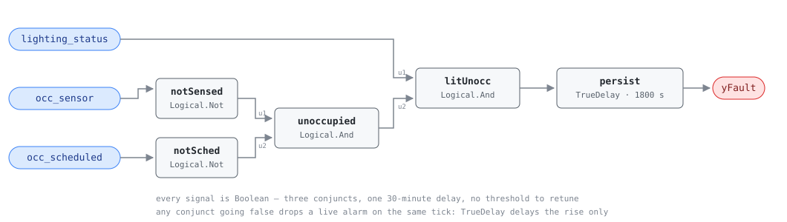

## Description

Lights burning in an empty building after hours. The rule wants two independent
witnesses before it says the space is empty — the occupancy sensor and the
schedule — because either alone is wrong often enough to be useless: a schedule
says nothing about the person working late, a PIR says nothing about the person
sitting still. That is what makes a finding worth dispatching, and it is also
why the rule under-reports: lights on all night in a room whose sensor has
failed to a permanent "occupied" are invisible here. Prevalence is the reason
the card exists — Mazzetto (2025) logged 1,149 occurrences in ten months at a
single facility, and every hour of it is 100% waste. It is the only card in the
library that leaves the mechanical plant, and it earns its place because the
schedule that is wrong here is usually the master schedule AHU-FC-052 is failing
on (hence CLU-04) and the fix is the same BAS work order.

## Detection Logic

```
yFault = lighting_status
     AND NOT occ_sensor
     AND NOT occ_scheduled
     sustained continuously for alarm_delay
```

Block graph (`rule.cxf.jsonld`):



Five blocks, no arithmetic and no thresholds — every input is already a boolean,
so there is nothing to compare and nothing to tune but the delay.

Each of the three conjuncts blocks the fault by itself, and any of them going
the other way drops a live alarm on the same tick: `TrueDelay` delays the rising
edge only, so a schedule that opens mid-fault clears the finding immediately and
a later unoccupied period starts a fresh 30 minutes.

`persist` asserts at exactly `T + delayTime`, so the realized test is "lit and
unoccupied for strictly more than `alarm_delay`" at tick resolution. Continuous
means continuous — someone crossing the room discards the elapsed time rather
than pausing it, which is the intended trade: a full timer restart per PIR trip
means an intermittent sensor produces silence rather than a stream of 30-minute
findings. `delayOnInit = true` (CDL default `false`) makes a controller restart
into an already-lit empty building wait out the full 30 minutes.

## Possible Diagnoses

The reference's four, in its order:

1. Lighting control override active — a panel in HAND, or a BACnet
   priority-array entry holding the circuit on. Most common, cheapest to fix
2. Occupancy sensor bypassed — disconnected, taped over, or decommissioned in
   software after nuisance-switching complaints
3. Timer or photocell failure — a local astronomic timeclock that drifted or
   lost its battery, or a photocell reading a lit interior
4. BAS schedule misconfiguration — the lighting schedule never edited from the
   default, or wrong holidays and time zone (the same root cause as AHU-FC-052)

## Energy Impact

CRITICAL_WASTE, HIGH confidence, DIRECT_MEASUREMENT — the reference's profile.
While the fault is active the whole circuit is waste: `waste_kw =
lighting_circuit_kw`, with no thermal term and no baseline to model, which is
why confidence is HIGH on a rule this simple. EEM-18 puts occupancy-based
lighting control at 15-20% of annual lighting energy. Climate-neutral: the waste
scales with unoccupied hours, not weather. The reference's severity 4 (info)
against CRITICAL_WASTE answers a different question — every kilowatt-hour is
unnecessary, but nothing breaks and nobody is uncomfortable, so it is a work
order for the next scheduled visit rather than a callout.

## Emissions Impact

Scope 2, DIRECT_EMISSIONS, HIGH confidence; the reference's range is 500-5,000
kg CO₂e/yr, and its parenthetical is the point — "lighting waste, high MOER
overnight." Avoided-emissions basis MOER (marginal). The fault runs almost
entirely when solar is off the grid and the marginal generator is gas or coal,
so its emissions rank routinely beats its energy-cost rank in regions with cheap
overnight power.

## Deviations

- **Severity 4, from the chapter, against the family README's 3.**
  `faults/sys/README.md` lists this rule at severity 3 and its own note says the
  SYS-FC-050-057 rows are provisional transcriptions to be re-verified when each
  card is authored. The chapter says "Severity: 4 (info)" and wins; the README
  row needs updating by whoever owns that file.
- **`occ_scheduled` replaces the reference's schedule-evaluation call.** The
  reference writes `NOT in_occupied_schedule(current_time, occ_schedule)`, a
  function over a calendar; the block graph has no clock, so the host evaluates
  the schedule (time zone, holidays, exceptions) and feeds the boolean, as
  AHU-FC-052 does. `points/sys.points.json` records it as a derived point.
- **The point is named `occ_scheduled` here and `occ_schedule` in
  `points/ahu.points.json`.** One concept, two spellings. Cards bind by exact
  name within their own family dictionary so nothing breaks, but it is worth
  resolving library-wide.
- **One delay, not two.** This card's reference entry lists a single tunable,
  `AlarmDelay = 30 min`, so there is one `TrueDelay` and time-to-alarm is 30
  minutes flat. AHU-FC-052 carries a `grace_period` because its own entry gives
  it one; none was invented here to match the sibling's shape.
- **No thresholds, so the library's strict-comparison deviation does not apply.**
  Every input is a boolean and the graph contains no `Reals` block, so there is
  nothing to retune per binding.
- **`delayOnInit = true`** (CDL default `false`), the library's standing choice:
  a controller restart into an already-lit empty building waits out the full 30
  minutes rather than alarming on the first tick.
- **`TrueDelay` asserts at exactly `T + delayTime`,** so the realized test is
  "lit and unoccupied for strictly more than `alarm_delay`" at tick resolution.
- **The rule sees status, never power.** `lighting_circuit_kw` in
  `runtime_estimation` is a host-side nameplate or metered value; no such point
  is bound and the graph produces a boolean. Accumulation is the host's.
- Operating states and preconditions are declared in frontmatter for host
  enforcement rather than encoded in the block graph. There is no NO_EVAL logic
  in the graph: it computes the fault given valid data.

## Notes

Two failure paths lead to different trades. If `occ_sensor` and `occ_scheduled`
disagree night after night, the schedule is the suspect and the fix is a BAS
edit at $0. If they agree and the circuit stays on anyway, the suspect is
downstream of the BAS — a HAND switch, a welded relay, a local timeclock — and
the fix needs an electrician.

Where this fires alongside AHU-FC-052 on the same nights, treat it as one
finding. The [after-hours-operation](../../../playbooks/after-hours-operation.md)
playbook is shared for that reason, and CLU-04 exists to make the master
schedule the thing that gets fixed rather than three symptoms of it.
