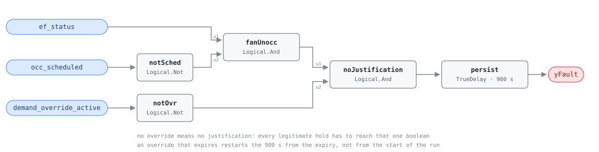

## Description

An exhaust fan running all night in an empty building. The fan's own kilowatts
are the small half of the bill: every cubic metre it throws away is replaced by
outdoor air pulled through whatever the envelope offers, and that air gets
conditioned — or it does not, and the building sits at negative pressure until
morning with the heating plant chasing infiltration it was never sized for.
That is why the reference calls a fan motor's waste heating-dominant. It is also
unusually common: PNNL's retuning survey puts exhaust-fan schedule problems in
roughly 35% of buildings, because exhaust fans are commissioned by a different
trade than the AHU, often sit on their own timeclock, and appear on no graphic.
The third term is where the engineering is — plenty of after-hours exhaust is
correct, so the rule only accuses a fan running with nothing claiming
responsibility for it.

## Detection Logic

```
yFault = ef_status
     AND NOT occ_scheduled
     AND NOT demand_override_active
     sustained continuously for alarm_delay
```

Block graph (`rule.cxf.jsonld`):



Five blocks, all boolean: no thresholds, nothing to retune but the delay.

Each conjunct blocks the fault by itself. An override that expires while the fan
keeps running starts the clock from the expiry, not from the start of the run.
The reverse edge is instant — `TrueDelay` delays only the rising edge, so a
matured finding drops on the tick the occupied period opens.

`persist` asserts at exactly `T + delayTime`, so the realized test is "running
unoccupied and unjustified for strictly more than `alarm_delay`" at tick
resolution, and an interruption discards the elapsed time rather than pausing
it. `delayOnInit = true` (CDL default `false`) makes a controller restarting at
02:00 into a running fan wait out the full 15 minutes.

Fifteen minutes is the reference's number and it is short for this library
(most rules hold for 30). The condition it guards is a discrete state rather
than a noisy analog signal, so the delay buys immunity to short legitimate runs
and to a status point that flickers at startup, and nothing else.

## Possible Diagnoses

The reference's four, in its order:

1. Schedule misconfiguration — the fan's schedule was never built, or is a copy
   of an occupied-hours-plus-buffer schedule nobody trimmed. Most common, $0
2. Override stuck in the BAS — a manual hold or a BACnet priority-array entry
   from a service call that nobody released
3. Fan relay stuck closed — the controller is commanding off and the fan runs
   anyway, the case that separates a proven `ef_status` from a command point
4. Interlock with the AHU not configured — the fan has no relationship to the
   air handler it belongs with, which is SYS-FC-057's subject

## Energy Impact

CRITICAL_WASTE, HIGH confidence, DIRECT_MEASUREMENT — the reference's profile.
`waste_kw = ef_rated_kw × (ef_speed/100)³ + conditioning penalty`: the cube law
on speed, plus the thermal cost of replacing what went out the roof. PNNL-25985
puts EEM-07 at 0.5-3% of site energy, modest per fan and additive because
buildings have many of them and roughly a third have the problem. Climate
sensitivity is heating-dominant: the fan does not care about the weather, the
makeup air does, and an unbalanced building in January pays for every cubic
metre twice — once to heat it and once in perimeter complaints next morning.

## Emissions Impact

Scope 2, DIRECT_EMISSIONS, HIGH confidence; the reference's range is 200-2,000
kg CO₂e/yr covering the fan plus the conditioning penalty. Avoided-emissions
basis MOER (marginal) — like the other after-hours faults this one runs
overnight when the marginal generator is dirtiest, so its emissions weight runs
ahead of its energy cost. The conditioning half is Scope 1 wherever the makeup
air is heated by a fuel-fired plant; the reference assigns the whole card Scope
2 and this transcribes that assignment rather than splitting it.

## Deviations

- **`occ_scheduled` replaces the reference's schedule-evaluation call.** The
  reference writes `NOT in_occupied_schedule(current_time, occ_schedule)`, a
  function over a calendar. The block graph has no clock, so the host evaluates
  the schedule and feeds the boolean, exactly as AHU-FC-052 does;
  `points/sys.points.json` records it as a derived point.
- **The point is named `occ_scheduled` here and `occ_schedule` in
  `points/ahu.points.json`.** One concept, two spellings across dictionaries.
  Cards bind by exact name within their own family so nothing breaks, but it is
  worth resolving library-wide.
- **`demand_override_active` is a bare BAS flag with no ontology behind it.**
  The dictionary entry carries `brick: null, s223: null` because Brick 1.4.4
  models no override status. The consequence lands in `preconditions` rather
  than in the graph: the rule treats "no override" as "no justification," and a
  site that has not wired every legitimate hold into that one boolean gets
  nightly false positives it will learn to ignore.
- **One delay, not two.** The reference lists a single tunable for this rule,
  `AlarmDelay = 15 min`, so there is one `TrueDelay` and no grace period. The
  sibling AHU-FC-052 has a `grace_period` because its own entry gives it one;
  none was invented here to match.
- **No thresholds, so the library's strict-comparison deviation does not apply.**
  Every input is a boolean and the graph contains no `Reals` block.
- **`delayOnInit = true`** (CDL default `false`), the library's standing choice:
  a controller restarting at 02:00 into a running fan waits out the full 15
  minutes rather than alarming on its first tick.
- **`TrueDelay` asserts at exactly `T + delayTime`,** so the realized test is
  "running unoccupied and unjustified for strictly more than `alarm_delay`" at
  tick resolution.
- **Overlaps SYS-FC-057 and neither rule suppresses the other.** A fan running
  unoccupied with its AHU off satisfies this rule and SYS-FC-057's condition 1
  at once; this one alarms at 900 s and that one at 2700 s. Both findings are
  true and they carry different fixes — turn the fan off after hours here,
  synchronize it with the AHU there — so `suppresses` stays empty both ways and
  CLU-08 groups them. Whether the cluster should promote one to trigger is a
  `clusters/clusters.json` question for whoever owns that file (CLU-08's trigger
  today is AHU-FC-052).
- **The rule sees run status, never speed or power.** `ef_speed` and
  `ef_rated_kw` in `runtime_estimation` are host-side; no such point is bound,
  and a VFD-driven fan idling at 20% trips this rule exactly as hard as one at
  full speed while wasting an eighth of the energy. Accumulation and ranking are
  the host's.
- Operating states and preconditions are declared in frontmatter for host
  enforcement rather than encoded in the block graph. There is no NO_EVAL logic
  in the graph: it computes the fault given valid data.

## Notes

Trend the fan's status against the AHU's for a week before touching anything.
Three patterns come out of that plot with different fixes: a fan running 24/7
has no schedule at all, a fan that stops hours after the AHU has a schedule
copied and never trimmed, and a fan starting at odd hours is following an
override or a local switch. Only the first two are $0.

Where the finding is a local timeclock or a wall switch outside the BAS, the fix
is not a schedule edit. The
[exhaust-fan-schedule-misalignment](../../../playbooks/exhaust-fan-schedule-misalignment.md)
playbook files that case under Step 2 "Remote fix," and it is not one — someone
has to stand at the panel. Bringing the fan under BAS control is a small capital
job, worth saying so in the work order rather than discovering it on site.
