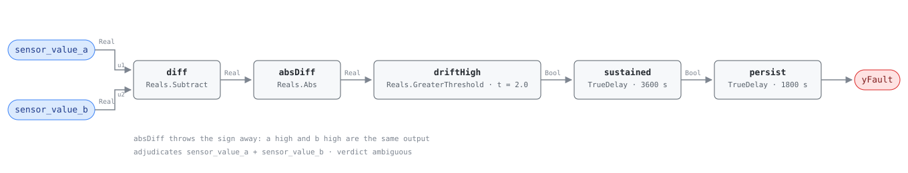

## Description

Two sensors that should be reading the same number are not. A single transmitter
has nothing to be checked against and every rule that reads one believes it; put
a second in the same air stream, or take a pair the physics already constrains,
and the disagreement is evidence no single-sensor rule can produce. The failure
it catches is drift — slow, monotone, never still enough for a flatline test and
never fast enough for a spike test, which is why it survives for years and why
the reference puts its prevalence at 15%. What it costs is rarely its own
energy: a biased outdoor-air sensor disables an economizer, a biased supply-air
sensor drags a reset schedule with it, and what shows up on the report is some
other rule firing for a reason that is not true.

**The `adjudicates` contract.** While `yFault` is active, both bound points are
unfit to be believed: the host must return NO_EVAL for every rule on the same
equipment instance that consumes either one, deriving that set from each card's
`points` list rather than from any list written here. The verdict is `ambiguous`
because `|a − b|` says the pair disagrees and cannot say which member is wrong.
`adjudicates` is card metadata; the block graph is unchanged and the engine
never sees it.

That an in-graph rule may judge data at all is the accepted design's argument:
"data quality is the host's" is about *delivery* — did a sample arrive, when,
and what the field bus said about it — while this rule is about *physical
plausibility*, computable from the signal, and a fault of a piece of equipment,
because a sensor is equipment. AHU-FC-062 and RTU-FC-052 already ship that
argument; this card is the same object with the equipment family taken out.

## Detection Logic

```
yFault = |sensor_value_a − sensor_value_b| > drift_threshold
         sustained continuously for drift_duration,
         then held a further alarm_delay
```

Block graph (`rule.cxf.jsonld`):



Five blocks and no gate. The sign discarded by `absDiff` is the rule's defining
property rather than an implementation detail: swap the two inputs and the
output is identical on every tick, which is `verdict: ambiguous` written as
arithmetic.

`driftHigh` is a strict `Reals.GreaterThreshold` — CDL `Reals` has no
`GreaterEqual` — so a pair sitting exactly `drift_threshold` apart reads
healthy. The threshold literal is in the bound points' units, because the graph
has none: bound to an ERV as `erv_oa_entering_temp` against `oat` (two
thermometers in the same outdoor air stream, both °C, no host derivation and no
mode gating), `2.0` means 2.0 K; bound to a pair of humidity transmitters the
same literal means two points of relative humidity, which is not the reference's
number. Retune at binding.

`sustained` and `persist` are the reference's two published delays chained
rather than added, so 90 minutes to alarm at the defaults. Both assert at
exactly `T + delayTime`, and continuous means continuous in both: a
reconvergence discards the elapsed time rather than pausing it. `delayOnInit =
true` on both (CDL default `false`) makes a pair already diverged at controller
restart wait out the full 90 minutes.

## Possible Diagnoses

The reference's four, in its order:

1. Sensor calibration drift — the intended target, fixed by the playbook's Step
   3 recalibration
2. Sensor wiring fault — a long run picking up an offset, a loose terminal, or a
   3-wire RTD lead-resistance error reading as a fixed bias
3. Sensor placement — the two are not in the same air stream after all (a spare
   outdoor sensor on a sunlit wall, a probe downstream of a leak, a pair split
   across a mixing plane), which is a binding correction, not a work order
4. Sensor failure — a transmitter drifting toward a rail, on its way to the
   flatline SYS-FC-100 will catch when it arrives

Every one of the four names a single sensor and this rule cannot say which of
the two it is; the playbook's Step 3.4 settles it by taking a reference
instrument to both members.

## Energy Impact

COMFORT_ENERGY, LOW confidence, QUALITATIVE_ONLY — the reference's profile.
There is no runtime waste term and this card does not invent one: a drifted
sensor spends nothing by drifting. `savings_range` is EEM-01's recalibration
figure, 0-5% of site energy *where the drift is causing downstream faults*, and
the conditional does the work — the amount belongs to the economizer or reset
rule being misled, not to this one. Confidence is LOW for a specific reason: the
rule is confident about the pair and silent about either member, and its
false-positive rate is governed by whether the binding is sound. Diagnosis 3 is
the standing false positive, and no threshold distinguishes it from real drift.

## Emissions Impact

Scope 1 or 2 depending on what the mis-measurement drives, QUALITATIVE_EMISSIONS,
LOW confidence, avoided-emissions basis N/A — the reference's assignment. The
ambiguity in `scope` is real: a drifted sensor biasing a boiler is Scope 1, the
same sensor biasing a chiller or economizer is Scope 2, and the sensor itself
emits nothing. The quantity is entirely cascade, which is why
`runtime_estimation` is empty.

## Deviations

- **First card in the library carrying `adjudicates`** (contract above). No rule
  list appears on this card and none should: a hand-written list is correct the
  day it is written and silently incomplete the first time someone authors a
  rule reading the same point. AHU-FC-062's hand-written thirteen-entry
  `suppresses` is the counter-example, and two of those thirteen do not exist
  yet.
- **The fan-out is larger than it looks.** Bound to an ERV as
  `erv_oa_entering_temp` / `oat`, the closure is ERV-FC-050 and ERV-FC-051 —
  every rule the ERV family currently has, so the unit goes dark on one finding.
  Whether a host should then go silent or report at reduced confidence is an
  open question for the library owner; what this card owes is an honest
  declaration of scope, which is both points.
- **`verdict: ambiguous` rather than picking a victim in prose.** The
  alternative was to declare `sensor_value_b` the reference (the reference's
  required-points table calls it that) and adjudicate only `sensor_value_a`.
  Nothing in the graph distinguishes the two inputs and `absDiff` guarantees
  identical output under a swap, so naming the members primary and reference is
  a binding convention, not a property this rule can exploit.
- **`sensor_value_a` / `sensor_value_b` are role points, the documented
  exception to the canonical-name convention.** The same graph deploys against
  many real points and the reference's own required-points table says "varies by
  application" in the units column. The cost is named rather than hidden: the
  host's instance configuration must record each binding — the same artifact
  `adjudicates` resolves against, so the design needs it either way.
- **`drift_threshold` ships as one number where the reference publishes two.**
  The reference's `2°C / 5%` is it acknowledging that the threshold is
  per-quantity; a CXF `S231:value` is one double. The shipped 2.0 is the
  temperature half, the same value AHU-FC-062 uses for `sensor_tolerance`, and
  the 5% alternative is documented in `params`. Precedent for an explicitly
  per-binding placeholder: VAV-FC-050's `ventilation_requirement`.
- **Two delays in series, not one.** The reference lists `drift_duration`
  (60 min) and `AlarmDelay` (30 min) as separate tunables for one condition, so
  both are kept and chained, the VFD-FC-050 shape. A single 5400 s delay behaves
  identically as shipped; the chain is what lets a site keep a 30-minute drift
  window and a two-hour alarm hold, or the reverse, without re-authoring.
- **No activity gate, deliberately.** SYS-FC-100 needs `equip_active` because a
  signal that is not moving on idle equipment is not evidence of anything; a
  bias test needs no such permission, since two thermometers in the same air
  disagree when one is wrong whether or not a fan runs. What this rule does need
  — that the pair is seeing the same quantity right now — is a per-binding claim
  about dampers and modes that no boolean expresses, so it is host-enforced
  preconditions, the call AHU-FC-062 made for its post-changeover exclusion.
- **No discrete blocks, so no startup artifact to mask.** `Subtract` and `Abs`
  are combinational, and so is `GreaterThreshold` at the shipped `h = 0` — it
  takes a state word only when hysteresis is enabled — so tick one compares two
  live readings and means it. `Discrete.UnitDelay`'s tick-one artifact and the
  ban on `Reals.Derivative` belong to SYS-FC-101; this card's only state is the
  two timers.
- **`TrueDelay` asserts at exactly `T + delayTime`,** verified against the engine
  at the pin rather than assumed: with `delayOnInit` the timer is zero on the
  first tick and accumulates `dt` from the second, so the realized test is
  "diverged for strictly more than `drift_duration + alarm_delay`".
- **Common-mode drift is invisible.** Two sensors from one calibration batch, on
  one supply voltage, with one wrong scaling constant drift together and the
  subtraction cancels it. The rules that could see it are SYS-FC-055 (a virtual
  sensor built from other points) and a fleet-comparison form that is not
  written.
- **Kept the reference's number instead of taking a new one.** A consecutive
  `SYS-FC-102` in the FC-100 family was offered; 054 won (decided 2026-08-17)
  because the reference's SYS-FC-054 *is* this rule, `clusters/clusters.json`
  already lists it in CLU-09, and `playbooks/sensor-drift.md` already names it
  twice. The cost is a sensor family of 054 plus 100/101 rather than three
  consecutive IDs.
- **`clusters: [CLU-09]` is a declaration, not an edit.** CLU-09 already carries
  SYS-FC-054 as a member. That CLU-09's *trigger* should arguably become one of
  the sensor rules, with AHU-FC-062 demoted to member, is a single-writer file
  and someone else's edit — flagged here, not made.
- **`suppresses: []`, and it must stay that way in both directions.** The
  NO_EVAL fan-out is `adjudicates`' job, derived per instance. The stronger
  constraint belongs to whoever writes the next card: a card carrying
  `adjudicates` MUST NOT appear in any other card's `suppresses`, because an
  equipment fault silencing the sensor rule that invalidates it is a cycle. The
  linter does not check this today.
- **`category: COMFORT_ENERGY` transcribed, not argued.** `PROTECTIVE` is
  arguably more honest for an adjudicating rule, whose delivered value is
  avoided false alarms and preserved diagnostic coverage rather than energy, but
  the reference says COMFORT_ENERGY and so do AHU-FC-062 and RTU-FC-052; a
  category convention for sensor faults is library-wide. Severity 3 likewise.
- Operating states and preconditions are declared in frontmatter for host
  enforcement rather than encoded in the block graph, per the library's design
  stance.

## Notes

Read the finding as a work order for two sensors, not one — Step 3.4 of the
[sensor-drift](../../../playbooks/sensor-drift.md) playbook says so, and it is
the only procedure two points justify. A technician sent to a guessed member has
a 50% chance of recalibrating a correct sensor against a drifted reference,
which makes the pair agree and the building wrong.

Rule out diagnosis 3 from a trend first, because it is free and it is the most
common false positive. Real drift opens slowly and does not close; a placement
mismatch opens and closes with the weather, the schedule, or the damper, and the
repair is a bracket rather than a calibration.

The family's three members answer different questions: SYS-FC-100 catches the
transmitter that has stopped moving, SYS-FC-101 the one that jumps further than
the process can, and this one the one that is quietly wrong. A sensor that trips
this rule and later trips SYS-FC-100 has finished failing.
