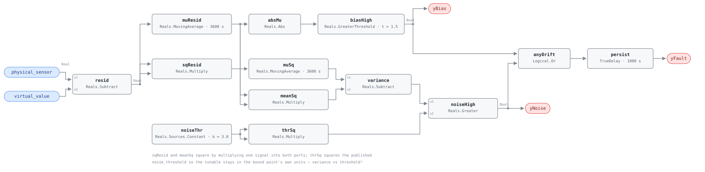

## Description

Give a sensor a second opinion built from every other point that correlates with
it, and the difference between the two is evidence about the sensor that the
sensor cannot supply about itself. That second opinion is the virtual sensor: a
Ridge regression the host fits over a learning period on three or more
correlated features, publishing a prediction of the accused point every tick.
Koo & Yoon (2022) report an RMSE of 0.30 °C for that kind of model on
temperature, and reliable detection of biases above about 1 °C — which is the
whole basis for putting a 1.5 °C band around the residual and believing what
crosses it.

The residual is where this card starts and stops. Everything upstream of it —
feature selection, the learning period, the fit, the retraining schedule — is
host work, and the graph never sees it; `virtual_value` arrives as an ordinary
derived point in the same way HP-FC-050 and VAV-FC-050 consume host-fitted
baselines. What the graph does is two statistics on one signal: the window mean
of the residual, which catches the slow monotone bias, and the window variance,
which catches the transmitter that has started jumping. Those are the reference's
diagnoses 1 and 2, and this card keeps them separable in the output rather than
merging them into an undifferentiated alarm.

It is the third member of the sensor family and the one with the most reach.
SYS-FC-054 needs a redundant partner in the same air stream and can only say
that one of two sensors is wrong. This rule needs no partner — a model built
from unrelated points stands in for one — and it names a single sensor, which is
why its `adjudicates.verdict` is `invalid_while_active` where SYS-FC-054's is
`ambiguous`. What it gives up for that is honesty about its own input: the model
is only as good as the sensors feeding it, which is diagnosis 4 and the caveat
that runs through this whole card.

## Detection Logic

```
residual = physical_sensor − virtual_value

yBias  = |MovingAverage(residual, window)| > bias_threshold
yNoise = MovingAverage(residual², window) − MovingAverage(residual, window)²
                                          > noise_threshold²
yFault = (yBias OR yNoise) held continuously for alarm_delay
```

Block graph (`rule.cxf.jsonld`):



Thirteen blocks, one subtraction and two branches off it. `resid` produces the
only quantity the rule works on; `muResid` averages it and `absMu` throws the
sign away, so a transmitter reading low is caught on the same schedule as one
reading high (`physical_sensor_reads_low`). The noise branch is the
computational identity `Var(r) = E[r²] − (E[r])²` built from blocks that exist:
`sqResid` squares the residual by feeding it into both ports of a
`Reals.Multiply`, `muSq` averages that, `meanSq` squares the mean the bias
branch already computed, and `variance` subtracts. `noiseThr` and `thrSq` do the
same trick to the threshold, which is why the published tunable stays in the
bound point's units — a technician retunes `noiseThr.k` to 2.0 °C and the graph
compares against 4.0, with no unit that has to be explained.

Both comparisons are strict, as the reference writes them. A steady residual of
exactly 1.5 reads healthy forever (`bias_exactly_at_the_threshold`), and so does
a square wave of amplitude exactly 3.0, whose variance is exactly 9.0
(`noise_exactly_at_the_threshold`). That second vector is what pins the squaring:
for a square wave amplitude equals standard deviation exactly, so the vector
amplitude and the published threshold are directly comparable numbers.

**The window is memory, and it cuts both ways.** `Reals.MovingAverage` is a
continuous-time integral mean, so the statistics migrate rather than jump. A 2.5
bias appearing after a clean hour takes 0.6 of a window — 1.5/2.5 — to drag the
mean across the band, so the branch trips 2160 s after the step and the alarm
1800 s after that (`calibration_bias_after_a_clean_window`, alarm at 7560 s). The
same arithmetic runs backwards after a repair: in
`residual_cleared_after_the_alarm` the sensor is recalibrated at 7200 s and the
alarm does not clear until 8580 s, because until then the window still holds the
biased hour. A host that expects the finding to disappear the moment the
technician closes the ticket will conclude the repair failed.

The block's warmup convention is the exception to that patience and is worth
knowing: until the window fills, `MovingAverage` divides by elapsed time rather
than by the window, so a bias already present when the controller starts is in
the mean within one tick. `bias_present_at_load` pins it — `yBias` at 60 s,
`yFault` at exactly 60 s + `alarm_delay`, which is also this card's explicit
crossing of the `TrueDelay` boundary. The disjunction has to be held
continuously: in `bias_reverses_before_the_alarm_matures` the branch trips at
60 s and drops at 900 s, the timer resets, and nothing is ever reported.

## Possible Diagnoses

The reference's four, in its order:

1. **Target sensor calibration drift (bias error).** The intended target, and the
   one `yBias` names. A transmitter reading a fixed amount high or low: nothing
   about it looks broken, which is why it survives for years
2. **Target sensor intermittent failure (noise increase).** The one `yNoise`
   names. The reading still averages correctly and has stopped being steady —
   a failing A/D channel, a loose terminal, or a sensing element on its way out
3. **Target sensor wiring degradation.** Presents either way depending on how it
   is failing: a corroded splice adds a bias, a marginal connection adds noise,
   and the same run of cable can do both across a week
4. **Correlated sensors have drifted (cross-check).** The residual is a
   difference, and this rule attributes all of it to the accused sensor because
   that is the only point it was pointed at. If one of the model's input sensors
   drifted instead, the prediction moves and the residual appears with the
   accused transmitter in perfect health. `virtual_model_drifts_instead` pins
   that: every output tick is identical to the scenario where the physical
   sensor was the faulty one

Read the fourth against `adjudicates.verdict: invalid_while_active`. The verdict
is a strong claim — treat this point as unfit for every rule that consumes it —
and diagnosis 4 is the residual ambiguity the host has to weigh before acting on
it. The cheap discriminator is the family: run SYS-FC-054, SYS-FC-100 and
SYS-FC-101 on the model's *input* sensors, and a clean bill from all three on
the features is what turns this rule's finding from a suspicion into an
accusation. The expensive discriminator is a reference instrument, which is
where the playbook ends up anyway.

## Energy Impact

COMFORT_ENERGY, LOW confidence, QUALITATIVE_ONLY — the reference's own profile
for this card, transcribed. There is no runtime waste term and this card does
not invent one: a drifted sensor spends nothing by drifting. The cost is entirely
cascade, through EEM-01 (sensor recalibration) and the downstream faults a
believed-but-wrong reading causes or hides, and it is accounted for by the rules
this one adjudicates.

Confidence is LOW for a reason that is structural rather than a hedge. The
statistic is sound and the detection floor is published — Koo & Yoon put it near
1 °C of bias against a 0.30 °C model RMSE — but the whole verdict rests on the
model, and the model rests on other sensors and on a learning period nobody in
the graph can audit. Diagnosis 4 is a standing false positive with no in-rule
remedy, a model fitted on a drifted sensor is a standing false negative, and a
model extrapolating outside its training envelope produces both.

## Emissions Impact

Scope 1 or 2 depending on what the mis-measurement ends up driving,
QUALITATIVE_EMISSIONS, LOW confidence, avoided-emissions basis N/A — the
reference's assignment, and the ambiguity in `scope` is real. A drifted sensor
biasing a boiler is Scope 1; the same sensor biasing a chiller or an economizer
is Scope 2; the sensor itself emits nothing. The quantity is entirely cascade,
which is the same reason `runtime_estimation` is empty.

## Deviations

- **The Ridge regression is host-side and never enters the graph.** The
  reference's required points are "physical_sensor, 3+ correlated input
  features", and its equation begins
  `virtual_value = regression_model.predict(correlated_features)`. None of that
  is expressible in CDL elementary blocks, and none of it should be: model
  training and inference are host work, the prediction arrives as the derived
  role point `virtual_value` (see its entry in `points/sys.points.json`), and the
  graph computes only the residual statistics. The library already consumes
  host-fitted baselines this way in HP-FC-050 and VAV-FC-050. The consequence is
  that the correlated features are invisible here — the rule binds two points
  where the reference names four or more, and diagnosis 4 is invisible to it for
  exactly that reason.
- **`rolling_std` → variance against the squared threshold.** The engine has no
  standard-deviation or variance block, but `Var(r) = E[r²] − (E[r])²` is
  buildable from two `MovingAverage` instances, two `Reals.Multiply` and a
  `Reals.Subtract`, and `variance > threshold²` is equivalent to
  `std > threshold` for non-negative quantities. The alternative was to publish
  `noise_threshold_sq = 9.0` and skip two blocks; it was rejected because the
  reference publishes 3.0 °C and a card whose tunable is in degrees-squared is
  hostile to whoever has to retune it on site. So `noiseThr` carries the
  published number, `thrSq` squares it in-graph, and `params.noise_threshold`
  stays in natural units. (Sibling note, not an edit: AHU-FC-056 states that
  "squaring inside a moving average is not expressible" in this block set and
  substitutes mean absolute deviation instead. This card shows the variance form
  is expressible; the two cards should be reconciled by whoever owns AHU-FC-056,
  and the MAD substitution there is defensible on its own terms because its
  ratio test is scale-invariant.)
- **The absolute value on the bias branch is an addition.** The reference writes
  `rolling_mean(residual, window) > bias_threshold` with no `| |`, which as
  written detects only sensors reading *high* — a transmitter drifting 3 K low
  produces a mean of −3 and passes. `absMu` fixes that, matching the treatment
  the reference itself gives its paired-sensor rule SYS-FC-054
  (`|sensor_a − sensor_b|`). `physical_sensor_reads_low` pins the consequence:
  the low-reading sensor is caught on the same schedule as the high one, and the
  finding does not name the direction — the trend does.
- **`window` and `alarm_delay` are library-chosen, because the source publishes
  neither.** The reference's tunables line for this card is truncated in the
  source pdf — it reads "bias_threshold = 1.5°C, noise_threshold = 3.0°C," and
  ends on that comma — so both timing numbers are this library's. `window` is
  3600 s: long enough that a process transient averages out, short enough that a
  drifted sensor is named inside a shift, and it matches the 60 min
  `drift_duration` the reference publishes for SYS-FC-054, which is the same
  question asked with two sensors instead of a model. `alarm_delay` is 1800 s,
  which is SYS-FC-054's published `AlarmDelay`. Both are defaults rather than
  findings, and a site with a slower trend interval should raise `window` before
  it does anything else.
- **`Reals.MovingAverage`'s 64-checkpoint ring sets a minimum tick interval.**
  The block stores one checkpoint per tick and drops the oldest in-window
  checkpoint (with a one-time warning) beyond 64, so the tick interval must be at
  least `window/63` — 57.1 s at the shipped window. The vectors step at 60 s,
  which clears it with 61 checkpoints in the window. A host ticking every 30 s
  gets a silently truncated window: the rule still detects, against half the
  history the card claims. AHU-FC-056 hit the same floor and documented it the
  same way; `window` therefore binds *both* MovingAverage instances and hosts
  must move them together.
- **The block divides by elapsed time until its window fills, so there is no
  window-fill gate in the graph.** A residual present at load is in the mean
  within one tick, which is why `bias_present_at_load` alarms at 1860 s rather
  than after an hour of warmup. That is the honest behaviour of a statistic
  computed over the data available, not an artifact — but it is computed over
  less data, and `preconditions` recommends the host report NO_EVAL for the
  first `window` after a restart, the same call AHU-FC-056 makes for its own
  warmup. Unlike AHU-FC-056, this rule has no ratio test, so a short window
  cannot manufacture a fault out of a warmup artifact; it can only be noisier.
- **`adjudicates: {points: [physical_sensor], verdict: invalid_while_active}`.**
  The verdict is `invalid_while_active` rather than `ambiguous` because the rule
  names one sensor: unlike SYS-FC-054, whose two inputs are interchangeable under
  `Abs`, this rule's two inputs are not symmetric — one is a measurement and the
  other is a computation. `virtual_value` is consumed and deliberately **not**
  adjudicated: it is not a sensor, nothing downstream consumes it, and its health
  is a model question that the reference gives its own rule (META-FC-050). The
  fan-out is not enumerated on this card by design; the host computes it as the
  rules on this equipment instance whose `points` intersect
  `adjudicates.points`, so it stays complete as rules are added. Per the design
  doc §2.3 this card must not appear in any other card's `suppresses`.
- **Two extra boundary outputs, and they are sub-conditions rather than
  evaluability signals.** `yBias` and `yNoise` exist because the reference's
  diagnoses 1 and 2 are different failures with different repairs and the `Or`
  destroys the distinction. They are read *with* `yFault`, never instead of it:
  both are undelayed, so either can flicker during a transient without the alarm
  moving, and a false `yBias` never means NO_EVAL — that is what SYS-FC-100's
  `yWindowOk` is for, and this rule has no equivalent because its evaluability
  question (is the model still fit?) lives outside the graph entirely.
- **Role points, and the thresholds are in the bound point's units.** Same
  documented exception as SYS-FC-054 and SYS-FC-100 (SCHEMA.md points contract):
  one graph deploys against many real points, so the boundary inputs are role
  names and the host's instance configuration records each binding. Both
  published thresholds are the reference's temperature numbers; a humidity or
  pressure binding that leaves them at 1.5 and 3.0 is comparing against a band
  nobody chose.
- **Both comparisons are strict, matching the reference's own operators.** The
  library's standing `>=` → `>` deviation does not apply — the reference writes
  `>` on both branches. The boundary vectors exist anyway because 1.5 and 3.0
  are exactly where a retuned site will sit.
- **`persist.delayOnInit = true`** (the CDL default is `false`), the library's
  standing choice: a residual already outside the band when the controller
  restarts waits out the full 30 minutes rather than alarming on the first tick.
- **`TrueDelay` asserts at exactly `T + delayTime`,** so the realized test is
  "either branch held for strictly more than `alarm_delay`" at tick resolution.
  `bias_present_at_load` pins both sides of that edge with the branch flag
  visible: `yBias` rises at 60 s, `yFault` is still false at 1800 s and asserts
  at 1860 s.
- **`clusters: [CLU-09]` is a declaration, not an edit.** CLU-09 (Sensor
  Integrity Failure) already lists SYS-FC-055 as a member with SYS-FC-054 as its
  trigger, and `playbooks/sensor-drift.md` already names this rule twice — once
  in its Applies-To row and once in step 1.2, which tells the technician to read
  this rule's bias output before touching anything. Both files were written
  before this card and neither needs an edit for it.
- **`category: COMFORT_ENERGY` transcribed, not argued.** SYS-FC-100 departs to
  `PROTECTIVE` on the grounds that a sensor gate delivers avoided false alarms
  rather than energy, and the argument applies word for word here. It is not
  taken, for the same reason SYS-FC-054 did not take it: the reference publishes
  a profile for *this* card and it says COMFORT_ENERGY. The family is now split
  between the two labels — 054 and 055 transcribe, 100 and 101 depart — and
  making that consistent is a library-wide call rather than this card's. Severity
  3 and `method: statistical` are likewise the chapter card's.
- **The reference publishes no test vectors for this card,** so all fourteen
  scenarios in `vectors.json` are authored, following the design doc §4.4's
  strategy: the clean pair, a residual inside the band, a process both signals
  track, bias-only and noise-only faults each with the other branch pinned down,
  both threshold edges from both sides, the delay edge from both sides, the
  reversal that resets the timer, the recovery lag, the sign symmetry, and the
  diagnosis-4 ambiguity.
- Operating states and preconditions are declared in frontmatter for host
  enforcement rather than encoded in the block graph, per the library's design
  stance.

## Notes

Reference note, transcribed: "Koo & Yoon (2022): virtual sensor RMSE of 0.30 °C,
bias > 1 °C reliably".

Read `yBias` and `yNoise` before dispatching, because they change the work order.
A bias finding is a calibration: the transmitter is fine, its zero is not, and
the fix is a reference instrument and a trim. A noise finding is rarely a
calibration at all — it is a connection, a channel, or an element that has begun
to fail — and recalibrating it wastes a visit. A sensor showing both is usually
the second one, on its way to the flatline SYS-FC-100 will catch when it
arrives.

Check the model's inputs before believing the model. Diagnosis 4 is the standing
false positive of this whole approach, and it costs nothing to rule out from a
desk: pull the same family's rules on the correlated features, and look at
whether the residual appeared at the same time as a change in one of them. A
residual that starts the day a chiller was rebalanced or an air handler
changed sequence is a model that has gone stale, not a sensor that has drifted,
and META-FC-050 is the rule that says so.

Retraining resets what this rule can see, and that is worth building into the
maintenance procedure rather than discovering later. A model refitted while the
accused sensor is drifting learns the drift as truth and the residual returns to
zero — the finding disappears, nothing was repaired, and the sensor is now
invisible to the rule permanently. Retrain after the calibration, never before,
and treat a fault that cleared without a work order as a retraining event to be
explained.

The other members of the family answer different questions about the same
transmitter and are worth reading together: SYS-FC-100 catches the sensor that
has stopped moving, SYS-FC-101 the one that jumps further than the process can,
SYS-FC-054 the one that disagrees with a partner in the same air stream, and this
one the one that disagrees with everything else in the building at once. The
[sensor-drift](../../../playbooks/sensor-drift.md) playbook covers the
verification and service workflow for all four.
