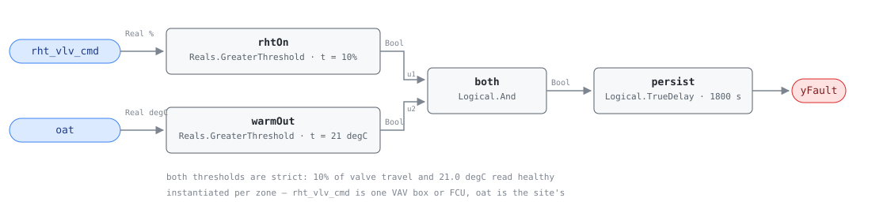

## Description

A reheat coil is heating a zone while it is 26 degC outside. Nothing about the
building needs that heat, and whatever the coil delivers the plant paid to cool
the air first — simultaneous heating and cooling seen from the zone end, which
PNNL found in about a fifth of the buildings it retuned. The usual cause is the
absence of a control decision rather than the failure of one: most zone
sequences call for reheat any time the space falls under its heating setpoint
and nothing in that logic knows what the weather is doing, so a zone under an
overcooled supply duct in July asks for heat all afternoon and gets it. The fix
is a line of programming — lock the reheat valve out above an outdoor air
temperature — which is why one instance usually means the whole zone family is
affected. Instantiated per zone: `rht_vlv_cmd` is one box's valve.

## Detection Logic

```
yFault = rht_vlv_cmd > reheat_active_threshold
     AND oat > zone_heating_lockout_temp
     sustained continuously for alarm_delay
```

Block graph (`rule.cxf.jsonld`):



Four blocks, and either conjunct blocks the fault on its own.

Both comparisons are strict, which is what the reference writes (`>` in both
terms) rather than a reinterpretation of it, so a valve reported at exactly
10.0% and an outdoor air temperature of exactly 21.0 degC each fail their term.
Those exact values matter more than usual here, because 10% and 21 degC are
round numbers a retuned site will park on deliberately.

`persist` starts on the crossing, not at midnight, so a zone already reheating
when the weather crosses the lockout alarms 30 minutes after the crossing.
Sustained means continuous — a ten-minute dip below the lockout discards the
elapsed time rather than pausing it — and the fault clears on the tick the valve
shuts, because `TrueDelay` delays the rising edge only. It asserts at exactly
`T + delayTime`, and `delayOnInit = true` (CDL default `false`) makes a zone
already reheating at controller restart wait out the full 30 minutes.

## Possible Diagnoses

The reference's four, in its order:

1. **Zone heating lockout not programmed by OAT** — the sequence has no weather
   term at all. The common case, the cheap fix, and why findings arrive in batches
2. **Reheat valve stuck open** — mechanical, and distinguishable from the trend:
   a stuck valve reads the same command all day and ignores a commanded close
3. **Zone controller demanding heat due to sensor error** — a zone temperature
   sensor reading low makes the box genuinely believe the space is cold, and
   every part of the control chain then behaves correctly
4. **Perimeter heating operating independently of BAS** — baseboard or radiant
   perimeter on its own thermostat or reset curve, which the BAS neither
   commands nor sees

## Energy Impact

CRITICAL_WASTE, HIGH confidence, DIRECT_MEASUREMENT — the reference's profile.
The waste term needs no counterfactual: `waste_kw = rht_vlv_cmd/100 ×
vav_rht_capacity_kw` for every hour the condition holds, all of it pure loss
because the heat is applied to air the plant just paid to cool. The reference
puts it at 100% of reheat energy while active and up to 20% of the zone's annual
energy, at ~20% prevalence across the PNNL 151-building study. Cooling-dominant
by climate, but the multiplier is what matters: the defect is nearly always
systemic, so the site number is the per-zone number times the count of zones
sharing the sequence.

## Emissions Impact

Scope 1, DIRECT_EMISSIONS, HIGH confidence; the reference gives 500-4,000 kg
CO₂e/yr for reheat waste during warm weather, on a static Scope 1 factor. That
assumes hot-water reheat from a gas-fired boiler, the common case. Electric
reheat, or hot water from a heat pump or district loop, moves the same kilowatts
into Scope 2 — the quantity is unchanged and the inventory line is not, so hosts
should follow the actual heating source (the same caveat VAV-FC-055 carries).

## Deviations

- **`lockout_check_duration` and `AlarmDelay` are treated as one knob.** The
  reference's equation ends "sustained for `lockout_check_duration`" but its
  tunables table publishes three parameters, none named that, including
  `AlarmDelay = 30 min`. Both names describe how long the condition must hold
  and only one has a published number, so the graph carries a single `TrueDelay`
  at 30 minutes. This is the opposite call from VAV-FC-055 and SYS-FC-054, which
  chain two timers because their references publish two numbers; inventing a
  second here would put an unsupported duration in the card.
- **Both comparisons are strict, matching the reference's own operators,** so
  the library's standing `>=` → `>` deviation does not apply on this card.
- **Filed under SYS, instantiated per VAV or FCU zone.** The reference's header
  reads `Equipment: VAV, FCU` while the ID is `SYS-FC-056` — a tension in the
  source, not in this card. Deployment is one instance per zone with a host-side
  rollup, and `rht_vlv_cmd` and `oat` are duplicated into
  `points/sys.points.json` with matched groundings, because lint resolves a
  card's points against its own family dictionary.
- **No cross-zone aggregation in the graph, and the count is where the real
  diagnosis lives.** One zone reheating in summer is a zone problem; half the
  zones on an air handler is a supply-air-temperature problem, and the
  [vav-min-flow-reheat](../../../playbooks/vav-min-flow-reheat.md) playbook's
  step 1.4 turns that ratio into the discriminator. The graph cannot express a
  variable-width zone vector, so the rollup is the host's.
- **Overlaps VAV-FC-055 deliberately, and the two ask different questions.**
  VAV-FC-055 is reheat *at minimum flow* during the cooling season: three terms,
  an 18 degC season threshold, and a damper term that separates waste from a
  zone answering a genuine load. This card has no damper term and a 21 degC
  threshold, so it fires on a zone that is genuinely cold and genuinely being
  heated — because above 21 degC outdoors the reference's claim is that no zone
  should be heating at all. A box tripping this one alone is reheating with its
  damper open, which points at diagnosis 3 or an overcooled supply duct. Both
  are CLU-05 members with VAV-FC-055 as trigger, so the cluster encodes the fix
  order.
- **No occupancy gate, no mode gate, no supply-fan gate.** The reference
  specifies none, and adding one would change the fault: unoccupied reheat above
  21 degC outdoors is a worse instance of it, not an exception. The one
  defensible gate — a reheat coil downstream of a dehumidification coil, where
  warm-weather reheat is design intent — is a binding decision, so it lives in
  `preconditions`.
- **`oat` drift is the standing false positive and this card does not solve
  it.** A sun-baked or drifted outdoor sensor reading 3 K high manufactures the
  fault across every zone at once, which is also the tell. SYS-FC-054,
  SYS-FC-100 and SYS-FC-101 adjudicate `oat` directly; where a host runs them,
  an active sensor finding on the bound `oat` makes this rule NO_EVAL through
  the `adjudicates` fan-out.
- **`clusters: [CLU-05]` is a declaration, not an edit.** CLU-05 already lists
  SYS-FC-056 as a member with VAV-FC-055 as trigger.
  `playbooks/vav-min-flow-reheat.md` already names SYS-FC-056 in its step 2.3
  text but not in its Applies-To row; adding the ID there is the playbook
  owner's edit, flagged rather than made.
- **The reference's Notes block is truncated mid-sentence in the source
  document** — "Found in ~20% of buildings. In perimeter zones this is
  especially" — and is quoted below as far as the source runs. The perimeter-zone
  claim is not recoverable from the chapter text and has not been reconstructed.
- Severity 3, `method: rule`, phase 2 and the whole impact profile are the
  chapter card's, matching the provisional row in `faults/sys/README.md`; the
  reference's §5.8.1 index carries no severity column, so the chapter card
  governs.
- Operating states and preconditions are declared in frontmatter for host
  enforcement rather than encoded in the block graph, per the library's design
  stance.

## Notes

Reference note, quoted as far as the source runs: "Found in ~20% of buildings.
In perimeter zones this is especially".

Count the zones before dispatching anyone. This fault is systemic far more often
than mechanical: diagnosis 1 is a missing line of sequence logic nobody wrote for
any box, so the normal shape is dozens of zones alarming on the same warm
afternoon and clearing together when one lockout is programmed. A single zone
alarming while its neighbours stay quiet points at diagnoses 2, 3 and 4.

The remote fix is the [vav-min-flow-reheat](../../../playbooks/vav-min-flow-reheat.md)
playbook's step 2.3: a summer reheat lockout above an outdoor air temperature,
applied in batch, at no cost. Set it at the reference's 21 degC before arguing
about the number — lower and the site fights genuine morning heating loads in
the shoulder seasons, higher and it pays the difference in reheat.

Check the outdoor air sensor first, and check it once rather than per zone. It
is the single input every instance shares, a 3 K error moves every finding at
the site together, and verifying it against a hand-held reference takes ten
minutes.
