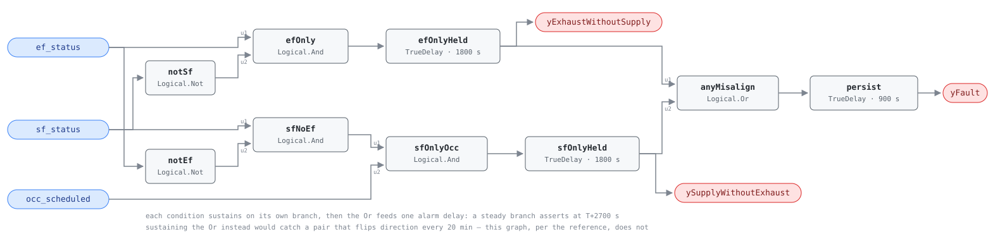

## Description

Exhaust and supply are supposed to move together. When they do not, the building
stops being a balanced system and becomes a pump: exhaust without supply pulls
the floor negative and drags unconditioned air in through every door and window
frame, and supply without exhaust pushes it positive and leaves the spaces that
need extraction sharing their air with everyone else. Neither shows up on a
temperature trend; both show up as draughty entrances, doors that will not
latch, and a heating bill nobody can explain. The reference gives it ~35%
prevalence, one of the highest numbers in the document, and the cause is
organisational: exhaust fans are installed by a different trade, commissioned at
a different time, and often run from a local timeclock no BAS point touches. The
rule is deliberately two-sided and the sides are not symmetric — exhaust running
with the supply fan off is a fault at any hour, while supply running with the
exhaust off is a fault only during occupied hours, because an AHU cycling
overnight for setback with the toilet exhaust properly shut down is correct.

## Detection Logic

```
C1 = ef_status AND NOT sf_status                        sustained misalignment_duration
C2 = sf_status AND NOT ef_status AND occ_scheduled      sustained misalignment_duration

yFault = (C1 held OR C2 held) sustained a further alarm_delay
```

Block graph (`rule.cxf.jsonld`):



Nine blocks in two branches and a join, each branch carrying its own
`misalignment_duration` sustain before the shared `persist`.

**Timing.** The two delays are chained, not summed, and chained `TrueDelay`s on
one steady signal add exactly: a misalignment that starts at T asserts its
direction flag at T + 1800 s and `yFault` at T + 2700 s — 45 minutes at the
shipped defaults, which is what the reference's two published tunables come to
when both are kept. Each stage asserts at exactly `T + delayTime`, so every
realized test is "strictly more than" its delay at tick resolution, and
`delayOnInit = true` on all three (CDL default `false`) makes a restart into an
already-misaligned pair wait out the full 45 minutes.

**Per-condition sustain is not the same rule as sustaining the `Or`.** A pair
misaligned on every tick of a two-hour run that flips direction every twenty
minutes matures neither branch and is never reported; under a single
`TrueDelay(1800)` on the `Or` it would alarm at 2700 s. The reference's wording —
each condition "sustained for duration" — picks the first reading, and that is
what ships.

**The two direction flags are diagnostic, not evaluability flags.** Both are
false when the rule is healthy, and whichever is true alongside `yFault` says
which way the building is being pushed. They mature 900 s before `yFault`, so a
host wanting an early warning has one. Unlike the `y…Ok` outputs elsewhere in
this library, false does not mean NO_EVAL.

## Possible Diagnoses

The reference's five, in its order:

1. Exhaust fan schedule not synchronized with the AHU — the ordinary case, a $0
   BAS edit
2. Exhaust fan on an independent timer or switch — not on the BAS at all, so the
   finding is real and the remote fix will not work (see Notes)
3. Exhaust fan override left active — a manual hold from a service call
4. BAS programming error — the interlock was written and is wrong: inverted
   logic, wrong AHU referenced, or a start/stop pair missing the exhaust side
5. Exhaust fan VFD fault keeping the fan running — the drive lost its command
   and runs on a local reference or fault-state default

Read the direction flags against that list: `yExhaustWithoutSupply` points at 2,
3 and 5, `ySupplyWithoutExhaust` at 1 and 4.

## Energy Impact

CRITICAL_WASTE, HIGH confidence, DIRECT_MEASUREMENT — the reference's profile.
The fan term is direct: `waste_kw = ef_rated_kw × (ef_speed/100)³` for every
hour the exhaust runs alone. The pressurization term is the larger and looser
one, which the reference puts at 1-3% of site energy: infiltration through an
unbalanced envelope, conditioned in whichever direction the season demands,
which is why climate sensitivity is "both" rather than heating-dominant like
SYS-FC-053. The supply-without-exhaust half wastes little fan energy and is
mostly a ventilation-compliance and comfort finding; it shares the card and the
severity because the reference put it there and the fix is the same work order.

## Emissions Impact

Scope 2, DIRECT_EMISSIONS, HIGH confidence; the reference's range is 200-2,000
kg CO₂e/yr for the fan plus the pressurization penalty. Avoided-emissions basis
MOER (marginal). Where the infiltration penalty is met by a fuel-fired heating
plant the honest scope is 1 + 2; the reference assigns the card Scope 2 and this
transcribes that assignment rather than splitting it.

## Deviations

- **Two delays in series, not one.** The reference lists `misalignment_duration`
  (30 min) and a separate `AlarmDelay` (15 min) for one rule and does not say how
  they compose. Both are kept and chained — the SYS-FC-054 and VFD-FC-050 shape
  — so a steady single-branch misalignment alarms at T + 2700 s. A single 2700 s
  delay behaves identically as shipped; the chain is what lets a site keep a
  30-minute misalignment window and a two-hour alarm hold, or the reverse.
- **`misalignment_duration` binds two CXF paths.** One card parameter, one delay
  per branch, and SCHEMA.md's list form for `params.*.cxf` requires hosts to set
  both together. Retuning one branch alone would make the rule quietly
  asymmetric in a way the reference never describes.
- **Per-condition sustain, so continuous misalignment that alternates direction
  is not caught.** This follows the reference's wording and is a real blind spot
  rather than an implementation artifact; a fan pair oscillating that way is a
  controls problem the reference has no rule for.
- **Two extra boundary outputs, and they are not the library's usual `y…Ok`
  evaluability flags.** SCHEMA.md allows additional outputs for sub-condition
  flags and these are that: both are false in the healthy case and true means the
  named condition has matured. Hosts that treat every non-`yFault` output as an
  evaluability gate will get this exactly backwards.
- **`occ_scheduled` replaces the reference's `occ_schedule` schedule object.**
  The block graph has no clock or calendar, so the host evaluates the schedule
  and feeds the boolean, as AHU-FC-052 does. The same concept is spelled
  `occ_schedule` in `points/ahu.points.json` — one concept, two dictionary names,
  worth resolving library-wide.
- **The asymmetry between the two conditions is the reference's, transcribed.**
  Condition 1 has no occupancy qualifier and condition 2 does, so exhaust running
  with the supply fan off is a fault at 03:00 while the mirror case is not. The
  engineering reason is in the Description; the authority is the reference.
- **No override input, unlike SYS-FC-053.** That card carries
  `demand_override_active` because its reference entry names the point; this one
  does not, so a legitimate scheduled night purge trips condition 1. Adding an
  override conjunct would be an invention, so the exclusion lives in
  `preconditions` — exclude those fans at binding.
- **No thresholds, so the library's strict-comparison deviation does not apply.**
  Every input is a boolean and the graph contains no `Reals` block.
- **The reference's four published test vectors are scenarios 1-4 of
  `vectors.json`,** transcribed with its own column values; the rest are
  authored.
- **Overlaps SYS-FC-053 and neither rule suppresses the other.** An exhaust fan
  running unoccupied with its AHU off satisfies SYS-FC-053 at 900 s and this
  rule's condition 1 at 2700 s. Both are true and their fixes differ, so
  `suppresses` stays empty in both directions; CLU-08 groups them.
- **The rule sees run status, never speed or power.** `ef_rated_kw` and
  `ef_speed` in `runtime_estimation` are host-side, and the pressurization term
  is not computable from these three booleans at all. Accumulation is the host's.
- Operating states and preconditions are declared in frontmatter for host
  enforcement rather than encoded in the block graph. There is no NO_EVAL logic
  in the graph: it computes the fault given valid data.

## Notes

Establish first whether the BAS can actually stop this fan, because diagnosis 2
changes what the work order costs. The cheapest test is to command it off and
watch `ef_status`. A fan on a local timeclock or a janitor's wall switch does not
answer, and the
[exhaust-fan-schedule-misalignment](../../../playbooks/exhaust-fan-schedule-misalignment.md)
playbook files reprogramming that timer under Step 2 "Remote fix" — which it is
not. Its own better answer is in the same step: an interlock relay that makes the
exhaust follow supply status, a small capital job worth naming in the work order.

Where this rule and SYS-FC-053 both fire on the same fan they are one problem
with two views — SYS-FC-053 says the fan runs when the building is empty, this
one says it runs when its air handler is not — and fixing the interlock usually
clears both, which is what CLU-08 expresses.

Building pressure is the confirmation measurement and hardly anyone has the
sensor. If the site has one, an unbalanced pair shows up as a sustained offset
tracking the misalignment window exactly. If not, the door test costs nothing: a
lobby door that pulls hard against you at 07:00 and swings freely at noon is the
same finding in physical form.
