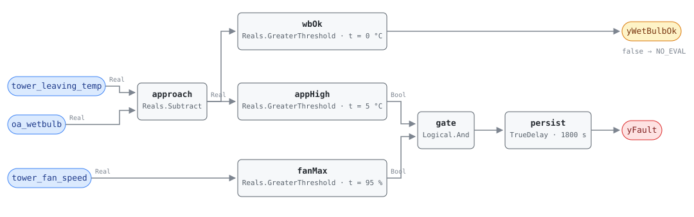

## Description

A cooling tower pushes its leaving water down toward the ambient wet-bulb, and
how close it gets — the approach — measures whether the fill, the water
distribution and the airflow still do what they were bought to do. Scale,
clogged spray nozzles, blocked air inlets and recirculated discharge air all
read the same way: more air needed than before for the same water. A
variable-speed fan hides every bit of that. At part load the drive backs off and
approach rides wherever the control loop is satisfied, so a large approach
usually means a lightly loaded tower rather than a dirty one. This rule asks the
question only when the fan has nothing left to give: approach above the band
**while the fan is at capacity** is the tower failing to deliver, and the
chiller pays for it.

## Detection Logic

```
approach = tower_leaving_temp − oa_wetbulb

yWetBulbOk = approach > 0                            (false ⇒ host reports NO_EVAL)
yFault     = approach > approach_high_band
             AND tower_fan_speed > fan_capacity_threshold,
             sustained continuously for alarm_delay
```

Block graph (`rule.cxf.jsonld`):



The fan conjunct is not a data-quality gate but the rule's premise: the study
behind this card measured healthy approach spanning 1.6–13.3 K across four
climates on nothing but fan modulation (`tools/simharness` README, "Tower
groundwork"). An ungated threshold inside that span alarms on healthy towers in
half the fleet, and one above it never fires anywhere. Both conjuncts compare
strictly, so a tower exactly on the band, or a drive exactly at 95%, reads
healthy.

`wbOk` tests the sign of the same difference: a tower cannot make water colder
than the wet-bulb, so a non-positive approach means the psychrometric derivation
or a water sensor is wrong and the silence underneath is NO_EVAL. It is a
boundary output only — it cannot change `yFault`, since a non-positive approach
already fails the high test.

`persist` requires 30 continuous minutes and carries `delayOnInit = true`; its
falling edge is immediate, and fans backing off at the end of the day is the
ordinary way this alarm clears with nothing fixed.

## Possible Diagnoses

1. Scale or biological fouling on the fill — the classic cause, and the one the
   O&M guides name first; usually accompanied by a water-treatment record that
   stopped being kept
2. Clogged or broken spray nozzles, or a distribution basin flooding to one
   side — the fill only works where the water actually falls
3. Air-side blockage: plugged inlet louvers, collapsed drift eliminators, debris
   screens, or a new structure that has put the tower into its own discharge
4. Fan or drive not delivering the airflow the command implies — slipping belt,
   worn gearbox, blade pitch drifted, or a motor running backwards after service
5. Condenser water flow above design, which raises approach as it lowers range
   (TOWER-0002 reads the other half of that pair, and flow is the first thing
   to check when both fire)
6. A tower now undersized for the load on it — added chiller capacity, a
   changed process, or a derate the selection never carried
7. Control chasing an unreachable condenser-water setpoint, which pins the fans
   at capacity on a perfectly clean tower (playbook step 2.2 — the fix is the
   setpoint, not the tower)
8. A wet-bulb derivation reading low, which inflates approach with no physical
   change at all; `yWetBulbOk` only catches the opposite error

## Energy Impact

EFFICIENCY_LOSS, LOW confidence, PROXY_ESTIMATION. The fan is already at
capacity, so the fault costs nothing extra on the tower side — the whole bill is
the chiller's, which sees warmer condenser water and lifts against it at roughly
2–4% more power per K (BEE 2006; the DOE/PNNL O&M guides' chiller chapter gives
1.2–1.7%/°F split by compressor type). A tower 3 K off its commissioned approach
therefore costs something like 6–12% of chiller power for as long as it stays at
capacity, which is the hottest and most expensive hours of the year. Confidence
is LOW for the same reason the band is a placeholder: the sensitivity ratio is
well corroborated, but nothing in the literature says how much approach rise a
given degree of fouling produces, so the trigger point of the estimate is a
commissioning number rather than a published one.

## Emissions Impact

Scope 2, PROXY_EMISSIONS, LOW confidence. All of it is chiller electricity, so
the basis is the marginal operating emissions rate, and the fault concentrates
in exactly the hours a summer-peaking grid is dirtiest — the avoided emissions
are worth more than the annual-average kWh figure implies. No published emissions
range exists for tower degradation; the estimate is the host's chiller kW times
its own factors.

## Deviations

- **The band is a commissioning placeholder and its fault-side corroboration is
  pending.** Three sources were read for a degraded-approach magnitude — BEE
  2006, PNNL-13890, and DOE/PNNL O&M Best Practices 3.0 — and all three are
  silent: they give design approach bands and named causes of poor performance,
  never a number at which approach becomes a fault. The only quantitative
  grounding under the shipped 5.0 K is this library's own 4-climate simulation
  envelope (`tools/simharness/README.md`, "Tower groundwork"), which measures
  healthy operation, not faulted. A CTI or ASHRAE tower-chapter source is the
  outstanding gap; until it is read, treat `approach_high_band` the way
  HP-0001 asks its baseline coefficients to be treated — as a value the site
  must set, not a value the library has established.
- **The fan-at-capacity conjunct is the study's design result, not a
  convenience.** Healthy approach ran 1.6–13.3 K across Miami, Atlanta, Tucson
  and Buffalo purely from VFD modulation, so no fixed ungated threshold is
  defensible; at design-like loaded conditions healthy p95 was ~2.3 K, which is
  what makes the gated form thresholdable at all. The vector
  `part_load_high_approach_stays_silent` pins an 8 K healthy approach staying
  silent at 60% fan.
- **`fan_capacity_threshold = 95%` is adopted, and it is what a two-speed tower
  breaks.** The simulation ran variable-speed cells; the number is a judgment
  about drive headroom rather than a measured line. A single- or two-speed fan
  reads full speed whenever it runs, which silently restores the ungated rule —
  that limit is `preconditions` text because no block can see it.
- **`yWetBulbOk` is an evaluability output that is deliberately not wired into
  the conjunction.** With any positive band, a non-positive approach already
  fails the high test, so an `And` term would add a block and change no verdict.
  What the flag buys is the distinction a host cannot otherwise make: a quiet
  rule because the tower is fine, versus a quiet rule because the psychrometric
  input is nonsense.
- **That sign test only catches one direction of wet-bulb error.** A derivation
  reading too high shrinks approach and, far enough, inverts it — caught. A
  derivation reading too low inflates approach and produces a false fault that
  looks exactly like fouling — not caught by anything in the graph, and the
  reason the derivation's accuracy is a precondition rather than a footnote.
- **The validity floor is 0 K and is not exposed as a card parameter.** It is
  the thermodynamic limit of evaporative cooling, not a tunable, and it is CDL's
  own `GreaterThreshold` default, which SCHEMA.md says to leave unwritten. A
  small negative tolerance for sensor noise would read better on a real site but
  would need a negative parameter, which this library ships only where a fitted
  sign demands it (HP-0001's regression slope).
- **`alarm_delay = 1800 s` departs from the hour its siblings use.** CHW-0004
  and HW-0004 require 60 minutes because their gates admit a lot of ordinary
  operation; here the fan gate has already excluded everything transient, and a
  full-capacity window on a shoulder-season afternoon can be shorter than the
  alarm delay itself. Thirty minutes still covers a staging transition and a
  load step.
- **There is no range or flow conjunct, so a flow fault reads as a tower fault.**
  Condenser flow above design raises approach without any tower degradation
  (diagnosis 5), and the tower dictionary carries no flow point to test it with.
  TOWER-0002 measures the range half of that signature and the playbook orders
  flow before fill; folding both into one card would have produced a rule that
  alarms on neither cleanly.
- **Severity 3, `method: rule` and `phase: 2` are library choices.** No
  reference chapter or index covers cooling towers — there is nothing to
  transcribe and nothing whose severity column to follow. The classification
  follows the sibling condenser-side cards: a degradation that costs money
  continuously and threatens nothing.
- **`clusters: [CLU-10]`.** A condenser-side syndrome (this rule, TOWER-0002 and
  CHW-0005 all describe one plant lifting harder than it should) is a
  reasonable cluster and is the cluster owner's edit, not this card's.
- `persist.delayOnInit = true` (CDL default `false`), the library's standing
  choice: a tower already over the band at controller restart waits out the full
  30 minutes rather than alarming on the first tick.
- No published test vectors exist for this fault — there is no published
  algorithm — so every scenario in `vectors.json` is authored from the equation
  and replayed against the pinned engine rev.
- Operating states and preconditions are declared in frontmatter for host
  enforcement rather than encoded in the block graph, per the library's design
  stance.

## Notes

Read `yWetBulbOk` before `yFault`, and read the fan speed before either: this
alarm ends every evening when the load falls away and the fans back off, and
nothing about that is a repair. Trend approach against wet-bulb over a week of
full-capacity hours before dispatching anyone — a tower whose approach has
drifted up season over season at matched wet-bulb is fouling, while one that
only ever reads high at a particular setpoint is a controls finding.

Where CHW-0005 fires and this card does not, the fouling is on the condenser
tubes rather than in the tower; where both fire, do the water treatment first,
since the same water made both deposits.
