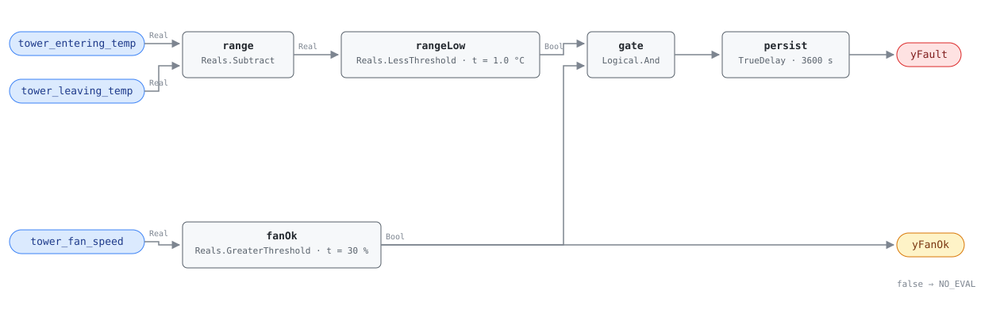

## Description

Range is what the condenser loop takes out of the water: how far the tower drops
it between the chiller's discharge and the basin. It is the one tower quantity
with a stable healthy band — a 4-climate simulation of a large office plant put
the median between 2.2 and 3.2 K from Miami in July to Tucson in January, while
approach over the same runs spread from 1.6 to 13.3 K. A range collapsed to a
fraction of that says the loop is moving far more water than the heat it carries
needs, or that the water and the air are not meeting. Neither finding is about
tower capability: range = heat rejected / (flow × cp), and flow is not a point
this rule can see. What the rule reports is that the pair has come apart; the
playbook checks flow first.

## Detection Logic

```
range  = tower_entering_temp − tower_leaving_temp   (warm chiller-leaving minus cold basin outlet)

yFanOk = tower_fan_speed > min_fan_speed_for_eval   (false ⇒ host reports NO_EVAL)
yFault = range < range_low_band AND yFanOk,
         sustained continuously for alarm_delay
```

Block graph (`rule.cxf.jsonld`):



The operand order is the trap. The tower dictionary grounds `tower_leaving_temp`
as *entering* condenser water — the cold basin outlet on its way to the chiller —
so the warm side is `tower_entering_temp` and it goes on `u1`. Subtract the other
way and every healthy tower reports a permanent fault while looking like a rule
that works.

`rangeLow` is strict, so a tower sitting exactly on the band reads healthy, and
the boundary is bit-exact: 30.0 − 29.0 is precisely 1.0. `fanOk` is the
evaluability story — a fan barely turning rejects little heat, and the range
underneath it is small for a reason that has nothing to do with a fault. Fan
speed is the only load-shaped signal in the tower dictionary; Deviations records
what that substitution costs. `persist` requires 60 continuous minutes and
carries `delayOnInit = true`: a collapsed range is a loop condition, not an
event.

## Possible Diagnoses

Library-authored — no source lists range-collapse causes, so this is the
mass-balance read of `range = heat rejected / (flow × cp)`:

1. Condenser water flow above design — a second pump staged on, a VFD forced to
   full, a balancing valve opened after a service call. The commonest cause and
   the one this rule cannot separate from any other; check it first
2. Tower bypass valve open or leaking, the winter freeze-protection valve left in
   hand being the classic — water reaches the basin without crossing the fill
3. Water short-circuiting inside the tower: cracked distribution basin, lifted
   hot-water deck covers, or collapsed and missing fill letting water fall past
   the air stream
4. Flow through an idle cell on a multi-cell tower — the idle cell returns water
   near its entering temperature and the common header mixes the range away
5. A chiller unloaded further than the fan gate excludes: less heat to reject at
   unchanged flow. The gate is a fan-speed proxy, not a load measurement
6. Water-side sensor error — a 0.5 K offset is half the shipped band. An entering
   sensor reading low, or a leaving sensor reading high, both bias toward the alarm
7. Sensors bound to different cells, or across a bypass. This alarms hardest of
   all and has nothing to do with the tower

## Energy Impact

EXCESS_CONSUMPTION, LOW confidence, PROXY_ESTIMATION. Where the collapse is
flow-driven — the usual case — the waste is condenser pumping:
`excess_cond_pump_kw ≈ cond_pump_kw × (design_range − actual_range) / design_range`,
CHW-0004's estimator on the condenser loop. Where it is a bypass or a
short-circuit the pumping term understates the cost, because the water returning
to the chiller is warmer than the tower could have made it and the chiller pays
for the lift (~2-4% of chiller power per °C, BEE 2006). Confidence is LOW for a
reason no tuning fixes: the trip band has no literature behind it, and the rule
cannot tell a flow increase from a tower defect.

## Emissions Impact

Scope 2, PROXY_EMISSIONS, LOW confidence. Both terms are purchased electricity —
condenser pump kWh and chiller kWh — so the avoided-emissions basis is the
marginal operating emissions rate. The lift term peaks on hot afternoons when the
grid is dirtiest, so a bypass found in July is worth more than its annual kWh
figure suggests. No published emissions range exists for this fault; the estimate
is the host's own pump and chiller factors.

## Deviations

- **The band is a commissioning-set placeholder, and its only quantitative
  grounding is simulation.** The HVAC FDD Reference has no cooling-tower chapter,
  and all three sources deep-read for this family (PNNL-13890 §7.5, DOE/PNNL O&M
  Best Practices 3.0 §9.5, BEE 2006) are **silent** on any range fault magnitude —
  they name causes of poor tower performance and attach no number to one.
  `range_low_band = 1.0 K` is placed under the 2.2-3.2 K healthy p50 measured by
  this library's own 4-climate study (`tools/simharness/README.md`, "Tower
  groundwork"), which describes healthy operation, not the fault side.
  **CTI/ASHRAE fault-side corroboration is pending.** Until a site commissions the
  band from its own full-load range this card is runnable but not calibrated —
  HP-0001's contract, and the reason `confidence: LOW`.
- **One absolute band, not a design × fraction pair.** CHW-0004 and HW-0004
  assemble their trip lines from a design delta-T times a fraction because
  PNNL-27338 supplies both halves. No tower source supplies a fraction, and the
  simulation gives an absolute healthy band rather than a ratio to design, so a
  two-parameter form would dress a placeholder up as a derivation.
- **Range is not a tower-capability measurement, and the flow confound cannot be
  fixed in-rule.** `range = Q / (flow × cp)`: a flow increase collapses it with the
  tower untouched. No condenser-flow point exists in the tower dictionary and
  adding one would not help — it would turn the rule into a heat-balance
  calculation whose answer is still ambiguous without design flow. The confound
  lives in `preconditions`, in diagnosis 1, and in the playbook's step 1.3. Tower
  *capability* degradation is TOWER-0001's approach test, not this one.
- **The fan-speed floor is entirely adopted.** No tower source gates a range or
  approach reading on anything. Shipping an ungated range test would alarm through
  every mild night and every unloaded chiller hour, which is the same failure
  HW-0004 records for PNNL-27338 §4.6. 30% is chosen against typical tower VFD
  minimum speeds (20-25%), not against a citation.
- **`tower_fan_speed` gates the rule, `tower_fan_status` does not.** The dictionary
  carries both. Status answers "is the fan running"; speed answers "is the tower
  working", which is the question a range reading needs, and a threshold on a real
  is what SCHEMA.md asks an evaluability output to be. The cost is a fan that is
  tripped or in hand while its speed *command* still reads 60% — a NO_EVAL the rule
  will miss, carried in `preconditions`.
- **There is no chiller-on conjunct, and that is a real blind spot.** A condenser
  loop circulating with no heat input equalises, range goes to zero, and the rule
  alarms at full confidence on a plant with no tower defect. Adding a chiller
  status would import a plant-level condition into a tower rule and silence it
  through the off-cycles of a normally staging plant; HW-0004 rejected the same
  edge for the same reasons. The honest placement is `operating_states` plus a host
  gate.
- **Nothing guards against a negative range.** Sensors bound the wrong way round,
  or a reverse-flow path, give a negative difference that is below any positive
  band and alarms permanently (pinned by `loop_side_semantics_inverted`). A
  comparison against zero could suppress it, but reverse flow through a bypass is
  itself a real hydraulic fault, so the guard would hide a plant problem to hide a
  binding one. Commissioning check: watch the sign once, before trusting the rule.
- **Strict `<` at the band and strict `>` at the floor.** CDL `Reals` has no
  `LessEqual` or `GreaterEqual`. A tower at exactly 1.0 K range reads healthy and a
  fan at exactly 30.0% reads NO_EVAL; both disagreements are measure-zero and both
  err toward silence.
- **`yFanOk` is an evaluability flag, not a sub-condition flag.** False means
  NO_EVAL and the host must not read the `yFault = false` underneath it as a
  healthy tower. Same stance as CHW-0004's `yLoadOk` and HP-0001's `yPowerOk`.
- **`alarm_delay = 3600 s` is adopted from CHW-0004, not sourced.** No tower
  source specifies a persistence at all. An hour matches the chilled-water sibling
  and rides out a chiller stage change, a pump changeover, and a cell rotation.
  Persistence is not averaging: a range alternating either side of the band every
  20 minutes never alarms (`intermittent_collapse_never_alarms`), even though a
  loop spending half its day collapsed is a genuine finding.
- `persist.delayOnInit = true` (CDL default `false`), the library's standing
  choice: a tower already below the band at controller restart waits out the full
  hour rather than alarming on the first tick.
- **Severity 3 and `method: rule` are library judgements.** No reference index
  exists for the TOWER family to carry them, and the fault is a waste finding with
  no comfort or protection consequence — a collapsed range costs pump and chiller
  energy and nothing else fails.
- **`clusters: [CLU-10]`.** `clusters/clusters.json` has no condenser-side cluster; CLU-06
  is chilled water by name and membership. A tower syndrome (this rule,
  TOWER-0001 and CHW-0005 all describing one condenser loop giving away
  energy) is a reasonable future cluster and the cluster owner's edit.
- **`suppresses` and `suppressed_by` are both empty.** TOWER-0001 is the closest
  candidate, but approach and range answer different questions — a tower can fail
  both, either, or neither — and both findings stay separately actionable.
  Suppression edges must be declared on both cards in any case.
- **No published test vectors exist for this rule.** Nothing in the literature
  specifies a range-collapse case, so every scenario in `vectors.json` is authored
  from the equation and replayed against the pinned engine rev.
- Operating states and preconditions are declared in frontmatter for host
  enforcement rather than encoded in the block graph, per the library's design
  stance.

## Notes

Read `yFanOk` before `yFault`. A tower coasting at 20% fan on a mild morning holds
it false for hours, and every `yFault = false` underneath means "not evaluated"
rather than "range is fine".

Check condenser flow before anyone climbs the tower. Trend range against the
number of condenser pumps running and against pump speed: a range that steps down
when a second pump starts is diagnosis 1 and needs no tower work at all. A range
that is low across every flow state points at the bypass valve, then at the fill
and the distribution basin. Where TOWER-0001 fires as well, the approach finding
is the tower's and this one is still probably the loop's.
