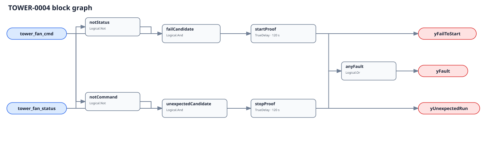

## Description

This rule checks whether one cooling-tower fan did what its final command
requested. A commanded fan without independent proof can mean a failed drive,
starter, belt, motor, interlock, or proof point. A proven fan after its command
has gone away can mean local control, a stuck output or contactor, a second
controller, or a command bound upstream of the true owner.

## Detection Logic

```
fail_to_start  = tower_fan_cmd AND NOT tower_fan_status
unexpected_run = NOT tower_fan_cmd AND tower_fan_status

yFailToStart   = fail_to_start sustained for start_proof_time
yUnexpectedRun = unexpected_run sustained for stop_proof_time
yFault         = yFailToStart OR yUnexpectedRun
```



Each mismatch has a separate `TrueDelay(delayOnInit=true)`. A direct direction
reversal therefore clears the old diagnostic immediately and starts the other
timer from zero. Time never survives a healthy sample or transfers between
directions.

## Possible Diagnoses

`yFailToStart`:

1. VFD/starter trip, disconnect, overload, failed motor, belt, gearbox, or fan
2. Vibration, freeze, low-water, fire, or OEM safety interlock is active
3. Final cell-stage command was mapped to the wrong fan
4. Proof switch, airflow/rotation sensor, auxiliary contact, or integration is bad
5. Command point is upstream of free-convection, anti-cycle, or safety logic

`yUnexpectedRun`:

6. Local/manual mode, service override, or a second tower controller
7. Welded contactor, stuck output, or VFD run command held internally
8. Normal deceleration/coast-down exceeds the configured stop window
9. Fleet status was incorrectly bound to an individual fan instance

## Energy Impact

PROTECTIVE, direction-dependent. Failure to start threatens heat rejection and
can raise chiller lift, but its energy effect cannot be calculated from these
two Boolean points. Unexpected operation can waste the same fan's measured kW;
use that only as an upper bound because some rejected heat may still be useful.

## Emissions Impact

Scope 2, proxy-only for unexpected fan operation. Do not claim avoided energy
or emissions for a failed start without a separate condenser-plant model.

## Deviations

- **Both 120 s timers are adopted commissioning values.** No cited source
  establishes a universal tower-fan proof window. Configure them independently
  around actual acceleration, deceleration, proof pickup, and network latency.
- **The command is downstream of normal tower logic.** A plant enable or
  upstream leaving-water request is intentionally rejected because free
  convection, cell staging, minimum timers, and safeties can all keep an
  individual fan off correctly.
- **No rule-wide suppression targets TOWER-0001.** Failure to start can make
  approach-high non-evaluable, but unexpected operation can leave approach
  physically meaningful. Current metadata cannot suppress only one direction.
- **`delayOnInit=true` is explicit on both lanes.** A runtime restart does not
  turn an existing command/status disagreement into an immediate alarm.
- **EnergyPlus validation is not claimed.** Fan power or airflow ratio can
  establish status, but the current fixture has no independent final BAS fan
  command. Deriving command from status would make proof tautological.

## Notes

Dispatch from the direction output, not `yFault` alone. Confirm authority and
point identity remotely before sending a technician: a correct fan paired with
the wrong cell's command produces a perfectly repeatable false diagnosis.
