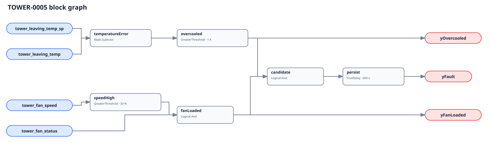

## Description

A healthy variable-speed tower reduces or stops fan work when leaving water is
already colder than its active target. This rule finds the narrower waste case:
the water is materially below setpoint while the same cell is proven running
above a meaningful fan speed. Cold water with the fan off remains explicitly
silent; natural convection is normal operation, not a fault.

## Detection Logic

```
temperature_error = tower_leaving_temp_sp - tower_leaving_temp
overcooled         = temperature_error > overcooling_allowance
fan_loaded         = tower_fan_status AND tower_fan_speed > minimum_fan_speed
candidate          = overcooled AND fan_loaded

yOvercooled = overcooled
yFanLoaded  = fan_loaded
yFault      = candidate sustained for sustained_duration
```



The algebra avoids a second subtract block: setpoint minus measured leaving
temperature is positive when the tower overcools. Both comparisons are strict,
so exactly 1 K of undershoot or exactly 30% fan speed remains clear.
`TrueDelay(delayOnInit=true)` resets immediately if temperature recovers, fan
proof drops, or speed unloads.

## Possible Diagnoses

1. Leaving-water setpoint is reset upward but the tower sequence still follows
   a stale, local, or differently scaled setpoint
2. Fan minimum speed, VFD floor, or cell-stage deadband is too high
3. Fan is in hand/local, speed command is overridden, or drive feedback is wrong
4. Isolation or bypass valve is stuck/mis-sequenced, making the sensed stream
   unrepresentative of the controlled common header
5. Leaving-water sensor reads low or active setpoint is mapped to the wrong node
6. Cell lead/lag logic keeps too many fans loaded after the heat-rejection load falls
7. A legitimate low-water strategy was not excluded by the host

## Energy Impact

EXCESS_CONSUMPTION with MEDIUM confidence. The direct waste is tower-fan
electricity during the persisted condition. Integrating measured same-cell fan
power gives a conservative upper bound, not guaranteed savings: the corrected
sequence may still require some fan work. Chiller energy can move in either
direction with condenser-water temperature and must not be added without a
site-specific optimum-lift model.

## Emissions Impact

Scope 2 from avoidable fan electricity, using the site's marginal operating
emissions rate. No portable savings or emissions fraction is claimed.

## Deviations

- **No source establishes the three numeric defaults.** The 1 K allowance and
  10-minute persistence are adopted commissioning starts. The 30% loaded floor
  is `NO_PORTABLE_DEFAULT`: configure it from same-cell feedback/power before
  adoption because a speed percentage is not a universal meaningful-energy line.
- **The 1 K allowance must exceed measurement uncertainty.** Common-header
  setpoints compared with individual-cell outlet temperatures can create a
  false undershoot on parallel towers; topology and setpoint distribution are
  preconditions, not hidden graph assumptions.
- **Speed feedback is preferred.** A verified command proxy is weaker because
  a drive in local, limited, or overridden operation can deliver something
  else. The host must label that binding and avoid near-threshold conclusions.
- **This rule stays outside CLU-10.** It is a control/energy finding, not the
  condenser-side degradation syndrome triggered by TOWER-0001.
- **No suppression is encoded.** TOWER-0004 failure-to-start can invalidate the
  fan premise, while its unexpected-run direction can cause this exact fault;
  whole-rule suppression would erase a useful diagnosis.
- **Simulation validates healthy FPR only, not causal TPR.** The recorded Denver
  July campaign uses native per-object outlet temperature, fan power, and
  airflow ratio at 60 s. Airflow ratio is an effective-airflow proxy rather
  than mechanical VFD feedback, and the parallel towers share one loop target.

## Notes

Read both diagnostic outputs before dispatch. `yOvercooled=true` with
`yFanLoaded=false` is often normal free convection. `yFanLoaded=true` without
overcooling says the fan may simply be doing useful work.
