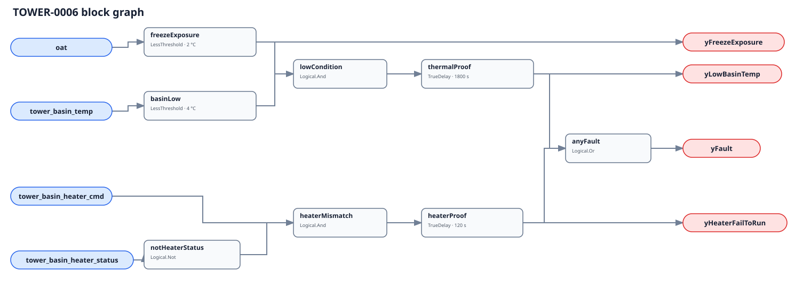

## Description

This watchdog exposes two different failures without pretending either is a
complete freeze-control system. The electrical lane finds a final heater request
that lacks independent proof. The thermal lane finds bulk basin water that
remains below a site/OEM minimum while outdoor conditions meet the configured
freeze-exposure threshold. Either is a prompt to follow the approved freeze
plan—not permission to defeat safeties or energize equipment manually.

## Detection Logic

```
freeze_exposure = oat < freeze_exposure_oat
heater_mismatch = tower_basin_heater_cmd AND NOT tower_basin_heater_status
low_condition   = freeze_exposure AND tower_basin_temp < minimum_basin_temp

yHeaterFailToRun = heater_mismatch sustained for heater_proof_time
yLowBasinTemp     = low_condition sustained for thermal_response_time
yFreezeExposure   = freeze_exposure
yFault            = yHeaterFailToRun OR yLowBasinTemp
```



Both comparators are strict: exactly 2 °C OAT is not exposure and exactly 4 °C
basin temperature is not low under the shipped graph. Each lane has an
independent `TrueDelay(delayOnInit=true)` and clears immediately when its own
condition clears.

## Possible Diagnoses

`yHeaterFailToRun`:

1. Open disconnect, breaker/fuse, contactor, control transformer, or heater element
2. Low-water, thermostat, over-temperature, or OEM safety correctly blocking operation
3. Failed current/power proof or status mapped to the wrong heater circuit
4. Final command is not actually downstream of local thermostat/safety logic

`yLowBasinTemp`:

5. Heater is undersized, failed, staged incorrectly, or not receiving voltage
6. Basin temperature sensor is biased, poorly located, or in a stagnant pocket
7. Basin level, wind exposure, leakage, or unintended circulation exceeds the design basis
8. Site intended drain-down/remote-sump operation but the host failed to suppress evaluation
9. The configured minimum or exposure threshold does not match the OEM freeze plan

## Energy Impact

No energy savings estimate. This is a protective finding whose value is avoided
freeze damage, loss of heat rejection, water release, and unsafe inspection
conditions. The opposite electrical direction—heater proven on with command
off—is deliberately not included and may become a future energy rule.

## Emissions Impact

Scope 2, qualitative only. Avoided repair and refrigerant/water consequences
are real but outside the point set and cannot be defensibly converted to
operational emissions here.

## Deviations

- **`minimum_basin_temp = 4 °C` is not portable.** OEM examples commonly
  describe about 40 °F protection, but strategy, equipment, ambient design,
  circulation, glycol, sensor location, and basin geometry differ. The shipped
  value is an adoption-blocking placeholder, not a universal safety setpoint.
- **The 2 °C exposure threshold and 120 s electrical timer are adopted.** The
  1800 s thermal response is `NO_PORTABLE_DEFAULT` because basin volume, heater
  capacity, circulation, and sensor placement dominate it. No cited source
  publishes this complete watchdog algorithm or these limits.
- **The graph does not encode water level.** Low-water cutoff is a mandatory
  independent safety and a host precondition. Never infer that `yFault=false`
  makes heater operation safe.
- **A proven heater does not suppress low basin temperature.** Electrical proof
  is not thermal adequacy, which is why the two lanes remain independent.
- **Command false/status true is intentionally silent in this graph, not safe.**
  It may indicate stale proof, a stuck contactor, or unintended heater operation
  with property/fire consequences—especially without water. Route it to the
  OEM/site safety workflow immediately; a future rule may separately quantify
  the excess-energy direction.
- **Basin protection is not plant protection.** OEM literature explicitly
  warns that a basin heater does not protect external piping, pumps, or heat
  exchangers; the full site drain-down/circulation plan remains authoritative.
- **No EnergyPlus validation is claimed.** Simulated basin-heater electricity
  is neither an independent command/proof pair nor a validation of the physical
  safety strategy.

## Notes

Follow the site/OEM freeze procedure before field inspection. Confirm basin
level and electrical isolation from a safe location. Do not bypass low-water or
other safeties, and do not manually energize a heater based on this diagnostic.
