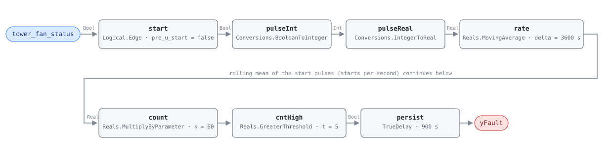

## Description

A tower fan motor is a large, high-inertia, across-the-line load turning a gear
reducer and a fan whose blades are still windmilling when the contactor closes
again. Each start pulls locked-rotor current through windings that have not
cooled, and the DOE/PNNL O&M guides put a hard number on how often that is
survivable: no more than four to five starts an hour. This is the only fault-side
number the cooling-tower literature supplies — the family's approach and range
bands are commissioning placeholders, and this one is not. Short-cycling is a
symptom, not a root cause; the rule reports that the fan is being asked to start
too often and the service call decides why. Most of the time the answer is a
control deadband and the fix is remote.

## Detection Logic

```
start  = rising edge of tower_fan_status                     one tick wide
count  = MovingAverage(start, count_window) × count_scale     starts in the trailing hour
yFault = count > max_starts_per_hour, sustained continuously for alarm_delay
```

Block graph (`rule.cxf.jsonld`):



`Logical.Edge` emits `u ∧ ¬pre(u)`, one tick wide, on every OFF→ON transition —
stops and run durations are not counted. `Reals.MovingAverage` is a
continuous-time integral mean, so a one-tick pulse of height 1.0 encloses one
tick interval of area and `n` starts inside the window give
`rate = n · dt / count_window`; multiplying by `count_scale = count_window / dt`
recovers `n`. That makes `count_scale` a function of the host's tick interval,
and it is the first thing to check before deploying — see the first two
Deviations. The comparison is strict, so exactly five starts an hour reads clear
and six alarms; the boundary is exact in IEEE-754, since `60.0 × (5 × 60 / 3600)`
evaluates to precisely 5.0. `persist` then requires the count to stay above the
ceiling for 15 minutes, which rides out the burst around a chiller stage change
without leaving a motor restarting all afternoon. `delayOnInit = true` holds that
window across a controller restart.

## Possible Diagnoses

1. Condenser-water or basin temperature deadband set too narrow — the fan
   satisfies the setpoint in a minute and restarts as the water drifts back. The
   commonest cause, and the one remote fix worth trying before a truck roll
2. Condenser water setpoint below what the wet-bulb allows: the fan runs to
   capacity, overshoots when the load steps, and cycles against an unreachable
   target
3. Cell staging with no minimum on/off timers, or several cells sharing one
   setpoint and hunting against each other
4. A single-speed fan on a tower whose load needs modulation — cycling is the
   only capacity control it has, and no setting fixes it
5. Cell oversized for the load: at low load one cell's minimum output already
   exceeds what the loop needs
6. Vibration switch or motor overload tripping and auto-resetting — the
   protection is doing the cycling and the underlying fault is mechanical
7. A VFD faulting and restarting on undervoltage or start overcurrent, which
   reads identically from the status point

## Energy Impact

PROTECTIVE, MEDIUM confidence, QUALITATIVE_ONLY. The rule sees one boolean and
cannot price a start, so no waste term is computable from its inputs and the cost
is asset life: a tower fan motor and gear reducer worn out early, plus the cell's
time out of service on a plant that may have no spare capacity in July. MEDIUM
confidence rather than HIGH because the threshold, while stated plainly in two
editions of the same DOE/PNNL guide, is a maintenance rule of thumb with no study
behind it and no dependence on motor size — a large tower fan is often rated for
fewer starts than four an hour, and a small one tolerates more.

## Emissions Impact

Scope 2, QUALITATIVE_EMISSIONS, MEDIUM confidence. AHU-FC-001's convention gives a
PROTECTIVE fault with no emitting stream scope "N/A"; this card does not qualify,
because a cycling fan spends every restart accelerating a high-inertia load while
delivering little airflow, and the condenser water it fails to cool costs the
chiller lift. Both terms are electricity the plant actually draws, neither is
computable from a run status, and the larger emissions term is indirect: a motor
and gear reducer replaced years early carry their embodied carbon.
Avoided-emissions basis: N/A.

## Deviations

- **The threshold ships at the permissive end of the source band.** The DOE/PNNL
  guides state four to five starts per hour; `max_starts_per_hour = 5.0` with a
  strict `>` alarms at six and clears at five, so nothing fires while the tower is
  anywhere inside the range the source calls acceptable. A site reading the
  requirement strictly sets 4.0; a site with a large fan motor should read its
  nameplate instead, since permissible starts fall with motor size and the source
  makes no such distinction.
- **This card's number is literature-backed, and the family's others are not.**
  TOWER-FC-050 and TOWER-FC-051 ship commissioning-set placeholder bands whose only
  quantitative grounding is this library's 4-climate simulation envelope
  (`tools/simharness/README.md`, "Tower groundwork"), with CTI/ASHRAE fault-side
  corroboration still pending. A starts-per-hour count is orthogonal to approach
  and range: it needs no fan-speed gate, no wet-bulb, and no thermal band, which is
  why it survives the gap that parks the other two at LOW confidence.
- **The tick interval is constrained at both ends, and the failure at the top end
  is Nyquist.** A start is visible only if the fan is seen OFF on one tick and ON
  on the next, so the most this rule can ever observe is `count_window/(2·dt)`
  starts per window — `1800/dt` per hour. The threshold must sit strictly below
  that ceiling: `5.0 < 1800/dt` gives `dt < 360 s`. The moving average's fixed
  64-checkpoint ring sets the floor: the retained window holds `count_window/dt + 1`
  checkpoints, so `dt ≥ 3600/63` ≈ **57.2 s**. Legal band **[57.2 s, 360 s)**, 60 s
  recommended and the only tick these vectors exercise. Practical advice beyond the
  legal band: at 300 s the ceiling is exactly 6 starts/h, so six is the *only*
  count above the threshold the rule can represent — keep `dt ≤ 120 s` (ceiling
  15/h) for usable headroom. Retuning the threshold to 4.0 relaxes the top of the
  band to 450 s.
- **`count_scale` is coupled to the host's tick interval and the failure is
  silent.** `k = count_window / dt`, so a host ticking every 120 s must set
  `count_scale` to 30.0; left at 60.0 it reports double the true count and alarms
  on three starts an hour. RTU-FC-050's deployment constraint verbatim.
- **Rolling count built from a moving average, because the block set has no
  windowed counter.** `Integers.OnCounter` counts monotonically from a reset, so a
  trailing-hour count would need a host-driven hourly reset — a tumbling count
  whose verdict depends on where the hour boundary fell. RTU-FC-050's trade, taken
  again.
- **Startup artifact (a): a spurious first-tick pulse, which costs nothing.**
  `Logical.Edge` compares `u` against `pre_u_start` on the first tick, so a fan
  already running when the rule loads registers a start at t = 0. It encloses no
  area (`dt` is zero on the first tick) and never reaches the count, so
  `pre_u_start` is written explicitly as `false` and not exposed as a card
  parameter.
- **Startup artifact (b): the first hour reads as a pace, and here it can reach a
  verdict.** While `t < count_window` the moving average divides by elapsed time,
  so two starts in the first three minutes read as 40/h — the pace, extrapolated.
  `alarm_delay` (15 min) is shorter than the window, so that pace can assert
  (`warmup_rate_asserts` pins it). The host NO_EVAL precondition for the first
  `count_window` is not optional.
- **Strict `>` on a discrete count.** Exactly five starts an hour is clear and six
  alarms, the source's ceiling read literally. The boundary is exact in IEEE-754:
  `60.0 × (5 × 60 / 3600)` evaluates to precisely 5.0, so the five-start case is a
  real pin and not a near-miss.
- **The counting window is half-open.** `rate` compares the accumulated integral
  now against its value one `count_window` ago, so a start exactly `count_window`
  old has just left the window. The source is silent; it matters only on the
  threshold and it errs toward silence.
- **How long a crossing survives is `count_window` minus the span of the starts
  that caused it.** Six starts inside ten minutes hold `cntHigh` for nearly an hour
  and always alarm; six spread across fifty minutes hold it for 600 s and never do
  — same starts per hour, opposite verdicts, and the difference is invisible in the
  printed equation (`six_starts_per_hour_trips` against
  `spread_burst_clears_before_delay` pins both). What the rule reports is cycling
  sustained above the ceiling, not every excursion through it.
- **Severity 3, where RTU-FC-050's compressor sibling is severity 2.** Same
  detection shape, cheaper asset: a tower fan motor and gear reducer cost a
  fraction of a compressor, a multi-cell tower has redundancy a packaged rooftop
  does not, and no space goes uncooled while the repair is scheduled. No reference
  index exists for the TOWER family to carry a severity, so this is a library
  judgement recorded rather than inherited.
- **`alarm_delay = 900 s` is adopted from RTU-FC-050.** The source specifies a
  starts-per-hour ceiling and no persistence. Fifteen minutes is one to two more
  starts on a tower already cycling hard — enough to ride out the burst around a
  chiller stage change or a one-off drive trip.
- `persist.delayOnInit = true` (CDL default `false`), the library's standing
  choice: a fan already above the ceiling at controller start waits out the full
  15 minutes instead of alarming on the first tick after a restart.
- **`clusters: []`.** CLU-10 (Condenser-Side Degradation) was created at batch-18 closeout;
  this fault would not belong to one anyway: fan cycling is a control or mechanical
  defect on one cell, not a symptom of the plant-wide heat-rejection syndrome
  TOWER-FC-050 and TOWER-FC-051 describe. Any future tower cluster is the cluster
  owner's edit.
- **No published test vectors exist.** The source states a threshold, not cases, so
  every scenario in `vectors.json` is authored from the equation and replayed
  against the pinned engine rev.
- Operating states and preconditions are declared in frontmatter for host
  enforcement rather than encoded in the block graph, per the library's design
  stance.

## Notes

Bind `tower_fan_status` per cell and deploy one instance per fan, as the tower
point dictionary requires. An OR across a two-cell tower undercounts: a lag start
while the lead is already running never moves the signal, so a plant whose lead
cell runs continuously can cycle its lag cell all afternoon and read healthy.

Remediation follows the
[cooling-tower-performance](../../../playbooks/cooling-tower-performance.md)
playbook — deadband and staging first, then the setpoint against wet-bulb, then
the drive and the mechanical inspection. Its step 1.4 is the one check worth doing
before the truck roll: confirm the starts are sustained and rule out an aggressive
leaving-temperature deadband. Firing alongside TOWER-FC-050 points at the setpoint
(diagnosis 2) — a fan chasing an unreachable target both runs at capacity and
overshoots.
