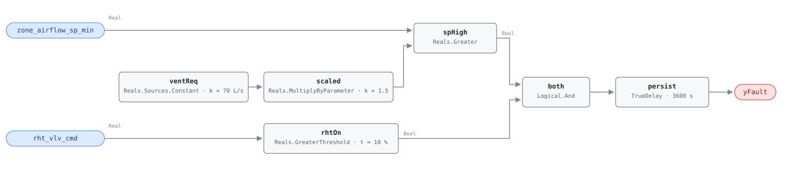

## Description

The box is configured never to deliver less than some floor of airflow, and that
floor sits far above what the zone needs for ventilation. Every hour the zone is
not calling for cooling, the box pushes cold supply air it does not need into
the space and the reheat coil pays to warm it back up — the fan on one side, the
boiler on the other, with the zone comfortable throughout, so nothing about the
symptom points at the cause. The fault lives in a number a commissioning
technician typed rather than in any equipment behavior, which is why the second
term matters: an oversized minimum only costs money while the reheat coil is
running against it. The setpoint test finds the defect, the reheat test proves
it is being paid for now. The economics are multiplicative — the same
default-minimum habit repeats across every box in a building — and PNNL-25985
ranks minimum VAV flow reduction (EEM-15) as the highest-impact individual
retuning measure for offices, at 5–16% of site energy.

## Detection Logic

```
sp_high = zone_airflow_sp_min > (ventilation_requirement × min_flow_multiplier)
rht_on  = rht_vlv_cmd > reheat_active_threshold

yFault  = (sp_high AND rht_on) sustained continuously for alarm_delay
```

Block graph (`rule.cxf.jsonld`):



At the shipped defaults the trip point is 70 × 1.5 = 105 L/s (about 222 cfm), so
a box configured at the reference's 235 L/s is flagged and one at 95 L/s is not
— but the 70 L/s is a placeholder, and the rule is only as meaningful as the
per-zone `ventilation_requirement` a host binds in its place (see Deviations).
Both comparisons are strict, as the reference writes them: a box configured at
exactly the allowance and a valve reported at exactly 10% both clear. The
60-minute `persist` delay matters more here than the block count suggests.
Neither input is noisy — a configured minimum does not jitter — so the delay is
not filtering measurement noise; it is filtering morning warm-up, when a box
legitimately runs reheat at whatever minimum it has while the space recovers
from setback. An hour of continuous reheat against an oversized minimum is no
longer warm-up. `delayOnInit = true` holds that window across a restart.

## Possible Diagnoses

1. Minimum flow setpoint set too high during commissioning — the common case,
   usually a default the technician never revisited
2. Minimum flow reset logic disabled: the box supports a dynamic minimum
   (dual-maximum, or a ventilation reset driven by occupancy) and it was
   switched off or never enabled
3. Code-required minimum genuinely higher than necessary — overdesign in the
   original ventilation calculation, a design-review item rather than a BAS fix

## Energy Impact

EXCESS_CONSUMPTION, HIGH confidence, PROXY_ESTIMATION. Two subsystems pay at
once: the reheat coil warms air the zone never needed and the supply fan moves
it. The reference's 10–20% excess reheat energy is the per-box figure;
PNNL-25985's EEM-15 gives the building-scale one at 5–16% of site energy, and
for a 50,000 ft² office at $2/ft² the playbook puts annual recovery at
$5,000–16,000. Estimation is PROXY because the rule sees a setpoint and a valve
command, not thermal flow: the waste share
`(zone_airflow_sp_min − ventilation_requirement) / zone_airflow_sp_min` leans
entirely on `ventilation_requirement` being right. Heating-dominant, though the
fan share runs whenever the box does.

## Emissions Impact

Scope 1 + 2, PROXY_EMISSIONS, HIGH confidence; typically 200–1,500 kg CO₂e/yr
per zone. The split follows the two subsystems — gas at the boiler serving the
reheat coil is scope 1, fan electricity is scope 2 — and hydronic reheat off an
electric boiler or heat pump moves the whole thing into scope 2.
Avoided-emissions basis: marginal operating emissions rate (MOER).

## Deviations

- **`ventilation_requirement` ships with a placeholder default.** The reference
  gives it as "Config" — no number, because the value comes from that zone's
  ASHRAE 62.1 calculation. This card ships 70.0 L/s (the reference's own test
  value, roughly an 1,800 ft² office at 8 occupants) so the document is runnable
  as delivered. **It is not a site value; hosts MUST set `ventReq.k` per box.**
  Set it 2× too high and the rule never fires on a genuinely oversized box, 2×
  too low and every box in the building alarms. It is the only parameter in the
  rule whose default carries no authority.
- **`reheat_active_threshold` is adopted, not transcribed.** It appears in the
  reference's equation but not its tunables table. This card adopts 10.0%, the
  value the same chapter gives VAV-0006's identically-named parameter, which
  asks the same question of the same point. Sites whose valve commands park at a
  nonzero rest position should retune above that position.
- **`zone_airflow` is dropped from the points list.** The reference's points
  table lists it but its equation never uses it — the test compares a configured
  setpoint against a ventilation requirement. It is verification context, not a
  rule input, and carrying it would force every host to bind a point the graph
  ignores. Precedent: AHU-0029 drops `oat` for the same reason.
- **A configuration value is consumed as a live point.** Hosts whose BAS does
  not expose the configured minimum as readable cannot run this rule from a
  trend archive alone; they need a config export bound as a point
  (`Min_Air_Flow_Setpoint_Limit` in the dictionary). Binding the *active*
  airflow setpoint instead breaks the rule — it rises above the minimum whenever
  the zone calls for cooling, producing alarms during normal cooling.
- `AlarmDelay = 60 min` becomes `persist.delayTime = 3600 s` with
  `delayOnInit = true` (Modelica/CDL default is `false`), the library's standing
  choice: a box already faulted at load waits out the full hour rather than
  alarming on the first tick after a restart.
- Operating states (heating, deadband) and preconditions (AHU running, zone
  occupied) are declared in frontmatter for host enforcement rather than encoded
  in the block graph, per the library's design stance.
- **Frontmatter `clusters` is empty.** CLU-05 covers this fault's neighbours
  (VAV-0003, VAV-0006, SYS-0007) but chapter 7 does not list VAV-0001
  among its members, and this card does not edit the cluster definition. The
  relationship is carried by the shared playbook and by `related`; worth
  revisiting when the cluster set is next reviewed, since an oversized minimum
  is diagnosis 1 for VAV-0006.
- `g36: null`. This is a research-backed 050-range rule; G36's own guidance on
  VAV minimums (20% of design airflow or the ventilation minimum, whichever is
  greater) informs the playbook's remediation but is not the source of the
  detection logic.

## Notes

Check the air handler before touching individual boxes: if this rule fires on
more than half the boxes on one AHU, the boxes are probably fine and the supply
air is too cold (AHU-0019). PNNL-27338's AIRCx check is the sharper version —
more than 25% of zones with reheat valves above 50% means look at the SAT reset
first.

The remote fix is the [vav-min-flow-reheat](../../../playbooks/vav-min-flow-reheat.md)
playbook's step 2.1: reduce the minimum to the calculated ventilation
requirement, reviewing the heating maximum on dual-maximum boxes at the same
time. Clearing this fault should also quiet VAV-0006 on the same box, since an
oversized minimum is its diagnosis 1; it will not quiet VAV-0003, which sees a
valve open with the zone already satisfied.
