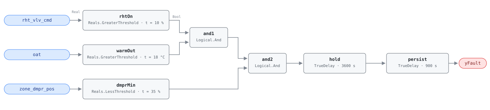

## Description

A reheat coil is running in July. The zone is passing the minimum airflow its
configuration insists on, that air arrives at the supply temperature the chiller
worked to produce, and the box heats it back up before it reaches the space —
simultaneous heating and cooling seen from the zone end, which is where much of
it happens in a VAV building. The damper term is what separates waste from load:
reheat with the damper open and modulating is a box answering a genuine heating
demand, and any finding there sits at the air handler. Reheat with the damper
parked at minimum is a configuration defect that persists every occupied hour
until someone changes a setpoint. The season term keeps the rule from arguing
with winter. This rule is the trigger of CLU-05 (Zone Heating & Cooling
Conflict); VAV-0003 and SYS-0007 are members that should clear behind it.

## Detection Logic

```
yFault = rht_vlv_cmd > reheat_active_threshold
     AND oat > cooling_season_oat                     (cooling season)
     AND zone_dmpr_pos < damper_at_minimum_margin
     sustained continuously for eval_duration
     and then held a further alarm_delay
```

Block graph (`rule.cxf.jsonld`):



Three threshold tests, two conjunctions, two delays. `hold` turns true only
after the conjunction has been continuously true for `eval_duration` (60 min)
and `persist` adds `alarm_delay` (15 min) on top, so a box that reheats through
the afternoon alarms at 4500 s. Any break in any of the three terms drops both
timers, so a damper stroke, a passing cloud on the OAT sensor, or a valve that
closes for five minutes restarts the clock. All three comparisons are strict, as
the reference writes them: a valve reported at exactly 10.0%, an outdoor air
temperature of exactly 18.0 °C, and a damper sitting exactly on 35.0% each fail
their term. Both `delayOnInit` flags are `true`, so a condition already present
at load waits out the full 75 minutes rather than alarming on the first tick
after a restart.

## Possible Diagnoses

1. VAV minimum airflow setpoint too high for this zone — the common case, and
   the one VAV-0001 confirms directly against the ventilation requirement
2. AHU supply air temperature setpoint too low, so every box on the air handler
   has to temper its minimum flow (AHU-0019)
3. SAT reset responding to a rogue zone: the reset is working, one zone is
   holding it at the cold end, and this box is paying for it (VAV-0002)
4. Zone has low internal loads but a high minimum flow requirement — a corner
   office or a perimeter zone sized for a load that never materialized

## Energy Impact

CRITICAL_WASTE, HIGH confidence, DIRECT_MEASUREMENT. The waste is on the wire:
`waste_kw = rht_vlv_cmd/100 × vav_rht_capacity_kw` for every hour the condition
holds, with no counterfactual to model — and the cooling energy spent making the
air it undoes is waste on top. The reference gives 5–20% of zone thermal energy
and PNNL-25985 maps the fix to EEM-15 (VAV minimum flow reduction) and EEM-16.
Cooling-dominant by climate, though the multiplier is what matters: a building
runs dozens to hundreds of these boxes, and EEM-15 is the highest-impact
individual measure across all building types in the PNNL study at 5–16% of site
energy, 7.7% nationally.

## Emissions Impact

Scope 1, DIRECT_EMISSIONS, HIGH confidence; typically 500–3,000 kg CO₂e/yr per
zone. The reference reports scope 1 because hot-water reheat is usually fed by a
gas-fired boiler, so the waste is on-site combustion. Boxes with electric reheat
coils, or hot water from a heat pump or district loop, move the same kilowatts
into scope 2 — hosts should follow the heating source rather than this default.
Avoided-emissions basis: marginal operating emissions rate (MOER).

## Deviations

- **`cooling_season` is implemented as the OAT comparison the reference puts in
  parentheses, not as a host-supplied season flag.** It is one comparison on a
  point the rule needs no help obtaining; consuming a host "cooling season"
  boolean would hide `cooling_season_oat` from `set_param` and make the rule's
  behavior depend on a definition the library cannot see.
- **The reference's heating-season vector expects NO_EVAL, and this rule reports
  it as a false `yFault`.** Out of season the rule reads false because the
  question is meaningless, not because the box is healthy, and publishing that
  distinction is the host's job via `operating_states`. No evaluability output is
  exposed, unlike AHU-0021's `yTempDeltaOk`: there the condition is computed
  from the rule's inputs and the host cannot check it without redoing the
  arithmetic, whereas here the gate *is* an input the host already holds.
- The precondition `OAT > cooling_season_oat` is deliberately stated twice — once
  in `preconditions`, once in the block graph — because the reference states it
  twice. The in-graph term is what makes the rule safe to run continuously; the
  precondition is what tells the host when a false output means anything.
- **Two delays in series rather than one.** `eval_duration` and `AlarmDelay` are
  separate tunables in the reference, so they stay separately tunable even though
  a single 4500 s delay behaves identically at the defaults (precedent:
  AHU-0027). A site on 15-minute trend data changes one parameter.
- All three comparisons are strict (`>`, `>`, `<`), matching the reference's own
  operators — no boundary reinterpretation, though the exact values are where a
  retuned site will sit.
- `hold.delayOnInit` and `persist.delayOnInit` are both `true` (Modelica/CDL
  default is `false`), the library's standing choice against alarming on the
  first tick after a controller restart.
- Operating-state gating (occupied cooling mode) and the fan-running precondition
  are declared in frontmatter for host enforcement rather than encoded in the
  block graph, per the library's design stance.
- The reference's Notes block is truncated in the source document mid-sentence.
  It is quoted below as far as the source runs and no further; the Torabi finding
  it was introducing has not been reconstructed.

## Notes

Reference note, quoted as far as the source runs: "Check AHU SAT first —
Torabi et al. (2022) found zone-level reheat".

Fix order within CLU-05 follows that advice. Diagnoses 2 and 3 both live at the
air handler and are cheaper to check than anything at the box: pull the supply
air temperature setpoint and its reset trend (AHU-0019, AHU-0023) and check
whether one zone is holding the reset at its cold end (VAV-0002). A supply air
temperature raised into its reset band clears this fault across every box at
once, while lowering one box's minimum flow fixes one box; the
[vav-min-flow-reheat](../../../playbooks/vav-min-flow-reheat.md) playbook's
counting rule discriminates — more than half the boxes flagged points at the air
handler, one to three at zone configuration. Its step 2.3 (a summer reheat
lockout) is the remote fix and step 2.1 (minimum airflow down to the ASHRAE 62.1
requirement) is the durable one; both are $0 and batchable.

The rule reads `zone_dmpr_pos` as evidence of what the box is doing, not what it
was told. On boxes exposing only the damper command, a blade stuck open while
the command sits at minimum satisfies the damper term and this rule reports
waste at a box passing full flow — VAV-0004 is what separates those two.
