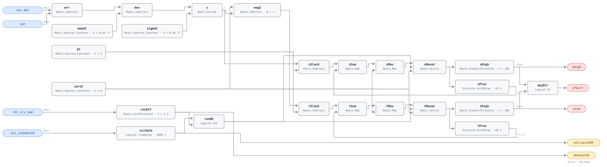

## Description

A reheat valve that will not quite close is the quietest fault a VAV box can
have: the zone stays comfortable, the damper compensates with more cold primary
air, and the only witness is a discharge temperature a degree or two above the
supply air feeding the box. That rise is real heat, paid for twice — once at
the boiler and again at the chiller that removes it. No single reading is worth
an alarm, because fan heat and duct gain put a small legitimate rise across
every box; what convicts the coil is a rise persistently above that baseline,
every minute, with the valve commanded shut. A cumulative sum chart is built
for exactly that shape of evidence.

## Detection Logic

```
dTerror  = vav_dat − sat                       rise across the box, °C

z_i      = (dTerror_i − error_mean) / error_sigma

armed_i  = occ_scheduled held true for exclusion_time
           AND rht_vlv_cmd < reheat_closed_threshold

S_i      = armed_i ? max(0,  z_i − slack_k + S_{i−1}) : 0
T_i      = armed_i ? max(0, −z_i − slack_k + T_{i−1}) : 0

yHigh    = S_i > alarm_limit_h        yLow = T_i > alarm_limit_h
yFault   = yHigh OR yLow
```

Block graph (`rule.cxf.jsonld`):



The recursion, the occupancy arming and the feedback-through-`UnitDelay`
topology are VAV-0008's, documented there; this card adds one gate. A single
`Logical.And` of the occupancy arm and the reheat-off comparison drives both
reset switches, so the accumulators hold state only while the coil is commanded
off — the one condition under which a discharge rise means anything. When the
coil is commanded open, the state is cleared, not frozen (see Deviations).
Both threshold comparisons are strict, and there is no alarm delay: the
accumulation is the persistence test.

## Possible Diagnoses

§5.1.3 attributes this channel to a leaking valve or element; the gate and the
direction flags narrow it further.

1. **Reheat valve passing** — worn seat, debris, or actuator not driving fully
   closed. The classic `yHigh` finding: rise within the source's measured
   3.7–11.9 °F leak band, coil commanded shut. Verify at the coil: pipe surface
   temperature downstream of the valve tells the truth in one visit.
2. **Electric reheat element held on** — welded contactor or failed SCR, the
   electric-box equivalent of a passing valve, same signature and a bigger
   safety question. FCU-0002 is the fan-coil sibling.
3. **Valve driven open by override or bad sequence** — the command reads closed
   at the BAS but a local override or miswired output holds it open. The rule
   cannot tell this from a leak; the work order can.
4. **Instrumentation, not the coil** (`yLow`, or a `yHigh` that survives valve
   isolation) — wrong AHU loop bound as `sat`, discharge sensor drifted or
   swapped with another box. A persistent negative rise is physically
   impossible from a leak, which is why the T chart's finding is named as
   instrumentation rather than folded into the coil story.

## Energy Impact

CRITICAL_WASTE, MEDIUM confidence, PROXY_ESTIMATION. Leak heat is bought at the
plant and then removed by cooling the same air back down — the same
double-payment as VAV-0003, seen from the temperature side instead of the
command side. The rule deliberately consumes no airflow point, so it prices
nothing in-rule; the proxy is `(dTerror − error_mean) × airflow` for a host
that wants numbers, and the leak-hours count alone ranks boxes for a valve
walk-down. Confidence is MEDIUM on the sibling cards' terms: the method is
validated on physically injected faults (§5.2), the shipped parameters are one
simulated box plus the source's campaign. Heating-season biased, since the
leak needs a live heat source behind the valve.

## Emissions Impact

Scope 1 or 2 by heat source, QUALITATIVE_EMISSIONS. A passing hydronic valve
spends boiler fuel (Scope 1 where gas) plus the chiller electricity that
removes it (Scope 2); an electric element is Scope 2 twice. The double-payment
structure means abating this fault removes emissions on both sides at once,
which is why it ranks above its comfort impact — the zone usually feels fine.

## Deviations

- **Reheat-on clears the accumulators rather than holding them.** The source
  computes dTerror only while the coil is off and says nothing about what the
  sums do meanwhile. Holding would carry a stale sum across a multi-hour
  heating call and alarm on the first armed tick after it; clearing costs the
  case where a slow leak is interleaved with regular legitimate reheat — but a
  coil regularly commanded open is VAV-0003's jurisdiction, not a coil
  passing unseen. The vectors pin the choice (`reheat_command_resets_accumulator`).
- **One `Logical.And` gates both charts through the shared reset switches,**
  collapsing the source's occupied-only rule and reheat-off rule into a single
  arm condition. The two evaluability flags stay separate outputs precisely
  because the host cannot otherwise tell which gate silenced the rule — a box
  heating all day publishes `yReheatOk = false` for hours and that is normal.
- **`error_mean`/`error_sigma` are measured, not floored — the contrast with
  VAV-0008.** Fan heat and duct gain give this channel a real healthy
  baseline; the committed vavcal method measured 0.44/0.39 °C across the
  OfficeMedium-4004 zones on reheat-off occupied ticks. They remain per-box
  commissioning values (§5.1.5): a long duct run or a series fan moves the
  baseline, and error_mean is where that lives.
- **`slack_k = 3.0` and `alarm_limit_h = 100` come from Table 5's Iowa
  campaign, not Figure 9's illustration** — the one channel in the trio whose
  defaults are measured. Still commissioning parameters; the campaign's boxes
  are not your boxes.
- **The T chart is kept and its finding renamed.** A leak cannot produce a
  negative rise, so `yLow` names instrumentation (wrong `sat` binding, sensor
  drift or swap) instead of pretending to be a coil finding. Dropping the
  chart would have been cheaper in blocks; keeping the source's two-sided
  recursion buys a free wrong-loop detector on the channel most exposed to a
  binding mistake.
- **`sat` stands in for entering-air temperature per §5.1.4's own workaround.**
  The bias of that approximation was validated below 0.005 °C by the committed
  harness method — in simulation, on one building; the real-world residual is
  duct gain, which `error_mean` absorbs by design.
- **`rht_vlv_cmd` is compared strictly below 1 % (`Reals.LessThreshold`)** —
  command, not position, because position feedback is rare on terminal units
  and a lying command is diagnosis 3. The threshold is a parameter so sites
  whose controllers never write a clean zero can still arm the rule.
- **The shared house choices are inherited, not re-argued:** in-graph reset
  driving the published sum and the delay input together, `delayOnInit = true`
  serving a fresh exclusion hour on restart, `UnitDelay` y_start seeding
  costless at zero, strict comparisons, no alarm delay, constants over
  parameterized gains. VAV-0008's Deviations carry the full arguments.
- **Severity 3, `category: CRITICAL_WASTE`, `confidence: MEDIUM` and the name
  are library-authored.** CRITICAL_WASTE follows VAV-0003 — same waste, same
  double payment — rather than the trio's COMFORT_ENERGY, because the zone is
  typically comfortable while this fault runs. `g36: null` on the same grounds
  as the siblings.

## Notes

The trio splits by error signal: VAV-0007 accumulates airflow tracking
error, VAV-0008 zone temperature error, this card the reheat-off discharge
rise. This is the only channel that needs `vav_dat`; a box without it runs the
other two as the source's reduced VPACC and loses only this coil's coverage.

VAV-0003 and this card meet at the same valve from opposite sides: 052
convicts a valve *commanded* open while the zone is satisfied, this card a
valve *passing* while commanded shut. Neither suppresses the other — a failed
actuator can produce both in one afternoon, and seeing both is the diagnosis.
