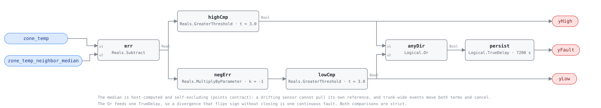

## Description

A zone temperature sensor that drifts takes its whole zone with it: the box
dutifully conditions the room to a wrong number, the occupants adjust the
setpoint to fight it, and every VAV diagnostic on that zone inherits the lie.
A single drifted sensor is invisible from inside its own control loop — the
loop closes on the sensor, so the trend looks healthy. What exposes it is the
rest of the fleet: sibling zones on the same air handler see the same supply
air and roughly the same weather, so a zone that reads persistently far from
its neighbors' median is the outlier, and the median — unlike SYS-0005's
two-sensor pair — says *which* sensor to distrust.

## Detection Logic

```
err     = zone_temp − zone_temp_neighbor_median

yHigh   = err  > drift_threshold          this zone reads above the fleet
yLow    = −err > drift_threshold          below the fleet (in-graph negation)

yFault  = (yHigh OR yLow) continuously for persist_time
```

Block graph (`rule.cxf.jsonld`):



Six blocks, stateless. The median is computed by the host per the point
contract — self-excluding, so a drifting sensor cannot drag its own
reference toward itself. Trunk-level events are free immunity: a failed AHU
or a building-wide swing moves the zone *and* the median together, and the
subtraction sees only the residual (`median_moves_with_zone` pins it). The
Or sits before the single persistence delay, so a sensor that flips from
reading high to reading low without ever closing is one continuous fault.
Both comparisons are strict; equality at the threshold reads healthy.

## Possible Diagnoses

1. **Sensor drift or failed calibration** — the finding this card names.
   Verify with a handheld reference at the thermostat; recalibrate or
   replace, per the [sensor-drift](../../../playbooks/sensor-drift.md)
   playbook.
2. **Bad placement rather than bad electronics** — a sensor over a copier,
   in supply-air wash, or on a sun-struck wall drifts with the source, not
   with age. Same signature, different work order: move it.
3. **A genuinely divergent zone that belongs out of the population** — a
   space repurposed since commissioning (new server load, new wall). The fix
   is the median population list, not the sensor.
4. **The zone really is out of control** — starved airflow or a failed box
   holds the space off setpoint while the sensor tells the truth. The VAV
   family's own rules (VAV-0004, VAV-0008) fire alongside this one in that
   case; this card alone, with the box quiet, points at the sensor.

## Energy Impact

COMFORT_ENERGY, LOW confidence, QUALITATIVE_ONLY. The drifted sensor itself
consumes nothing; the waste is whatever the wrong number drives — typically
over-conditioning of one zone and setpoint-fighting by its occupants — and
that is counted by the downstream rules this card adjudicates. Confidence is
LOW on SYS-0005's grounds: the mechanism is literature-backed but the shipped
thresholds are placeholders with no fault-injection validation behind them
yet. Climate-neutral.

## Emissions Impact

Scope 1 or 2 by what the false reading drives (reheat vs cooling),
QUALITATIVE_EMISSIONS. No direct term; abatement rides the downstream fix.

## Deviations

- **The median names the verdict; the pair could not.** SYS-0005 ships
  `verdict: ambiguous` because two sensors that disagree carry no majority.
  Five or more siblings do: this card adjudicates `zone_temp` as
  `invalid_while_active`, the single-sensor form SYS-0009/0010 established.
  The cost is the median contract itself — population size and composition
  are host obligations the graph cannot check.
- **drift_threshold 3.0 °C and persist_time 7200 s are library defaults, not
  literature values.** Yang et al. (2008) validate pairwise comparison
  thresholds on co-located AHU sensors; no source publishes a
  neighbor-median band. Shipped wider (3.0 vs the pair's 2.0) and slower
  (2 h single delay vs the pair's chained 60 + 30 min) because rooms are a
  looser reference than a shared duct; both retune at commissioning against
  the measured occupied spread.
- **One delay, not SYS-0005's chained two.** The reference specified that
  card's `drift_duration` + `AlarmDelay` split, so it was transcribed; this
  card has no source to honor and one `persist_time` is one fewer number to
  commission wrong.
- **The negation is in-graph** (`MultiplyByParameter · k = −1`) so the one
  published threshold stays positive and feeds both comparators — the same
  reason VAV-0008 keeps its constants positive rather than shipping a
  negative the retuner must remember.
- **Host-side occupancy gating, against the batch-19 precedent and for the
  house default.** The CUSUM trio gated in-graph because accumulators need
  their STATE reset; this rule is stateless, so `operating_states:
  occupied` does the job with zero blocks. The persistence delay does run
  through unoccupied hours — a 3 a.m. assertion is possible and the host
  discards it as NO_EVAL, which is suppression of output, not state, and
  therefore safe here.
- **`delayOnInit = true`** (CDL default `false`), the library's standing
  choice, does real work: a controller restart serves the full two hours
  before re-alarming rather than re-asserting into a zone that may have
  been fixed.
- **Severity 3, `category: COMFORT_ENERGY`, name** are library-authored;
  mirrored from SYS-0005, the nearest shipped relative. `g36: null` — G36
  has no fleet-relative sensor check.

## Notes

This closes the reservation VAV-0008's Notes and the family README have
carried since batch 19: the drift rule that decides whether the CUSUM
cards' `zone_temp` input can be believed. Run it beside them — a zone that
trips VAV-0008 *and* this card is a sensor problem wearing a comfort
problem's clothes.
