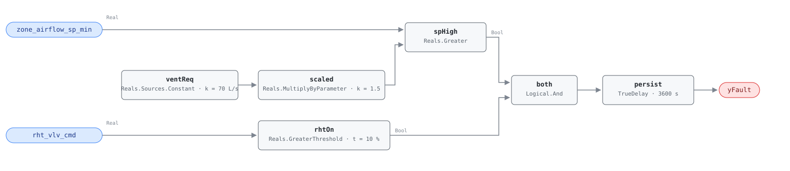

## Description

The box is configured to never deliver less than some floor of airflow, and that
floor is set far above what the zone actually needs for ventilation. Every hour
the zone is not calling for cooling, the box pushes cold supply air it does not
need into the space and the reheat coil pays to warm it back up. The fan pays on
one side, the boiler on the other, and the zone stays comfortable throughout, so
nothing about the symptom points at the cause.

This rule reads a configuration value as a live point. `zone_airflow_sp_min` is
not a measurement or a modulating setpoint; it is a number a commissioning
technician typed into the box controller, and the fault lives in that number
rather than in any equipment behavior. What keeps this from being a
configuration audit is the second term: an oversized minimum only costs money
while the reheat coil is actually running against it. A box configured 3× too
high in a zone whose reheat never opens is a latent problem, not a live one, and
this rule stays quiet about it. That is the deliberate split — the setpoint test
finds the defect, the reheat test proves it is being paid for right now.

The economics are multiplicative. A building has dozens to hundreds of boxes,
each one commissioned by hand, and the same default-minimum habit tends to
repeat across all of them. PNNL-25985 ranks minimum VAV flow reduction (EEM-15)
as the single highest-impact individual retuning measure for offices at 5-16% of
site energy, which is a building-scale number arrived at one box at a time. The
`vav-min-flow-reheat` playbook's step 1.4 turns the count of flagged boxes into
a diagnosis: more than half the boxes flagged points at the air handler (supply
air too cold, per AHU-FC-053), one to three points at zone-level configuration.

## Detection Logic

```
sp_high = zone_airflow_sp_min > (ventilation_requirement × min_flow_multiplier)
rht_on  = rht_vlv_cmd > reheat_active_threshold

yFault  = (sp_high AND rht_on) sustained continuously for alarm_delay
```

Block graph (`rule.cxf.jsonld`):



`ventReq` carries the zone's ventilation requirement as a constant so the
comparison has something to stand against; `scaled` multiplies it by the
allowance factor, and `spHigh` asks whether the programmed minimum clears that
allowance. At the shipped defaults that trip point is 70 × 1.5 = 105 L/s
(about 222 cfm), so a box configured at the reference's 235 L/s is flagged and
one at 95 L/s is not. `rhtOn` decodes the valve. Both comparisons are strict, as
the reference writes them: a box configured at exactly the allowance and a valve
reported at exactly 10% both clear, and the vectors pin all four sides.

The 60-minute `persist` delay matters more here than the block count suggests.
Neither input is noisy — a configured minimum does not jitter — so the delay is
not filtering measurement noise. It is filtering morning warm-up, when a box
legitimately runs reheat at whatever minimum it has while the space recovers
from setback. An hour of continuous reheat against an oversized minimum is no
longer warm-up.

## Possible Diagnoses

1. Minimum flow setpoint set too high during commissioning — the common case,
   and usually a default the technician never revisited rather than a decision
2. Minimum flow reset logic disabled: the box supports a dynamic minimum
   (dual-maximum, or a ventilation reset driven by occupancy) and it was
   switched off or never enabled
3. Code-required minimum genuinely higher than necessary — overdesign in the
   original ventilation calculation, which makes this a design-review item
   rather than a BAS fix

## Energy Impact

EXCESS_CONSUMPTION, HIGH confidence, PROXY_ESTIMATION. Two subsystems pay
simultaneously: the reheat coil warms air the zone never needed, and the supply
fan moves it. The reference's 10-20% excess reheat energy is the per-box figure;
PNNL-25985's EEM-15 gives the building-scale one at 5-16% of site energy, the
top-performing individual measure across office building types in that study.
For a 50,000 ft² office at $2/ft² energy cost the playbook puts the annual
recovery at $5,000-16,000.

Estimation is PROXY rather than DIRECT because the rule sees a setpoint and a
valve command, not thermal flow: the waste share
`(zone_airflow_sp_min − ventilation_requirement) / zone_airflow_sp_min` is an
inference about how much of the reheat load is attributable to excess air, and
it leans on `ventilation_requirement` being right. Heating-dominant, since the
waste is realized as reheat energy — but the fan share is climate-independent
and runs whenever the box does.

## Emissions Impact

Scope 1 + 2, PROXY_EMISSIONS, HIGH confidence; typical 200-1,500 kg CO₂e/yr per
zone. The split follows the two subsystems: gas at the boiler serving the reheat
coil is scope 1, fan electricity is scope 2, and a hydronic reheat system on an
electric boiler or heat pump moves the whole thing into scope 2.
Avoided-emissions basis: marginal operating emissions rate (MOER).

## Deviations

- **`ventilation_requirement` ships with a placeholder default.** The reference
  gives the default as "Config" — deliberately no number, because the value is
  per-zone and comes from that zone's ASHRAE 62.1 calculation (floor area ×
  0.06 cfm/ft² + occupants × 5 cfm/person, per the playbook's step 1.1). This
  card ships 70.0 L/s so the document is runnable as delivered: it is the value
  the reference's own test vectors use, and 70 L/s is roughly an 1,800 ft²
  office at 8 occupants. **It is not a site value.** Hosts MUST set
  `ventReq.k` per box at deployment. A wrong `ventilation_requirement` moves
  the alarm point silently in either direction — set it 2× too high and the
  rule never fires on a genuinely oversized box, 2× too low and every box in
  the building alarms. This is the only parameter in the rule whose default
  carries no authority.
- **`reheat_active_threshold` is adopted, not transcribed.** It appears in the
  reference's equation for this fault but not in its tunables table, so the
  reference states no default. This card adopts 10.0%, the value the same
  chapter gives for VAV-FC-055's identically-named parameter — the nearest
  in-document authority, and the two rules ask the same question of the same
  point. Sites that see valve commands park at a nonzero rest position should
  retune it above that position rather than accept a standing alarm.
- **`zone_airflow` is dropped from the points list.** The reference's required
  points table lists it, but its equation never uses it: the test compares a
  configured setpoint against a ventilation requirement, and measured flow
  appears nowhere. It is verification context — the playbook's step 1.1 has a
  technician look at actual airflow during low-demand periods — not a rule
  input. Carrying it would force every host to bind a point the graph ignores.
  Precedent: AHU-FC-063 drops `oat` for the same reason and keeps its role in
  the preconditions.
- **A configuration value is consumed as a live point.** `zone_airflow_sp_min`
  is a programmed constant, and hosts whose BAS does not expose the configured
  minimum as a readable point cannot run this rule from a trend archive alone;
  they need a config export bound as a point. The point dictionary anticipates
  this (`Min_Air_Flow_Setpoint_Limit`, "the configured floor, distinct from the
  active setpoint"). Binding the *active* airflow setpoint instead breaks the
  rule: the active setpoint rises above the minimum whenever the zone calls for
  cooling, which would produce alarms during normal cooling operation.
- `AlarmDelay = 60 min` from the reference tunables becomes
  `persist.delayTime = 3600 s` with `delayOnInit = true` (Modelica/CDL default
  is `false`), the library's standing choice: a box already faulted at load
  waits out the full hour rather than alarming on the first tick after a
  controller restart.
- Operating states (heating, deadband) and preconditions (AHU running, zone
  occupied) are declared in frontmatter for host enforcement rather than
  encoded in the block graph, per the library's design stance.
- **Frontmatter `clusters` is empty.** CLU-05 (Zone Heating & Cooling Conflict)
  covers this fault's neighbors — VAV-FC-052, VAV-FC-055, SYS-FC-056 — but
  chapter 7 does not list VAV-FC-050 among its members, and this card does not
  edit the cluster definition to add it. The relationship is carried by the
  shared `vav-min-flow-reheat` playbook and by `related` instead. Worth
  revisiting when the cluster set is next reviewed: an oversized minimum is
  diagnosis 1 for VAV-FC-055, so the fix ordering CLU-05 implies is real even
  though the membership list does not say so.
- Frontmatter `g36` is null. This is a research-backed 050-range rule; G36's
  own guidance on VAV minimums (20% of design airflow or the ventilation
  minimum, whichever is greater) informs the remediation in the playbook but is
  not the source of the detection logic.

## Notes

The remote fix is the playbook's step 2.1: reduce the minimum to the calculated
ventilation requirement, and on dual-maximum boxes review the heating maximum at
the same time. It is a 15-minute change per box that costs nothing and can
usually be batched across boxes on the BAS. Step 2.4 is the structural version
of the same fix — moving the box to dual-maximum control so heating and cooling
carry separate minimums — and is worth considering once more than a handful of
boxes are flagged.

Check the air handler before touching individual boxes. If this rule fires on
more than half the boxes on one AHU, the boxes are probably fine and the supply
air is too cold, which is AHU-FC-053's fault, not theirs. PNNL-27338's AIRCx
check gives the sharper version of the same test: more than 25% of zones with
reheat valves above 50% means look at the SAT reset first (playbook step 1.4,
and the `missing-reset` playbook from there).

Clearing this fault should also quiet VAV-FC-055 on the same box if that rule is
firing, since an oversized minimum is its diagnosis 1. The reverse is not true:
VAV-FC-052 sees a valve open with the zone already satisfied, which is a valve
or sequence problem that survives any minimum-flow correction.
