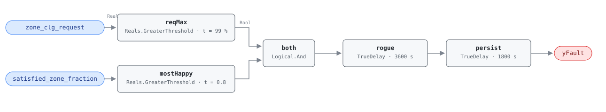

## Description

One zone holds its cooling request at maximum while the rest of the building is
comfortable. Trim-and-respond does what it was written to do: the AHU answers
the loudest zone, walks its supply temperature or duct static setpoint to the
aggressive end of the reset range, and leaves it there. The cost lands on every
other box on that air handler — colder air than they asked for, which they
reheat, or more static pressure than they need, which the fan pays for cubed —
while the rogue zone itself usually stays uncomfortable, because whatever is
wrong with it is not something more cooling fixes. The whole design turns on
telling a rogue zone from a messenger: a saturated request means "I need more
cooling", and what makes it a fault is the company it keeps. With half the
building unsatisfied the same request is a correct report of a building-wide
shortfall, and firing on it would send a technician to the wrong end of the
system.

## Detection Logic

```
yFault = zone_clg_request > request_max_threshold
     AND satisfied_zone_fraction > satisfied_threshold
     sustained continuously for rogue_duration
     and then held a further alarm_delay
```

Block graph (`rule.cxf.jsonld`):



Two threshold tests feed one conjunction and then two delays in series: `rogue`
turns true only after the conjunction has held for `rogue_duration` (60 min),
and `persist` requires a further `alarm_delay` (30 min), so a zone that never
lets go alarms at 5400 s. Any break in either term drops both timers and
discards the accumulated time — the alarm only ever describes one continuous
rogue episode, and a zone that recovers between morning warm-up peaks never
raises it. Both comparisons are strict, so a request sitting exactly on 99.0%
and a satisfaction fraction of exactly 0.80 both stay clear. Both `delayOnInit`
flags are `true`, so a rogue condition already present at load waits out the
full 90 minutes; the trade is that in-rule timing does not survive a restart,
which is the conservative direction.

## Possible Diagnoses

1. Zone has an internal load the design never accounted for — a server closet, a
   copy room, a tenant fit-out that added people or equipment
2. Zone thermostat miscalibrated or badly sited — direct sun on the sensor, a
   diffuser blowing across it, or a drift the zone cannot argue with
3. VAV box undersized for the actual zone load, so full cooling airflow still
   cannot hold the setpoint
4. Stuck VAV damper: the box commands full open, the blade does not move, and
   the zone stays hot no matter what the AHU sends it (confirm with VAV-FC-053
   before believing the load story)

## Energy Impact

EXCESS_CONSUMPTION, MEDIUM confidence, PROXY_ESTIMATION. The reference gives
3–10% of AHU energy, mapped to PNNL-25985 EEM-15. Estimation is PROXY because
the waste is a counterfactual — `ahu_penalty_kw ≈ ahu_actual_energy −
ahu_optimal_energy`, what the AHU would have consumed at the setpoint the rest
of the building would have permitted — and neither term is measured directly.
Climate sensitivity is both: a rogue zone dragging supply air down costs chiller
energy in summer and reheat energy in winter, and a rogue airflow request costs
fan energy year-round. The multiplier is what makes it worth catching: one box
holds a reset that serves thirty or three hundred.

## Emissions Impact

Scope 2, PROXY_EMISSIONS, MEDIUM confidence; typically 100–800 kg CO₂e/yr for
the AHU-level penalty one zone imposes. Scope 2 because the penalty is dominated
by fan and chiller electricity; a site whose reheat is gas or steam moves the
reheat share of the consequential waste into scope 1, which this card leaves to
VAV-FC-052 and VAV-FC-055 to account for. Avoided-emissions basis: marginal
operating emissions rate (MOER).

## Deviations

- **`zone_temp` and `zone_temp_sp` are dropped.** The reference lists both in
  its points table but its equation consumes neither — they are inputs to the
  host's derivation of "satisfied", which the equation reads only through the
  ratio. Inputs to a host derivation are not rule points (precedent: AHU-FC-063
  consumes `expected_mode` rather than the `oat` behind it).
- **`satisfied_zones / total_zones` becomes the host-derived point
  `satisfied_zone_fraction`.** Library v1 avoids array boundary points, so the
  host counts satisfied siblings and feeds one fraction, flagged `derived` in
  the point dictionary. Same pattern as `zone_reheat_fraction` in AHU-FC-053.
- **`satisfied_threshold` is a fraction 0–1, not a percent.** The reference
  states 80%; the point it compares against carries unit `1`, so the default is
  0.8. A host feeding a 0–100 percentage will never fire this rule.
- **`MAX_COOLING` is implemented as a threshold at 99.0%, an adopted value the
  reference does not state.** Equality against 100.0 is the wrong test for a real
  signal: a request scaled from a 16-bit analog value lands on 99.6 and an
  equality test would never fire. `> 99.0` reads "saturated at its ceiling" while
  excluding a genuine 99% request one count short of maximum, and
  `request_max_threshold` is exposed so a site with a coarser signal can lower
  it.
- The `satisfied_zone_fraction` comparison is strict `>`, which is what the
  reference writes — no boundary deviation on that term, though it is the
  boundary where two hosts' definitions of "satisfied" will disagree.
- **Two delays in series rather than one.** `rogue_duration` and `AlarmDelay`
  are separate tunables in the reference, so they stay separately tunable here
  even though a single 5400 s delay behaves identically at the defaults
  (precedent: AHU-FC-061).
- `rogue.delayOnInit` and `persist.delayOnInit` are both `true` (Modelica/CDL
  default is `false`), the library's standing choice against alarming on the
  first tick after a controller restart.
- The reference tags this fault for VAV and AHU. This card is the VAV-family
  instance, bound to one box's request and its siblings' satisfaction (precedent:
  AHU-FC-059); the AHU-side view is covered by AHU-FC-053, AHU-FC-057 and
  AHU-FC-058, which see the reset stuck at its limit without knowing which zone
  is holding it there.
- Operating-state gating (cooling modes) and the multi-zone precondition are
  declared in frontmatter for host enforcement rather than encoded in the block
  graph, per the library's design stance.

## Notes

`playbooks` is empty because no playbook here covers the zone-side diagnosis
this fault opens; the nearest relative is
[missing-reset](../../../playbooks/missing-reset.md), whose step 1.3 (do zone
requests reach the AHU controller?) is this rule's precondition check read from
the other end.

Fix order matters when this rule fires alongside AHU-FC-057 or AHU-FC-058. A
rogue zone is the classic reason a correctly programmed reset still looks dead
in trend data — the setpoint sits at the aggressive end all day because one box
keeps voting for it — which is exactly the signature those two statistical rules
detect. Fix the zone first; the reset should then start modulating within an
occupied day and the AHU-side faults clear on their own.

G36 sites run discrete cooling requests, not a continuous 0–100 signal. The
point dictionary's binding note for `zone_clg_request` covers the mapping: bind
100 to importance-weighted requests at their maximum and record the convention
with the point. This rule only tests for saturation at the ceiling, so it
survives the translation as long as the ceiling is the same number on both sides.
