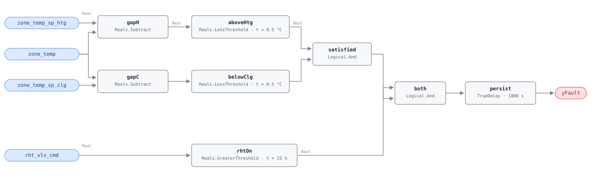

## Description

The zone is comfortable — sitting between its heating and cooling setpoints,
asking for nothing — and the reheat coil is running anyway. There is no thermal
work being done here that anybody wanted. Unlike an oversized minimum flow,
where the reheat at least offsets air the ventilation code required, every
kilowatt through this coil is waste with no offsetting benefit, which is why the
category is CRITICAL_WASTE and the runtime estimate has no efficiency term in
it: `waste_kw = rht_vlv_cmd/100 × vav_rht_capacity_kw`, the whole coil load.

The fault hides well. The zone stays comfortable, because a satisfied zone with
extra heat in it drifts up until the cooling loop opens the damper and takes the
heat back out — so the box masks its own symptom, and the only visible trace is
two subsystems working against each other at a scale too small for anyone to
notice on a meter. Multiply by the number of boxes in the building and it stops
being small.

Three mechanisms produce the same signature and the graph cannot tell them
apart: a valve that is stuck or leaking by, a control sequence that never
releases reheat when the zone reaches setpoint, and a valve whose stroke
calibration is off so that a commanded 0% leaves the plug off its seat. The
playbook's step 2.2 separates them from a workstation — command the valve to 0%
and watch what happens.

## Detection Logic

```
rht_on    = rht_vlv_cmd > reheat_open_threshold
satisfied = zone_temp > (zone_temp_sp_htg − zone_deadband)
        AND zone_temp < (zone_temp_sp_clg + zone_deadband)

yFault    = (rht_on AND satisfied) sustained continuously for alarm_delay
```

Block graph (`rule.cxf.jsonld`):



Both band bounds are written as a positive gap compared against the deadband,
which keeps the deadband a single positive parameter instead of a value that has
to be added on one side and subtracted on the other. `gapH` computes
`zone_temp_sp_htg − zone_temp`: positive when the zone is below its heating
setpoint, and `aboveHtg` fires when that gap shrinks under the deadband.
`gapC` computes `zone_temp − zone_temp_sp_clg` and `belowClg` mirrors it at the
top of the band. Both bounds read the same `zone_deadband` value, so a host
retuning it must set both CXF paths together.

At the shipped defaults and the reference's 21/23 °C setpoints, the satisfied
band runs 20.5 to 23.5 °C, exclusive at both ends (see Deviations). Below 20.5
the zone is genuinely calling for heat and the coil is doing its job; above 23.5
the zone is in cooling territory and reheat there is a worse fault than this
one, but it belongs to VAV-FC-055. The vectors cover both exits from the band.

The 30-minute `persist` delay covers the ordinary overshoot: a heating loop that
carries the zone a little past setpoint before it releases the coil will show
this signature for a few minutes on every recovery cycle, and that is control,
not a fault.

## Possible Diagnoses

1. Reheat valve stuck or leaking — the actuator is not where the command says,
   or the seat passes flow at closed. Hands off to the `stuck-actuator` playbook
2. Control sequence not releasing reheat when the zone is satisfied: the loop
   or the mode logic keeps a heating output alive past the point it should have
   dropped out
3. Incorrect valve stroke calibration — the actuator honors the command but the
   linkage maps 0% to a partly open plug

## Energy Impact

CRITICAL_WASTE, HIGH confidence, DIRECT_MEASUREMENT. The reference gives 5-15%
of zone thermal energy, under PNNL-25985's EEM-15 and EEM-38 (minimum flow
reduction and eliminating simultaneous heating and cooling). Estimation is
DIRECT because the valve command is the waste: with the zone inside its
deadband there is no useful heating output to subtract, so coil load scaled by
command position is the whole figure, and the only inference left is the coil's
rated capacity. Heating-dominant, since the wasted energy is hot water or
electric resistance at the coil — though the waste itself does not care about
the weather, and in cooling season it compounds by loading the chiller as well.

## Emissions Impact

Scope 1, DIRECT_EMISSIONS, HIGH confidence; typical 300-2,000 kg CO₂e/yr per
zone. Scope 1 covers the usual case of a hydronic coil on a gas boiler, where
the emissions are combustion at the building. Sites with electric reheat or a
heat-pump-fed hot water loop should read this as scope 2 and rescale, since the
kilowatts are the same but the inventory is not. Avoided-emissions basis:
marginal operating emissions rate (MOER).

## Deviations

- **The reference's `>=` and `<=` band bounds become strict.** CDL `Reals` has
  no `GreaterEqual` or `LessEqual`, so both bounds are implemented as
  `LessThreshold` on a gap (`u < t`), and a zone sitting exactly at
  `zone_temp_sp_htg − zone_deadband` or exactly at
  `zone_temp_sp_clg + zone_deadband` reads as outside the satisfied band where
  the reference reads it inside. The disagreement has measure zero on a real
  temperature signal and errs toward silence, the right direction for a rule
  whose alarm dispatches a technician. The vectors pin all four sides
  (20.5 °C and 23.5 °C clear, 20.6 °C and 23.4 °C alarm). A host binding
  coarsely quantized zone temperatures — integer °C, or a BAS that rounds to
  0.5 — should widen `zone_deadband` slightly rather than rely on the signal
  landing off the boundary.
- `zone_deadband` is one card parameter bound to two CXF paths (`aboveHtg.t`,
  `belowClg.t`), matching the reference's single tunable. Hosts must set both
  together; a site wanting an asymmetric band retunes the paths individually
  and notes the divergence. Precedent: AHU-FC-059's `valve_open_threshold`.
- **Band bounds are expressed as gaps rather than shifted setpoints.** The
  reference writes `zone_temp >= zone_temp_sp_htg − zone_deadband`. Implemented
  literally that would need a constant subtracted from the setpoint and a
  two-input comparison per bound; the gap form gets the same answer with one
  `Subtract` and one threshold per bound, and keeps `zone_deadband` a single
  positive `set_param` path with no sign flips. Algebraically identical apart
  from the strictness noted above. Precedent: AHU-FC-055 feeds `desired_oaf`
  in as a constant for the same reason.
- `AlarmDelay = 30 min` from the reference tunables becomes
  `persist.delayTime = 1800 s` with `delayOnInit = true` (Modelica/CDL default
  is `false`), the library's standing choice: a valve already open at load waits
  out the full 30 minutes rather than alarming on the first tick after a
  controller restart.
- The rule does not test whether the AHU is running, whether the zone is
  occupied, or whether the zone temperature sensor is trustworthy. All three are
  frontmatter preconditions for host enforcement, per the library's design
  stance. The sensor one bites hardest: a zone sensor reading 2 °C high puts a
  genuinely cold space inside the satisfied band with the reheat coil correctly
  responding to it, and this rule will call that a fault.
- Frontmatter `g36` is null, and no G36 clause appears in `source` either. G36
  sequences terminal-unit reheat, but the reference derives this detection
  logic from the PNNL retuning work rather than from a guideline clause, and
  SCHEMA.md reserves the `g36` field for the 001-049 range regardless.
- Severity 3 (warning) is the reference's chapter 10 card value, kept despite
  the CRITICAL_WASTE category. The category describes the character of the
  waste — no offsetting benefit — while the severity describes the response
  urgency, and a leaking reheat valve on one box is not an emergency. The
  reference's §5.8.2 index carries no severity column to cross-check against.

## Notes

The remote discriminator is the playbook's step 2.2: command the valve to 0% and
watch the zone. If the temperature keeps climbing, the valve is not where it
says it is and this is diagnosis 1 — hand off to the `stuck-actuator` playbook
for inspection and replacement. If the temperature responds and reheat comes
back on its own once the override is released, the valve is fine and the
sequence is the problem (diagnosis 2), which is a programming fix, not a truck
roll. Diagnosis 3 shows up as a valve that responds but never fully closes.

Within CLU-05 this rule is a member, not the trigger; VAV-FC-055 is. Fix the
trigger first where both are firing on the same box: reheat during the cooling
season usually traces back to an oversized minimum or a supply-air temperature
that is too low, and correcting either can quiet this rule without anyone
touching the valve. Where this rule fires alone — reheat with the zone
satisfied, in any season, with no cooling-mode context — the valve or the
sequence is the whole story.

The sibling relationships are worth keeping straight, since all three faults
look at the same valve. VAV-FC-050 asks whether the box is configured to force
reheat. VAV-FC-055 asks whether reheat is running while the building is trying
to cool. This rule asks whether reheat is running when the zone wanted nothing
at all.
