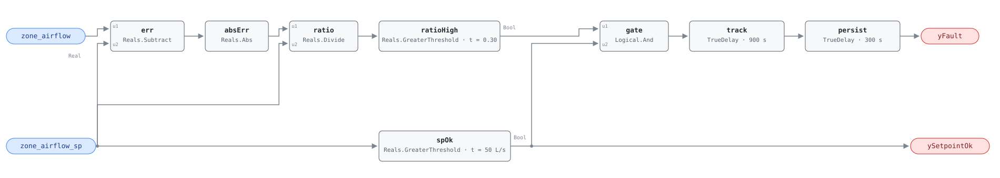

## Description

The box is not delivering the air it is being asked for. A VAV terminal is a
flow controller: the zone loop computes an airflow setpoint, and the damper
loop strokes the blade until the measured flow matches it. When measurement and
setpoint stay far apart, that inner loop has lost its authority — the damper is
stuck, the actuator has come off its shaft, the flow sensor has fouled, or there
is not enough static pressure at this branch for the box to reach setpoint no
matter how far it opens.

The fault is written as a fraction rather than an absolute flow so that one
threshold covers a 60 L/s office and a 900 L/s conference room. That choice
costs something at the bottom of the range, where a box holding its minimum is
measuring a few pascals of velocity pressure and a 30% error is a handful of
litres per second inside the sensor's own noise. The rule therefore carries an
explicit evaluability test and declines to judge boxes below
`min_evaluable_setpoint`.

Severity 3 (warning): comfort is the first casualty and energy the second. A box
starved of air leaves its zone uncomfortable, which produces a complaint and
then usually a setpoint change that costs energy everywhere else; a box
over-delivering pushes conditioned air the zone did not ask for and, on a reheat
box, buys it back at the coil.

## Detection Logic

```
ratio       = |zone_airflow − zone_airflow_sp| / zone_airflow_sp
ySetpointOk = zone_airflow_sp > min_evaluable_setpoint     (false ⇒ host reports NO_EVAL)
yFault      = (ratio > tracking_error_threshold) AND ySetpointOk
              held continuously for tracking_duration, then a further alarm_delay
```

Block graph (`rule.cxf.jsonld`):



`err` and `absErr` form the unsigned deviation, `ratio` divides it by the
setpoint, and `ratioHigh` applies the fractional threshold. Taking the absolute
value before the division makes the test symmetric: a box delivering 100 L/s
against a 200 L/s setpoint and one delivering 300 L/s against the same setpoint
are both 50% out and both report, which is what the reference's `| … |` asks
for and what the diagnoses require — a damper stuck open is as much a failure of
the flow loop as a damper stuck shut.

`zone_airflow_sp` fans out a second time into `spOk`, the evaluability branch.
Its output is both the boundary output `ySetpointOk` and the second input of
`gate`, so `yFault` reads false throughout a non-evaluable period — but false
`yFault` under false `ySetpointOk` means *unknown*, not *healthy*, and the host
must treat it that way. The gate is also what makes the division safe. CDL
`Divide` follows IEEE-754: a setpoint of exactly zero yields ±∞ or NaN rather
than an error, and a near-zero denominator amplifies ordinary sensor noise into
a fraction of any magnitude. NaN compares false everywhere, so it can never
raise `ratioHigh`; ±∞ and a noise-inflated finite ratio both can, and `gate`
stops them. A denominator small enough to misbehave is below
`min_evaluable_setpoint` by construction, so the belt and the braces are the
same piece of logic (AHU-FC-055 precedent).

`track` and `persist` are two delays in series (AHU-FC-061 pattern). `track`
implements the reference's `sustained for tracking_duration` — 15 minutes of
continuous violation, long enough that a damper stroking to a new setpoint after
a load change is not a fault — and `persist` adds the reference's separate
5-minute `AlarmDelay`. The two stay independently tunable even though a single
1200 s delay would behave identically at the defaults. Any momentary return to
setpoint drops both timers and discards the accumulated time, so the alarm only
ever describes one continuous excursion.

Both comparisons are strict, matching the reference's own `>` on each side. An
error sitting exactly on `tracking_error_threshold` is not a fault, and a
setpoint sitting exactly on `min_evaluable_setpoint` is not evaluable; the
vectors pin both boundaries from both sides.

## Possible Diagnoses

1. VAV damper stuck — mechanical failure of the blade, shaft, or linkage
2. VAV damper actuator disconnected, so the loop commands into thin air while
   the blade sits wherever it was left
3. Airflow sensor fouled or failed — a lint-blocked or water-logged
   differential-pressure pickup reads low and the loop opens the damper against
   a measurement that will not move
4. Duct obstruction downstream of the box — a closed fire damper, a collapsed
   flex duct, or a balancing damper someone shut during a complaint call
5. Insufficient system static pressure at this branch, in which case the box is
   working correctly and the fault is upstream

## Energy Impact

COMFORT_ENERGY, MEDIUM confidence, PROXY_ESTIMATION. The reference puts the loss
at 2–5% of zone energy and names comfort as the primary impact, which is the
right ordering: a box 50% short of setpoint is a hot or cold zone long before it
is an energy number. The waste term is computable only in the over-delivery
direction — `waste_kw ≈ (zone_airflow − zone_airflow_sp) × cp × |sat −
zone_temp|`, the cost of conditioning air the zone did not ask for — and it
needs the supply air temperature and zone temperature, neither of which this
rule consumes; the host assembles it. Under-delivery has no comparable term:
the box is spending *less* fan and coil energy than it should, and the cost
lands as unmet load, occupant complaints, and whatever building-wide setpoint or
static-pressure change gets made to answer them. Confidence is MEDIUM: the
mechanism is well established (Schein et al. 2006's VPACC rules are the origin
of this test, and ORNL's Im et al. 2025 dataset provides ground truth for stuck
VAV boxes), but the per-zone energy figure depends on which direction the box is
failing and on what the reheat coil does about it. Climate-neutral. No PNNL
measure maps to this fault.

The multiplier is the point. A building has dozens to hundreds of boxes, so 2–5%
of one zone's energy is not the number that matters — what matters is the
fraction of the boxes doing this. Ten percent of a 200-box building is twenty
zones making comfort complaints and burning reheat, and this rule finds them from
trend data instead of a truck roll.

## Emissions Impact

Scope 1 or 2, PROXY_EMISSIONS, MEDIUM confidence; typical 50–500 kg CO₂e/yr per
zone. Which scope applies follows what the excess air is conditioned by: an
over-delivering box on a hot-water reheat coil drives on-site combustion
(scope 1), while the fan energy moving the air and the chiller energy cooling it
are purchased electricity (scope 2). The range is per zone and multiplies across
the building exactly as the energy figure does. Avoided-emissions basis:
marginal operating emissions rate (MOER).

## Deviations

- **Evaluability is an output, not just a precondition.** The reference's third
  test vector (20 L/s measured against a 30 L/s setpoint) is labelled NO_EVAL
  rather than NO_FAULT. Because `zone_airflow_sp > min_evaluable_setpoint` is
  computable from this rule's own inputs, SCHEMA.md requires exposing it as a
  boolean output: `ySetpointOk`. The `setpoint_below_minimum` vector pins both
  halves of that verdict — `ySetpointOk` false and `yFault` held down — and the
  card states the semantics the host must apply: false `yFault` under false
  `ySetpointOk` is unknown, not healthy.
- **Two delays in series rather than one.** The reference separates
  `tracking_duration` (15 min) from `AlarmDelay` (5 min), so both are kept as
  independently tunable parameters (`track.delayTime`, `persist.delayTime`) even
  though a single 1200 s delay would behave identically at the defaults —
  AHU-FC-061's arrangement. The consequence: 20 minutes of continuous violation
  are required — exactly the duration of the reference's own FAULT vector — and
  `sustained_tracking_error` asserts at t = 1200 s. A site that wants a shorter
  duration test changes one parameter.
- **The tracking-duration condition alone is not a fault, and the vectors pin
  the gap.** `error_clears_between_delays` puts a 50% error on the box for
  1000 s: `track` satisfies its 15 minutes at t = 900 s, then the error clears
  before `persist` has served its 5 minutes, and both timers discard their
  accumulated time. A host reading only `yFault` never learns that the box was
  15 minutes into the condition, which is the intended behaviour — the alarm
  describes one continuous excursion or nothing.
- **The division is unguarded, and the gate is what makes that safe.** CDL
  `Divide` follows IEEE-754 rather than raising, so `zone_airflow_sp = 0` yields
  ±∞ or NaN. This is AHU-FC-055's arrangement verbatim: NaN cannot raise a
  comparison, ±∞ and noise-inflated finite ratios can, and `gate` holds `yFault`
  down over exactly the interval the host is told to disregard. Garbage
  arithmetic can only make the rule report itself unevaluable.
- **Both comparisons are strict**, which is the reference's own notation on both
  sides (`> tracking_error_threshold`, `> min_evaluable_setpoint`) rather than a
  substitution forced by the block set. No inclusive comparison was needed, so
  no measure-zero deviation arises here. The boundary arithmetic is exact rather
  than approximately exact: 140 L/s against 200 L/s evaluates to precisely the
  same double as the 0.30 threshold parameter, so
  `error_exactly_at_threshold` is a real pin and not a near-miss.
- **`playbooks: [stuck-actuator]` is library-assigned, not transcribed.** The
  reference's card for this fault carries no playbook row. Diagnoses 1 and 2 are
  literally a stuck damper and a disconnected actuator, and the playbook's
  procedures — plot command against feedback, stroke the actuator through its
  range from the BAS, then check linkage, signal, and free movement on site —
  are the fix for this fault without modification. The playbook's own *Applies
  to* row lists AHU-FC-054, AHU-FC-014, and AHU-FC-015; VAV-FC-053 belongs on
  it, and the addition is recorded here because `playbooks/` is single-writer.
- **`related` adds VAV-FC-054.** The reference's Related row lists AHU-FC-054
  (stuck or failed actuator — the same mechanism seen at the air handler) and
  VAV-FC-050. VAV-FC-054 is added from this side: hunting and tracking failure
  are the two ways a box's flow loop misbehaves, and a damper oscillating hard
  enough will also fail an averaged tracking test.
- **Vector tick is the library's usual 300 s.** This rule holds no windowed
  statistics — the only state is the two delay timers — so nothing couples the
  verdict to the host's tick interval, unlike VAV-FC-054. Both delays are exact
  multiples of 300 s, so every asserted edge lands on a tick.
- `track.delayOnInit` and `persist.delayOnInit` are both `true` (Modelica/CDL
  default is `false`), the library's standing choice: a tracking error already
  present at load waits out the full 1200 s instead of alarming on the first
  tick after a controller restart.
- Severity 3 (warning), phase 2, method `rule`, and the four tunable defaults are
  the reference's chapter 10 card; its §5.8.2 index carries no severity column.
  `g36: null` — this is a research-derived rule (Schein's VPACC work predates
  G36 and no §5.16 clause covers terminal-unit flow tracking).
- Operating states are declared, not gated: the reference marks the fault
  applicable in every state with the fan running, and the graph has nothing to
  exclude.

## Notes

This rule says the flow loop is failing; it does not say which part. The
cheapest way to split diagnoses 1–3 is to plot `zone_dmpr_pos` alongside the two
flow points for a day. A damper that never moves while the error persists is an
actuator or linkage problem (playbook step 3). A damper that strokes its full
range while the measurement barely responds is a sensor, a plugged pickup, or an
obstruction downstream — check the sensor before condemning the box, because a
fouled pickup and a collapsed flex duct look identical from the BAS and one of
them is a five-minute fix.

Diagnosis 5 is the one that is not about this box at all. If several terminals on
the same trunk report together, the branch is starved and the fault is upstream —
the duct static pressure setpoint, its reset logic, or a fan that cannot make the
pressure. One box short of air is a box problem; a dozen boxes short of air on
the same riser is a system problem, and replacing twelve actuators will not fix
it.

`min_evaluable_setpoint` deserves a moment at commissioning. At the 50 L/s
default, a box whose minimum setpoint is 40 L/s is never evaluated while it sits
at minimum, which is most of the year for an interior zone. That is deliberate —
the measurement is not trustworthy down there — but it means this rule watches
boxes when they are working, not when they are parked. A damper stuck at minimum
stays invisible until the zone calls for cooling and the setpoint rises past
50 L/s, at which point the box fails to follow and this rule reports it 20
minutes later.
