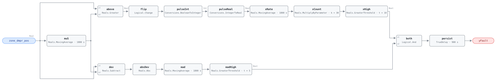

## Description

The damper never stops moving. A VAV box's flow loop is supposed to find a blade
position that delivers the setpoint and stay there until the setpoint moves; a
hunting box overshoots, corrects, overshoots the other way, and repeats every few
minutes all day. The zone usually feels fine — the swings average out — so nobody
reports it, and the box quietly strokes its actuator tens of thousands of extra
times a year. That wear is the real cost; the energy penalty is small and diffuse
(the reference puts it at 1–3% of zone energy), but a floating actuator driven to
death takes the zone with it when it fails. The usual cause is a proportional
gain too high for the box's damper authority, though a noisy airflow signal or a
duct-static loop fighting a zone-demand loop produce the same picture with
nothing mistuned. Prevalence roughly 5%.

## Detection Logic

```
muS    = MovingAverage(zone_dmpr_pos, eval_window)            rolling mean position
above  = zone_dmpr_pos > muS                                  which side of the mean
pulse  = (above ≠ previous tick's above)                      one tick wide, one per crossing
count  = MovingAverage(pulse, eval_window) × count_scale       crossings in the trailing 30 min
mad    = MovingAverage(|zone_dmpr_pos − muS|, eval_window)     amplitude, in MAD units

yFault = (count > max_reversals_per_window)
     AND (mad   > min_oscillation_amplitude)
         sustained continuously for alarm_delay
```

Block graph (`rule.cxf.jsonld`):



`muS` is the spine: one rolling mean feeds both tests — the crossing count on one
branch, the mean absolute deviation on the other — so the rule asks how often the
position ends up on the other side of its own half-hour average and how far from
that average it typically sits. Frequent crossings with a large deviation is
hunting; frequent crossings with a small deviation is dither on a feedback
signal; a large deviation with few crossings is a box following a load.
`Reals.MovingAverage` is a continuous-time integral mean, so a one-tick pulse of
height 1.0 encloses one tick interval of area and `count_scale = eval_window/dt`
converts the pulse average back into a crossing count. That couples this rule to
the host's tick harder than any other in the library: read the Nyquist band and
`count_scale` deviations before deploying, and honour the warm-up NO_EVAL
precondition. Both comparisons are strict — exactly ten crossings reads clear,
eleven alarms — and `persist` requires 15 continuous minutes of both conditions,
three or four more cycles at the reference's severe rate. `delayOnInit = true`
holds that window across a restart.

## Possible Diagnoses

1. PID loop tuning too aggressive — proportional gain too high for the damper's
   authority, or integral time too short for the box's response
2. Airflow sensor noise causing erratic setpoint tracking: the loop is chasing
   measurement noise, and no tuning change fixes a bad velocity pickup
3. Conflicting control signals — the AHU's duct static pressure loop and the zone
   demand loop acting on the same damper with overlapping response times
4. Damper actuator mechanical backlash: the blade lags the command, the loop
   over-drives to compensate, and the limit cycle is mechanical, not computational
5. Zone load disturbance near the thermostat — a copier, a projector, direct sun
   through a blind that opens and closes — a real load the box is following

## Energy Impact

COMFORT_ENERGY, LOW confidence, QUALITATIVE_ONLY. There is no waste term to
compute from this rule's inputs: it sees a damper position and cannot price a
stroke. The reference puts the loss at 1–3% of zone energy from inefficient
control and names actuator wear as the affected subsystem, which is the honest
ordering. Size the opportunity host-side per Energy Impact Reference §4.4
(hunting hours × zone fan and reheat energy); this rule contributes the hours.
LOW confidence for AHU-FC-056's reason — no controlled study isolates the losses
of a hunting loop from the tuning change that fixes it, and no PNNL measure
covers loop stability. Climate-neutral. Per zone the number is small enough to
ignore, which is why it goes unfixed; several hundred boxes with 5% hunting is a
dozen actuators being consumed years early against a fix that costs a gain
setting.

## Emissions Impact

Scope 2, QUALITATIVE_EMISSIONS, LOW confidence. Minimal in absolute terms: the
direct emissions are the marginal fan and reheat energy above, and the reference
records the concern as actuator wear rather than emissions. The larger indirect
term is embodied carbon in actuators replaced early. Avoided-emissions basis:
N/A.

## Deviations

- **Direction reversals → mean crossings, the substitution this rule is built
  on.** The reference counts direction changes, which need the previous sample
  (`CDL.Discrete.UnitDelay`, whose `samplePeriod` is one more silent coupling to
  the host tick) and have no noise floor — a position quantized to 1% reverses on
  essentially every tick it is not moving. The two counts agree on anything
  periodic (a cycle contains exactly two reversals and two mean crossings, and
  all three reference vectors reproduce) and diverge only on drift with small
  ripple, where the crossing count under-reads. That error is one-directional and
  the cases it misses are small-amplitude ripple `min_oscillation_amplitude`
  would have rejected anyway.
- **`min_oscillation_amplitude` is restated in MAD units.** The reference's
  default 10% swing reads as peak-to-peak; the engine has no peak detector and no
  rolling standard deviation, so the available statistic is AHU-FC-056's rolling
  mean absolute deviation. For a square oscillation of ±A about the mean MAD = A,
  so 10% peak-to-peak becomes **5.0 MAD**; for a sinusoid MAD = 2A/π = 0.637 A,
  so a 10% sine has a MAD of 3.2 and needs 15.7% to trip. The default matches the
  reference for the square-ish limit cycles a floating actuator produces and is
  conservative for smooth ones; a site wanting sine-equivalence sets 3.2.
- **Nyquist: this rule cannot run at the library's usual 300 s tick.** `above`
  changes at most once per tick, so the observable ceiling on the count is
  `eval_window/dt` — 6 at a 300 s tick, below the threshold of 10, and the rule
  could never fire (RTU-FC-050's failure mode). A legal deployment needs
  `dt ≥ eval_window/63` ≈ **28.6 s** (the moving average's 64-checkpoint ring
  holds `eval_window/dt + 1` entries) and `dt < eval_window/max_reversals` =
  **180 s** for the threshold to be reachable. Detection before the ceiling wants
  headroom, so 60 s is recommended and is the only tick these vectors exercise.
- **`count_scale` is coupled to the host's tick interval, and the failure is
  silent.** `k = eval_window / dt`, so a host ticking every 120 s must set
  `count_scale` to 15.0; left at 30.0 it reports double the true count and alarms
  on six crossings. Worse here than in AHU-FC-004 or RTU-FC-050 because tick,
  `count_scale` and `eval_window` must move together with the Nyquist band above.
- **`eval_window` binds three CXF parameter paths** — `muS.delta`, `xRate.delta`,
  `mad.delta` — and a host must set all three together and recompute
  `count_scale` with them. Splitting them changes what the statistic means: a
  mean over one window compared against deviations averaged over another is not a
  MAD of anything. AHU-FC-056 bound two paths per window for the same reason.
- **Rolling count built from a moving average, because the block set has no
  windowed counter.** `Integers.OnCounter` counts monotonically from a reset, so
  a trailing-window count would need a host-driven reset — a tumbling count whose
  verdict depends on where the boundary fell. AHU-FC-004's trade, including its
  half-open window: a crossing exactly `eval_window` old has just left the count.
- **`Reals.MovingAverage` is a continuous-time integral mean, not a sample
  mean.** The engine accumulates `u·dt` forward-Euler and divides by the window,
  so hand-computed sample statistics do not match it and every assertion edge in
  `vectors.json` was derived by replaying the graph at the pinned engine rev.
- **Warm-up NO_EVAL is load-bearing, and a warm-up transient can assert.** While
  `t < eval_window` all three averages divide by elapsed time, so eight crossings
  in the first ten minutes read as a count of 24. `alarm_delay` (900 s) is half
  of `eval_window`, so `delayOnInit` cannot cover the gap as it does in
  AHU-FC-004 and a startup burst can reach a verdict (`warmup_burst_asserts` pins
  it). The host precondition is not optional here (RTU-FC-050 precedent).
- **Startup artifact: a spurious first-tick pulse, which costs nothing.** On the
  first tick `muS` outputs 0.0, so any positive damper position makes `above`
  true and `Logical.Change` emits a pulse at t = 0. It encloses no area (`dt` is
  zero on the first tick) and never reaches the count. `flip.pre_u_start` is
  written explicitly as `false` and not exposed as a card parameter.
- **A perfectly steady damper produces exactly one crossing.** While the window
  fills, `muS` runs a hair below a constant input (its divisor is elapsed time
  plus a 1 ms guard) so `above` is true; when the window fills the mean equals the
  input exactly and `flip` emits one pulse. Harmless, but it is why a quiet box
  reads a count of 1 rather than 0 for its first half hour.
- **Neither statistic drops when the hunting stops; both decay across the
  trailing window.** The count falls only as old crossings age out and `mad` only
  as the flat stretch dilutes the average, so the alarm outlives the fix by
  design, the release time is a property of the window rather than the repair,
  and whichever statistic crosses back first releases it. What the rule reports
  is oscillation sustained above both thresholds, not every excursion through
  them.
- The reference's three test vectors are statistical summaries (reversal counts
  and swing percentages), not tick traces, so each is re-expressed as a damper
  trajectory producing the stated statistics, following AHU-FC-056's treatment of
  the same problem; the remaining scenarios are authored here.
- **`playbooks: []`.** Nothing in `playbooks/` covers control-loop tuning — the
  gap AHU-FC-056 recorded when it landed. A loop-tuning playbook can adopt both
  faults when it is written.
- **`related` adds VAV-FC-053.** The reference lists AHU-FC-056 only, which this
  card keeps as the same instability one level up. VAV-FC-053 is the box-mechanics
  pair: FC-053 asks whether the flow loop reaches its setpoint, this one whether
  it can stay there.
- **Method stays `rule` per the reference**, even though sibling AHU-FC-056 is
  `statistical` and this rule computes two rolling statistics: the crossing count
  is a deterministic count of events, and nothing here estimates a parameter or
  compares against a learned baseline. Severity 3 and phase 2 are the chapter 10
  card's; its §5.8.2 index carries no severity column.
- Operating states are declared, not gated: the reference marks the fault
  applicable in every state with the fan running, and the graph has nothing to
  exclude.
- `persist.delayOnInit = true` (Modelica/CDL default is `false`), the library's
  standing choice: an oscillation already in progress at load waits out the full
  15 minutes instead of alarming on the first tick after a restart.

## Notes

Bind position feedback where the box has it. A rule bound to the damper *command*
still catches diagnoses 1, 2, 3 and 5, since the loop is what oscillates; what it
cannot see is diagnosis 4, where backlash makes the blade lag and overshoot while
the command looks calmer than the motion. A command-bound instance is a
legitimate deployment with one diagnosis out of reach.

Check the airflow signal before touching the gains: diagnosis 2 produces textbook
hunting statistics behind a perfectly tuned loop, and retuning to compensate for
a bad measurement leaves the noise where it was. Trend measured flow next to
position — control hunting is smooth and roughly periodic, a noisy velocity
pickup is neither. Diagnosis 5 is the case where nothing is broken, and the
30-minute window helps: a genuine load disturbance gives a handful of large
excursions, not ten crossings of the running mean, so a marginal count with a
large amplitude means look at the zone. For diagnosis 3 the cross-check is the
number of zones — a dozen boxes on one trunk hunting together is the duct static
loop, and no zone-level retuning will settle it.
