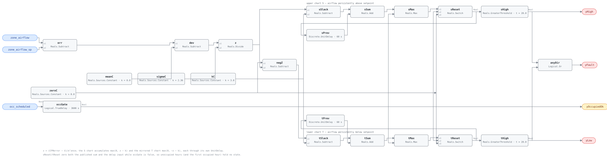

## Description

The box tracks its airflow setpoint slightly wrong, and keeps doing it. A damper
caught part way through its stroke, a differential-pressure pickup starting to
foul, a flow loop tuned soft enough to sit permanently a little off target — none
of these produce the 30% miss VAV-FC-053 waits for, and all of them are faults.
This rule accumulates the error instead of thresholding it. Each sample's flow
error is normalized against the box's own commissioned noise, the part of it that
looks like ordinary variation is written off, and whatever is left is added to a
running sum that grows only while the error keeps leaning the same way.
Symmetric noise never builds; a small persistent bias always does. Two sums run,
one per direction, so a box over-delivering and a box starving its zone arrive as
different findings. This is the airflow channel of NIST's VPACC, the first of
three (VAV-FC-102 temperature, VAV-FC-103 reheat-coil ΔT).

## Detection Logic

```
CFMerror    = zone_airflow − zone_airflow_sp
z           = (CFMerror − mean_flow_error) / sigma_flow_error
yOccupiedOk = occ_scheduled held continuously true for occupied_warmup   (false ⇒ host reports NO_EVAL)

while yOccupiedOk:   S = max(0, z − k + S_prev)     T = max(0, −z − k + T_prev)
otherwise:           S = 0                          T = 0

yHigh = S > alarm_limit_h     yLow = T > alarm_limit_h     yFault = yHigh OR yLow
```

Block graph (`rule.cxf.jsonld`):



The library's first feedback accumulator: `sReset`/`tReset` feed
`Discrete.UnitDelay` instances whose outputs return to `sSum`/`tSum`, which the
engine accepts because a unit delay's output at tick *i* is its input at tick
*i−1* by construction and so cuts the direct-feedthrough graph. `sample_period`
must therefore equal the host's tick, and the delay's `y_start` is left at the
CDL default of 0.0 — which is the correct initial accumulator value, so this
rule needs no warmup mask.

There is no persistence timer, because `alarm_limit_h` is the timer: time enters
through accumulated evidence rather than through a dwell on a boolean. That cuts
both ways on the falling edge. A rule with a `TrueDelay` drops the moment its
condition clears; this one drains at `slack_k` per sample from wherever the
accumulator got to, so an alarm outlives the fix by however long the sum takes to
fall back through the limit — minutes for a small bias, an hour for a large one.
The comparison is strict and the graph divides by `sigma_flow_error` unguarded,
which is safe only because that divisor is a commissioned constant with a
documented floor and not a live signal.

## Possible Diagnoses

Per §5.1.3, the CUSUM of CFMerror detects stuck dampers, differential-pressure
sensor faults, and unstable airflow control.

1. Damper stuck or actuator slipping — the classic case, and the direction flags
   split it: `yHigh` on a box that will not close down, `yLow` on one that will
   not open up
2. Differential-pressure flow sensor drifting or partly plugged — a fouling
   pickup reads low, the loop opens against it, and the *measured* error is small
   and one-signed for weeks, which is precisely the signature a threshold rule
   cannot see
3. Unstable or badly retuned flow control — a loop that overshoots symmetrically
   leaves both sums at zero, but one that limit-cycles around an offset does not
4. A mis-bound or stale `zone_airflow_sp` — a real sustained error against a
   number nobody is controlling to. Check the binding before the box
5. Branch static pressure chronically short of what this box needs, in which case
   the box is behaving correctly and the finding belongs upstream

## Energy Impact

COMFORT_ENERGY, MEDIUM confidence, PROXY_ESTIMATION. The mechanism is
VAV-FC-053's and so is the waste term — over-delivered air costs
`(zone_airflow − zone_airflow_sp) × cp × |sat − zone_temp|`, assembled host-side
because neither temperature is an input here; under-delivery costs unmet load and
complaints instead. What differs is scale: this rule fires on biases below the
threshold rule's 30%, so each box's number is small and the case for the work
order is the count of boxes and the months of drift caught early rather than the
instantaneous kilowatts. Confidence is MEDIUM because the method is validated on
real VAV boxes (the source detected all three of its injected faults with no
false alarms) while every parameter is per-site. Climate-neutral.

## Emissions Impact

Scope 1 or 2, PROXY_EMISSIONS, MEDIUM confidence. Which applies follows what
conditions the excess air: a hot-water reheat coil working against an
over-delivering box is on-site combustion, while the fan moving the air and the
chiller cooling it are purchased electricity. Avoided-emissions basis: marginal
operating emissions rate (MOER). Per-box quantities are small; the population is
not.

## Deviations

- **The shipped k and h come from the source's real-data section, not from its
  illustration.** Figure 9's k = 0.5, h = 5 is a synthetic demonstration on
  random normal data. §5.2.3 states that k was set to three for the Iowa Energy
  Center charts, and Table 5 publishes alarm-limit ranges per channel measured
  against injected faults. The airflow channel's own numbers are what ship.
- **`alarm_limit_h` defaults to 20, which is a library choice inside the
  source's interval.** Table 5 gives 3–180 (S) and 3–100 (T); Table 6's healthy
  peaks over seven zone-days are ≤ 3. Twenty is near the geometric centre of the
  overlap — roughly 7× the observed healthy ceiling and 5× below the tightest
  detection bound — and the source is explicit that its own numbers are
  preliminary and site-dependent.
- **One `h` for both directions, though the source's ranges are asymmetric.** Its
  S range runs to 180 and its T range to 100, and other channels' T sides are
  marked "not used" entirely. A single parameter keeps the common case honest and
  the two block paths stay individually settable for a site that wants the split.
- **`sigma_flow_error` ships as a per-box placeholder in the strong sense.** The
  5 CFM of Table 4 was measured on four ~280 L/s boxes; flow-sensor noise scales
  with the box, so the default is a worked example rather than a portable
  constant, and left unretuned on a 2000 L/s box it makes every ordinary
  fluctuation a 10 sigma event. Same contract as HP-FC-050's fitted baseline and
  VAV-FC-050's ventilation requirement, and the point dictionary is where a host
  looks for the binding.
- **The simulation harness cannot supply this channel's statistics, and does not
  pretend to.** `vavcal` computes normal-operation mean and standard deviation
  for the temperature and reheat-ΔT channels only. A modelled terminal's airflow
  is a solved quantity with no damper-loop dynamics and no DP-sensor noise in it,
  so a simulated CFMerror would report solver residuals rather than the
  quantity being calibrated. The airflow channel's defaults are therefore the
  source's own field measurements, and commissioning per §5.1.5 remains
  mandatory.
- **Occupancy is a bound point, not a host-side precondition.** The library's
  stance keeps gating in the host, but CUSUM's semantics require the accumulator
  to be *zeroed* at the start of each occupied period rather than merely ignored:
  a frozen non-zero sum would carry last night's history into this morning. The
  `Reals.Switch` pair selecting zero is the only way to express that in-graph.
  Precedent for occupancy as an ordinary input: AHU-FC-060, SYS-FC-057.
- **The first-hour exclusion is a `TrueDelay` with `delayOnInit = true`**, so it
  is served after every occupied-period start and after a controller restart. The
  source's reason is settling to steady state; it also covers the morning warm-up
  excursion, which would otherwise be the largest single accumulation of the day.
- **`y_start` is left at the CDL default of 0.0 and no warmup gate is needed** —
  the opposite call from SYS-FC-059, and for a good reason rather than
  inconsistency. There the seed fabricated a step against a live reading; here
  zero *is* the correct initial accumulator, so the delay's two-sample seed
  persistence costs at most one sample of accumulation and can never invent a
  fault.
- **`sample_period` and the alarm limit are coupled through the tick.** The
  accumulators advance once per sample, so h is evidence per sample and
  time-to-alarm scales inversely with the tick rate. A host moving from 60 s to
  300 s ticks keeps the same detection floor but takes five times as long, and
  the fix is to re-derive h, never to leave it alone and assume the rule is
  unchanged. Both `UnitDelay` instances take the value together through the
  list-form `cxf` path.
- **No persistence timer on the fault path**, unlike almost every other card
  here. Adding one would be redundant against evidence that is already
  time-integrated, and would delay a finding the accumulator has already
  established.
- **The alarm drains rather than latching or clearing cleanly.** Once the error is
  corrected the sum falls by k per sample and `yFault` stays true until it passes
  back below h — 23 minutes in the pinned vector. Hosts should treat the assert
  as the event and hold the work order, not track the falling edge.
- **Strict `>` on both limits, bracketed rather than pinned.** The vectors walk
  the accumulator across h one unit per sample and assert on the samples either
  side, because a normalized running sum is a computed double that cannot be
  parked exactly on the limit — AHU-FC-056's argument, and its arithmetic here is
  off by an ulp per sample.
- **Overlap with VAV-FC-053 is complementary, and neither suppresses the other.**
  053 catches a big fast miss on one look (30% of setpoint, sustained 20 min);
  this catches a small one that never clears — at the shipped parameters, roughly
  7 to 60 L/s on a 200 L/s box, a band 053 is structurally blind to. A box far
  enough out will trip both, which is a corroboration rather than a duplicate.
- **The library's units are the dictionary's, so the source's CFM figures are
  converted.** 5 CFM → 2.36 L/s at 0.4719 L/s per CFM; k and h are dimensionless
  and cross unchanged. Hosts on CFM convert before binding, per SCHEMA.md.
- **`points` needs nothing new.** §5.1.4 names room temperature, both zone
  setpoints, airflow setpoint, actual airflow and occupancy as points already in
  the local controller; this channel uses three of them and adds no
  instrumentation. VAV-FC-103's `vav_dat` is the family's only new point.
- **`playbooks` lists `stuck-actuator` first, which this batch's assignment did
  not.** The card was assigned `vav-min-flow-reheat` with the rest of the family,
  and it stays; but diagnoses 1 and 2 are a stuck damper and a failing flow
  sensor, which is `stuck-actuator`'s subject and VAV-FC-053's binding for the
  same reasons. Both are recorded here because `playbooks/` is single-writer.
- **Severity 3, phase 3, `method: statistical`, `g36: null`.** Severity follows
  VAV-FC-053, the threshold rule on the same signal; phase 3 and the 1xx band are
  SCHEMA.md's for advanced statistical rules, matching the reserved VAV-FC-100.
  VPACC predates G36 by two decades and no §5.16 clause covers terminal flow
  tracking.
- **The direction flags are drawn as neutral pills, not red ones.** SYS-FC-055
  and SYS-FC-057 draw sub-condition flags in the fault colour, which reads as
  three alarms leaving the graph; amber stays reserved for evaluability
  (`yOccupiedOk`). Worth reconciling library-wide rather than per card.
- Operating states and the remaining preconditions are declared in frontmatter
  for host enforcement rather than encoded in the block graph, per the library's
  design stance.

## Notes

Commission `sigma_flow_error` on data that includes ordinary setpoint activity,
not on a quiet afternoon. Every setpoint change produces a genuine tracking
excursion while the damper strokes, and a sigma fitted without any of them makes
those excursions look like evidence. The source's own boxes, sampled every
minute through real occupied days, peaked at an accumulated 3 — so on a
reasonably tuned box the strokes cost nothing, but that is a fact about their
boxes and their sampling interval, and it is the first thing to check when a
newly deployed instance alarms on its first day.

Read the direction flags before dispatching. `yLow` with a damper reading full
open is a starved branch or a plugged flow pickup; `yHigh` with a damper reading
closed is an actuator off its shaft or a flow sensor reading low against a
correctly positioned blade. Both are cheaper to tell apart from a day of trend
than from a ladder.
