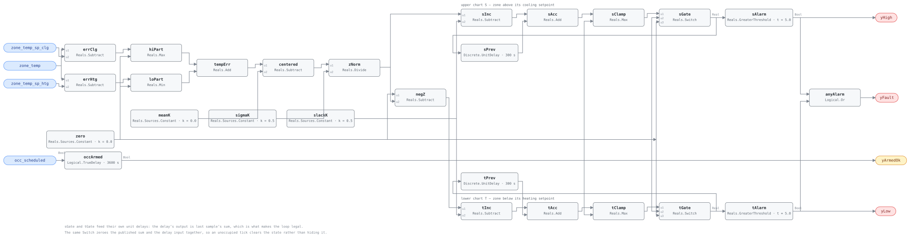

## Description

A zone that misses its setpoints by a little, all day, is invisible to a
threshold. Half a degree past the cooling setpoint is not worth an alarm on any
one reading, and no fixed band will catch it without also catching every
transient. A cumulative sum chart catches it by accumulating: the deviation is
normalized, a slack term is subtracted so ordinary variation nets out, and what
survives is added to a running total that only moves in one direction until the
zone comes back inside its band. Small and persistent beats large and brief,
which is the opposite of what every other VAV card in this library does.

Two totals run, one per direction, so the finding names which way the zone is
failing — a zone stuck above its cooling setpoint and a zone stuck below its
heating setpoint have almost no repairs in common. The accumulators are held at
zero outside the occupied schedule and for the first hour inside it: an
unoccupied zone is supposed to drift, and a zone still recovering from setback
has not yet failed at anything.

## Detection Logic

```
Temperror = max(0, zone_temp − zone_temp_sp_clg)     above the cooling setpoint
          + min(0, zone_temp − zone_temp_sp_htg)     below the heating setpoint
                                                     both zero inside the deadband

z_i       = (Temperror_i − error_mean) / error_sigma

armed_i   = occ_scheduled held continuously true for exclusion_time

S_i       = armed_i ? max(0,  z_i − slack_k + S_{i−1}) : 0
T_i       = armed_i ? max(0, −z_i − slack_k + T_{i−1}) : 0

yHigh     = S_i > alarm_limit_h        yLow = T_i > alarm_limit_h
yFault    = yHigh OR yLow
```

Block graph (`rule.cxf.jsonld`):



The two accumulators are the library's first feedback loops. Each closes
through a `Discrete.UnitDelay`, whose output at tick *i* is its input at tick
*i−1* by construction — that is what makes the cycle legal rather than an
algebraic loop, and the engine's block-level sort admits it because a
loop-breaker's input is read only by the deferred state update. Both delays run
on `sample_period`, which must be the host's tick interval: between sample
instants a delay holds its last value, so the accumulator recomputes from the
same history instead of advancing, and the published sum is a preview.

There is no persistence timer, because the accumulation is the persistence — a
disturbance large enough to add several increments still has to survive
`alarm_limit_h / slack_k` quiet samples before the sum drains back to zero.
That drain is the flip side of the sensitivity: after a repair the alarm clears
about ten samples later at the defaults, not immediately. Both comparisons are
strict, so a sum landing exactly on the limit reads healthy.

The occupancy reset is applied to the published sum and to the delay input
together, so an unoccupied tick emits a true zero rather than a one-tick
recomputation from zero — CUSUM needs the state cleared, not the output muted.

## Possible Diagnoses

The source attributes this channel to damper faults, valve faults and
temperature sensor faults (§5.1.3); the direction flags split them.

1. **Damper fault** — `yHigh` with a stuck or hunting damper that will not open
   past minimum starves the zone of cooling; `yLow` with a damper stuck open
   overcools it on primary air. Check position feedback against command before
   anything else.
2. **Reheat valve fault** — `yLow` where the valve cannot open (failed
   actuator, no hot water, air-bound coil) and the zone never reaches its
   heating setpoint; `yHigh` where it leaks or is driven open, which is
   VAV-FC-052's fault seen from the temperature side rather than the valve side.
3. **Zone temperature sensor drift or bad placement** — the sensor is wrong and
   the box is fine. A sensor in a supply-air stream, above a copier, or on a
   sunlit wall produces a permanent one-sided error that no repair to the box
   will clear. VAV-FC-100 is the rule that names this; until it ships, a
   sibling-zone comparison does the same job by hand.
4. **Primary air wrong or absent** — supply air temperature off its setpoint,
   duct static starved, fan down. Every box on the trunk trips in the same
   direction within a few samples of each other, which is the tell.
5. **Load beyond the box's capacity** — a re-purposed or over-occupied zone
   whose terminal was sized for something else. A commissioning finding, not a
   fault, and the only one on this list that a work order cannot close.

## Energy Impact

COMFORT_ENERGY, MEDIUM confidence, QUALITATIVE_ONLY. The rule reports that a
zone spent hours outside its band and in which direction; it cannot say what
that cost, because the cost depends entirely on which of the five diagnoses is
true. A starved zone wastes almost nothing directly and delivers the discomfort
the whole system exists to prevent; a zone held above its cooling setpoint by a
leaking reheat coil is burning heat and then paying to remove it, which is
VAV-FC-052's accounting. Confidence is MEDIUM rather than LOW because the method
is not speculative — the source validated VPACC against physically injected
faults on instrumented boxes at the Iowa Energy Center (§5.2) — and not HIGH
because the shipped slack and alarm limits are an illustration, so the
false-positive rate of *this parameterization* is uncharacterized. Climate-
neutral: a zone out of band is out of band in every climate.

## Emissions Impact

Scope 1 or 2 depending on which side trips and what serves the box,
QUALITATIVE_EMISSIONS, MEDIUM confidence, avoided-emissions basis N/A. A `yLow`
finding on a hydronic box points at heating energy, Scope 1 where the boiler
burns gas; a `yHigh` finding points at cooling and fan energy, Scope 2. The
split is real and this card does not collapse it, because the direction flag
that decides it is one of the two things the rule actually knows.

## Deviations

- **Temperror is signed here; the source's third branch is not.** §5.1.3 writes
  `Temperror = HSP − Temproom` below the heating setpoint, a positive magnitude,
  so its Temperror is non-negative in both directions. Taken literally that
  makes eq. 3's T chart dead on this channel — with a non-negative error and the
  measured x-bar of zero, `−z − k` is never positive and `yLow` could never
  assert. This card negates that branch (`zone_temp − zone_temp_sp_htg`), which
  leaves the magnitude identical to the source's and puts the source's own
  two-sided recursion back to work. The cost is that a zone alternating between
  hot and cold excursions accumulates in neither chart as fast as a magnitude
  signal would; that oscillation is VAV-FC-054's fault, not this one's.
- **The piecewise is built as `max(0, e_clg) + min(0, e_htg)`** rather than as a
  three-way selection. For `zone_temp_sp_htg <= zone_temp_sp_clg` the two terms
  are never both non-zero and the sum reproduces all three branches exactly, in
  five blocks with no boolean routing. It relies on that ordering: crossed
  setpoints make both terms live and the sum meaningless, which is why the
  frontmatter demands the ordering rather than clamping it in-graph.
- **`error_sigma` is a floor, not a statistic.** The committed harness method
  (`vavcal`) computes exactly this piecewise over occupied ticks and reports the
  cross-zone median mean and standard deviation; on B2B OfficeMedium-4004, 15
  zones, one July and one January week, healthy Temperror came back identically
  zero in both seasons. That is a fact about a well-controlled simulated
  thermostat as much as about the piecewise, and simulation noise (order 0.01-
  0.03 °C) is cleaner than any real sensor — but it does establish that there is
  no healthy standard deviation to divide by. So sigma ships as a documented
  floor in degrees, and the consequence is stated plainly: any sustained
  deviation above `slack_k × error_sigma` accumulates without limit.
- **`slack_k = 0.5` and `alarm_limit_h = 5` are Figure 9's illustrative pair.**
  §5.1.5 declines to publish production values and describes a per-box-type
  calibration campaign instead; Figure 9's numbers annotate a synthetic
  normal-distribution example, not a VAV box. They ship because a card needs
  defaults, and the parameter descriptions say exactly what they are. Contrast
  the APAR half of the same report, which commits a full threshold table.
- **The occupancy reset is in the graph, against the library's usual stance.**
  Operating-state gating is normally host-side, but suppressing the output is
  not the same as resetting the state: a frozen non-zero accumulator would carry
  yesterday afternoon's excursion across the night and alarm on the first armed
  tick. The source is explicit that the CUSUMs reset to zero (§5.1.3), so the
  reset must be where the state is. Binding `occ_scheduled` as an ordinary point
  follows AHU-FC-060 and SYS-FC-057.
- **The reset drives the published sum, not only the feedback path.** Switching
  only the delay's input would leave the current tick free to publish
  `max(0, z − k)` while unoccupied, so a single large unoccupied excursion could
  assert `yFault` at `alarm_limit_h` below 1. The Switch sits between the clamp
  and both consumers instead.
- **The first hour is a `Logical.TrueDelay` on `occ_scheduled`,** not a
  host-side convention: `armed` goes true only after the schedule has been true
  continuously for `exclusion_time`, and falls immediately when it drops.
  `delayOnInit = true` (CDL default `false`) is the library's standing choice
  and does real work here — a controller restarting mid-afternoon serves a fresh
  exclusion hour rather than arming empty accumulators into a running zone.
- **`sample_period` binds two CXF paths and couples the rule to the host's
  tick.** `Discrete.UnitDelay` advances on a grid derived from the first tick
  time; between instants it holds, so a host ticking faster than the period sees
  the accumulator recompute from an un-advanced history rather than climb. Ticks
  slower than the period degrade gracefully to a one-tick delay. Set both paths
  together, and set them to the tick.
- **`UnitDelay` seeds from `y_start` for up to two sample periods when the run
  starts off-grid** (engine-verified: the block samples on `when sampleTrigger`
  with no `initial()` clause, so a mid-interval start stages nothing until the
  next true instant). At `y_start = 0` — the default, left unset — that is
  indistinguishable from the reset state, so the quirk costs nothing here; it
  would matter to any future card seeding a delay non-zero.
- **No alarm delay on `yFault`.** Every other timing-bearing card in this
  library ends in a `Logical.TrueDelay`; this one does not, because the
  accumulation already is the persistence test and stacking a timer on top would
  make the effective detection time two unrelated parameters deep. The source
  alarms when the sum exceeds the limit, full stop.
- **Slack, limit, mean and sigma are `Reals.Sources.Constant` values, not
  `AddParameter`/`MultiplyByParameter` gains.** The memo's sketch used
  `AddParameter(p = −k)`, which would make the shipped tunable a negative number
  the retuner has to remember to negate. Constants keep every published
  parameter positive and in its natural unit, the same reason SYS-FC-055 squares
  its noise threshold in-graph rather than publishing the square.
- **One `alarm_limit_h` binds both charts.** §5.1.5 speaks of alarm limits for
  the S and T sums separately, so an asymmetric site is within the source's
  intent; the card exposes one parameter because symmetric is the sane default,
  and both CXF paths are listed so a host can split them deliberately.
- **Both comparisons are strict (`>`),** matching "exceeds" in §5.1.1. The edge
  is pinned exactly rather than by bracketing, because at the shipped defaults a
  0.5 °C excursion produces an increment of exactly 0.5 and the sum lands on
  5.0 and then 5.5 on consecutive samples with no floating-point slack.
- **Three extra boundary outputs, and they are not the same kind.** `yHigh` and
  `yLow` are sub-condition flags in SYS-FC-055's sense — diagnostic detail, read
  *with* `yFault`, and a false one never means NO_EVAL. `yArmedOk` is an
  evaluability flag in AHU-FC-006's sense: the occupancy gate lives inside this
  graph, so without it a host cannot tell a silent healthy zone from a zone
  nobody was watching.
- **Severity 3, `category: COMFORT_ENERGY`, `confidence: MEDIUM` and the name
  are library-authored.** The HVAC FDD Reference has no CUSUM card to transcribe
  and the source assigns no severity to anything. Severity 3 matches VAV-FC-052,
  the neighbouring zone-comfort card; the category follows the fault's character
  (a zone out of band costs comfort first and energy second).
- **`g36: null` and no G36 clause in `source`.** G36 sequences terminal units,
  but this logic is 2001 statistical-process-control work that predates it, and
  SCHEMA.md reserves the `g36` field for the 001-049 range regardless.

## Notes

The engine accepted the feedback loop without complaint on the first load, which
is worth recording because it was the open question for the whole family:
`Discrete.UnitDelay` declares no feedthrough from `u` to `y`, so the connector
DAG never sees a cycle and the block-level emit-before sort skips the cut input
entirely. Nothing about the loop needed working around.

`VAV-FC-100` is reserved for zone temperature sensor drift by neighbour
comparison. It is deliberately not in `related`, because it does not co-occur
with this rule — it is the rule that decides whether this one's input can be
believed, and diagnosis 3 is the whole of the overlap.

The family splits by error signal, not by fault: VAV-FC-101 accumulates airflow
error, this card zone temperature error, VAV-FC-103 the reheat-coil temperature
rise. A box in real trouble usually trips more than one, and which ones it trips
is most of the diagnosis.
