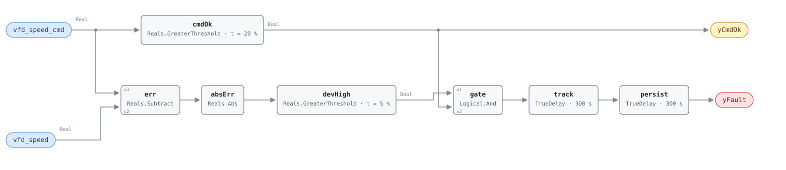

## Description

A variable frequency drive is asked for a speed and reports back the speed it is
running. When those two numbers separate and stay separated, something between
the control loop and the shaft has stopped working — the drive derating itself
on a hot heatsink, a motor loading up on a failing bearing, a belt slipping so
the driven equipment never reaches the speed the motor does, or a command that
never arrived. The rule is deliberately indifferent to which: two points, one
subtraction and a tolerance, which is why the same rule covers fan and pump
drives without change. What it buys is early warning on a component whose
failures are progressive — a derating drive or a slipping belt deteriorates for
weeks before it stops — so the alarm is about the equipment, not about energy.

## Detection Logic

```
deviation = |vfd_speed_cmd − vfd_speed|

yCmdOk = vfd_speed_cmd > min_cmd_for_eval        (false ⇒ host reports NO_EVAL)
yFault = (deviation > speed_error_threshold AND yCmdOk)
         sustained for deviation_duration, then held a further alarm_delay
```

Block graph (`rule.cxf.jsonld`):



`err` and `absErr` form the unsigned deviation, so the test is symmetric: a
drive falling short of its command and a drive overrunning it are both faults
and both alarm. Belt slip and a failing tachometer sit on opposite sides of that
same comparison.

`vfd_speed_cmd` fans out a second time into `cmdOk`, the evaluability branch,
whose output is both the boundary output `yCmdOk` and the second input of
`gate`. A drive commanded below its minimum speed therefore holds `yFault`
down — and that false means *unknown*, not *healthy*. Below its own minimum a
drive is under no obligation to track: a loop output of 10% on a drive whose
minimum is 20% leaves the machine stopped, and the resulting 10-point
"deviation" is correct behavior.

`track` and `persist` are two delays in series (the AHU-0027 pattern, also
used by VAV-0004): `track` is the reference's `sustained for
deviation_duration`, `persist` its separate `AlarmDelay`, ten minutes total at
the defaults and independently tunable. Any moment of tracking drops both timers
and discards the accumulated time, so the alarm always describes one continuous
deviation. Both comparisons are strict — a deviation of exactly 5.0 points is
not a fault, a command of exactly 20.0% is not evaluable.

## Possible Diagnoses

1. VFD internal fault — overcurrent, overvoltage, or overtemperature, the last
   of which shows first as quiet derating rather than a trip
2. Motor bearing failure, loading the drive until it can no longer hold
   commanded speed
3. Belt slip on fan applications — the motor reaches its speed and the driven
   equipment does not, so which of the two the feedback reports decides whether
   this rule can see it at all
4. Communication fault between the BAS and the drive, leaving the drive on its
   last received command or a local setpoint
5. Speed sensor or tachometer failure — the drive is fine and the measurement is
   wrong, which is why the point dictionary prefers the drive-reported speed
   where both are trended

## Energy Impact

PROTECTIVE, MEDIUM confidence, QUALITATIVE_ONLY. There is no per-fault energy
model and the reference does not offer one; it points to the Energy Impact
Reference §4.4 framework, which applies only once the failing component is
known. The direction of the waste depends on the cause: a derating drive makes a
pressure-controlled loop work longer for the same result, a slipping belt turns
shaft power into heat in the belt, and a failed tachometer costs nothing until
someone acts on its reading. Neutral climate sensitivity. The number worth
quoting to an owner is the repair — the playbook puts a drive replacement at
$500-$2,000 depending on motor horsepower.

## Emissions Impact

Scope 2, QUALITATIVE_EMISSIONS, MEDIUM confidence, basis N/A. VFD-driven
equipment is electric, so whatever additional draw the fault produces is
purchased electricity. The reference declines to give a range — "protective;
indirect via motor/VFD damage" — and that is the honest reading: the emissions
consequence is dominated by the replacement hardware and the runtime of whatever
the drive serves, neither of which this rule measures.

## Deviations

- **`min_cmd_for_eval` is an adopted addition; the reference has no such
  parameter**, only the bare deviation test. Without the gate the rule misfires
  wherever a drive is commanded below the speed it can physically hold: the drive
  sits stopped, the command sits at 10%, and the rule reads a 10-point fault on a
  machine behaving as designed. The 20.0% default is VFD-0002's `min_speed` —
  same chapter, same family, same quantity — and hosts retune it to the drive's
  actual minimum. Exposed as `yCmdOk` per SCHEMA.md so the host can tell NO_EVAL
  from healthy.
- **The gate creates a blind spot, and not a small one.** A drive running while
  commanded off — a welded contactor, a hand-off-auto switch left in hand, the
  stuck last-command case of diagnosis 4 — has a command of 0% and is never
  evaluated at any positive `min_cmd_for_eval`. The check that would catch it is
  a run-status-versus-command comparison at equipment level, which this library
  has no drive rule for; AHU-0018 and RTU-0006 ask the nearest question
  (a fan running outside its schedule) and catch only the after-hours version.
  Read `yCmdOk = false` as this rule standing down, not as an idle drive being
  fine.
- **Two delays in series rather than one.** The reference lists
  `deviation_duration` and `AlarmDelay` as separate tunables for the same
  condition, so both are kept and chained. A single 600 s delay would be
  indistinguishable as shipped, but a site wanting a two-minute deviation window
  and a ten-minute alarm hold can have it. Precedent: VAV-0004, whose reference
  tunables have the identical shape.
- **Strict `>` at the deviation threshold.** The reference writes `>` too, so
  nothing is lost, and CDL Reals has no `GreaterEqual` to express the inclusive
  form anyway. A deviation of exactly 5.0 points reads healthy; the disagreement
  is measure-zero on a real-valued signal and both sides are pinned.
- **`suppresses: [VFD-0002]` is an authored relationship**, not the
  reference's, which declares no suppression for either card. VFD-0002 reads
  the same `vfd_speed` feedback and asks whether the drive is parked at minimum;
  a drive whose feedback is not tracking its command cannot support that premise,
  so a live VFD-0001 makes VFD-0002's verdict unreliable rather than merely
  co-occurring. VFD-0002 carries the matching `suppressed_by`.
- **Both points are percent of rated speed and the rule converts nothing.** The
  point dictionary declares `%` for both; a drive trended in Hz must be scaled
  before binding. Stated in the preconditions because the failure mode is a
  permanent, plausible-looking deviation rather than an obvious error.
- `delayOnInit = true` on both delays (CDL default is `false`): a drive already
  deviating when the controller starts waits out the full ten minutes rather than
  alarming on the first tick.
- Frontmatter `clusters` is empty — the reference defines no cluster containing a
  VFD rule, and this card does not edit the cluster set. `g36` is null: a
  research-backed 050-range rule sourced to Ali et al. 2020 and engineering best
  practice rather than to a G36 clause.
- The reference publishes no test vectors for this card; every scenario in
  `vectors.json` is library-authored.

## Notes

Read `yFault` and `yCmdOk` together. An alarming drive can go quiet because the
loop backed its command below the evaluation floor rather than because it
recovered — both outputs fall on the same tick, and only the pair distinguishes
that from a genuine recovery. Step 3.1 of the
[vfd-pump-faults](../../../playbooks/vfd-pump-faults.md) playbook, verifying that
the VFD output tracks the command within 5%, is this rule's threshold read as an
acceptance test: the same number that raises the alarm closes the work order.
VFD-0002 asks a different question of the same drive — not whether it follows
its command, but whether the command has run out of room. Clear this one first.
