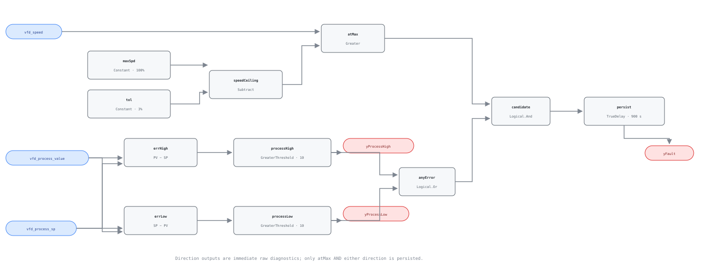

## Description

A process loop has spent its last increment of actuator authority: the drive is
near its configured maximum, yet the quantity it regulates remains materially
away from setpoint. That signature does not identify one component. It can mean
an obstructed air or water path, undersized equipment, a drive held below its
reported limit by current or torque protection, a bad process sensor, an
incorrect control direction, or a maximum that was commissioned too low. What
it does identify is the useful decision boundary: more ordinary loop output is
no longer available, so waiting for the controller to recover is not a fix.

## Detection Logic

```text
speed_ceiling = max_speed - speed_tolerance
at_max        = vfd_speed > speed_ceiling
process_high  = vfd_process_value - vfd_process_sp > pv_error_threshold
process_low   = vfd_process_sp - vfd_process_value > pv_error_threshold

yProcessHigh = process_high
yProcessLow  = process_low
yFault       = TrueDelay(at_max AND (process_high OR process_low),
                         sustained_duration)
```

Block graph (`rule.cxf.jsonld`):



The high and low branches are separate rather than an absolute-value block so
the graph can expose the error direction without pretending to know the loop's
control sign. They are mutually exclusive at a positive threshold and remain
raw: either may be true while the drive is at mid-speed. Only their OR is gated
by `atMax` and delayed. Any release of the speed or process branch clears the
fault and resets the complete 900-second timer.

## Possible Diagnoses

1. Air- or water-side obstruction: dirty filter/coil, closed damper or valve,
   blocked strainer, or restricted duct/pipe.
2. Equipment or distribution system undersized for the present load.
3. Drive current, torque, safety, demand, or application limit below the
   normalized maximum assumed by the BAS.
4. Process sensor bias, setpoint/unit mismatch, or reversed control action.
5. Mechanical degradation in the driven equipment, belt, coupling, or impeller.
6. Maximum-speed parameter or reset sequence commissioned incorrectly.

## Energy Impact

COMFORT_ENERGY, MEDIUM confidence, QUALITATIVE_ONLY. A saturated drive can spend
long periods near its largest electrical draw without meeting demand, but the
three inputs cannot distinguish useful peak-load operation from wasted work
behind an obstruction. Use the playbook to establish the cause before applying
fan/pump laws or claiming savings.

## Emissions Impact

Scope 2, qualitative. VFD-driven equipment is electric; any avoidable high-speed
runtime becomes purchased-electricity emissions. No avoided-emissions number is
defensible without measured power and a diagnosed correction.

## Deviations

- **This is a library-authored high-limit complement, not a transcribed PNNL or
  NIST equation.** Those sources support monitoring drive output and regulated
  process behavior; the exact 100%, 3-point, 10-unit, and 900-second choices are
  classified above rather than presented as published universal limits.
- **`pv_error_threshold` has no portable default.** The shipped 10.0 exists so
  the CXF graph is executable. A deployment that has not replaced it in the
  same units as the bound PV/setpoint is invalid.
- **Both comparisons are strict.** Exactly 97% is clear at the defaults and
  exactly +/-10 loop units leaves both direction flags false. The vectors pin
  every boundary from both sides.
- **Direction does not imply underdelivery.** `yProcessHigh` can be the bad side
  of one loop and the desired response of another. It is a diagnostic sign,
  not a cause label.
- **Automatic mode is suppressed explicitly.** VFD-0005 suppresses this rule
  because a local/hand or bypassed drive invalidates the automatic-loop
  saturation inference; VFD-0001 does the same when feedback cannot establish
  where the drive actually is. Suppression must be instance-scoped to the same
  physical drive.
- **The graph has no enable input.** A stopped drive produces a raw process
  direction but cannot satisfy `at_max`; the host still reports NO_EVAL because
  the operating premise is absent.
- `persist.delayOnInit = true`, so a violation present at engine start waits the
  full 15 minutes.
- No simulation validation is claimed. The current harness has no actual drive
  feedback paired with that same loop's PV and setpoint; joining the pump-flow
  proxy to boiler temperature would be cross-loop fabrication.

## Notes

Read the sign before visiting the field, then read the loop definition. A high
PV at maximum speed may be correct action for a reverse-acting loop, evidence of
overdelivery, or proof that the drive limit is unrelated to the bound process.
The generic rule deliberately stops at that boundary. Resolve VFD-0005 and
VFD-0001 first, verify loop units and direction, then check configured drive
limits and the mechanical path.
