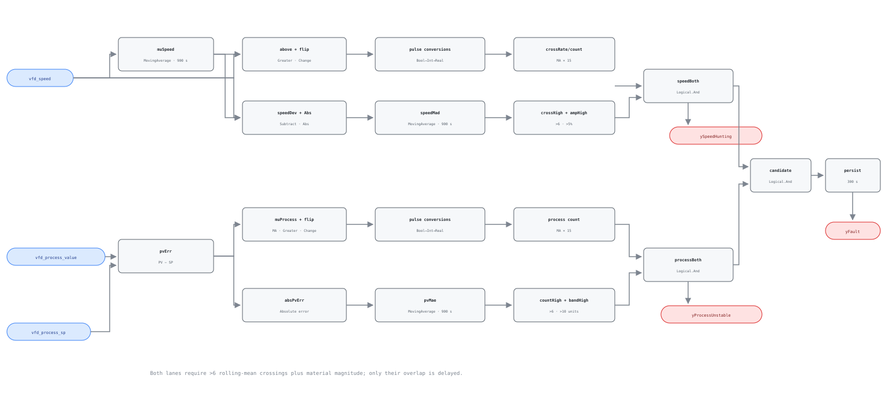

## Description

The drive and its process are moving together, but not settling. A poorly tuned
loop, noisy process signal, conflicting reset sequence, mechanical backlash, or
an application limit can make speed repeatedly overshoot its own center while
the controlled quantity repeatedly moves and remains materially away from
setpoint. The rule requires evidence in both places. Speed oscillation with a
stable process is useful tuning evidence but not this combined fault; process
oscillation behind a steady drive points somewhere else.

## Detection Logic

```text
speed_mean   = MovingAverage(vfd_speed, evaluation_window)
speed_count  = MovingAverage(Change(vfd_speed > speed_mean), window)
               * count_scale
speed_mad    = MovingAverage(abs(vfd_speed - speed_mean), window)
ySpeedHunting = speed_count > max_crossings_per_window
             AND speed_mad > min_speed_mad

process_err   = vfd_process_value - vfd_process_sp
process_mean  = MovingAverage(process_err, evaluation_window)
process_count = MovingAverage(Change(process_err > process_mean), window)
                * count_scale
process_mae   = MovingAverage(abs(process_err), evaluation_window)
yProcessUnstable = process_count > max_crossings_per_window
                AND process_mae > pv_allowance_band

yFault = TrueDelay(ySpeedHunting AND yProcessUnstable, alarm_persistence)
```

Each Boolean `Change` pulse is converted to integer and then real before its
rolling average, as shown in the CXF graph.

Block graph (`rule.cxf.jsonld`):



Both diagnostics are immediate rolling subconditions; only their overlap is
delayed. Stable operation clears them by aging old pulses and deviations out of
the trailing windows. A fresh engine instance resets the rings, edge histories,
and persistence timer.

## Possible Diagnoses

1. PID gain too high or integral time too short for the driven system.
2. Noisy, quantized, or intermittently connected process sensor.
3. Conflicting control loops or reset sequences acting on the same drive.
4. Mechanical backlash, sticking damper/valve, unstable pump system, or rapidly
   changing system resistance.
5. A real load disturbance, staging event, or setpoint reset that the host did
   not exclude.
6. Drive current/torque/application limits interacting with the BAS loop.

## Energy Impact

EFFICIENCY_LOSS, MEDIUM confidence, QUALITATIVE_ONLY. The loss is application
dependent: extra cube-law fan/pump work on high excursions, process energy that
overshoots and is corrected, and wear from continuous speed changes. The rule
has no power point or application model, so it reports hunting duration rather
than an invented savings percentage.

## Emissions Impact

Scope 2, qualitative. Any avoidable motor and process energy is purchased
electricity. Convert measured incremental energy after diagnosis; the rolling
statistics themselves have no emissions factor.

## Deviations

- **Mean crossings substitute for literal direction reversals.** This is the
  verified VAV-0005 implementation: a periodic cycle produces two of either,
  while drift with ripple can differ. The parameter is therefore named
  `max_crossings_per_window`, not `minimum_reversals`.
- **The roadmap's 10% speed excursion becomes 5% MAD.** For a square wave,
  10 points peak-to-peak is +/-5 and has MAD 5. A 10-point peak-to-peak sine has
  MAD about 3.2, so waveform shape matters. Computed-statistic boundaries are
  bracketed in vectors rather than asserted on exact equality ticks.
- **The process lane is an adaptation, not NIST's two-sided CUSUM.** It counts
  crossings of process error around its rolling mean and independently requires
  mean absolute error from the true setpoint. This rejects stable offset but
  intentionally admits a one-sided oscillatory offset; the dedicated vector
  pins that broader behavior.
- **The same crossing limit is applied to both lanes.** NIST publishes no
  VFD-specific value of six. It is one adopted, jointly tuned concept and both
  strict comparisons use `> 6`.
- **`pv_allowance_band` has no portable default.** The executable 10.0 must be
  replaced in the loop's own units before deployment.
- **Event counts are tick-coupled.** A one-tick pulse has area equal to the
  preceding tick interval; `count_scale = evaluation_window / dt` converts its
  moving average back to a count. Irregular ticks bias individual events.
- **The legal sampling interval is narrow.** The 64-checkpoint ring requires
  `dt >= 900/63 = 14.3 s`, while strict `count > 6` requires `dt < 900/6 =
  150 s`. At the current replay harness's 300-second cadence this rule can never
  alarm. Sixty seconds is the only cadence exercised here.
- **Warm-up is host-gated.** Partial-window divisors extrapolate the observed
  event pace, so a startup burst can raise raw diagnostics despite
  `delayOnInit=true`; the first 900 seconds are NO_EVAL.
- **Moving averages are continuous-time integrals**, not sample statistics, and
  event history is half-open: an event exactly one window old has aged out.
- **Change-of-value and sub-tick blindness remain.** A wide COV deadband hides
  crossings; an even number of reversals between samples can return to the same
  observed value and disappear entirely.
- **Suppressions are instance-scoped.** VFD-0001 and VFD-0005 invalidate this
  drive's speed/automatic-loop premise. Their raw states should gate evaluation
  immediately; waiting for another rule's delayed alarm creates a race.
- No simulation FPR is claimed. The harness has neither a genuine VFD speed/PV/
  setpoint triplet nor a legal hunting cadence.

## Notes

The diagnostic split is the investigation order. If only `ySpeedHunting` is
true, inspect speed command, feedback, limits, and mechanical response before
retuning the process loop. If only `yProcessUnstable` is true, the disturbance
or sensor is not being driven by measured VFD motion. When both are true, first
exclude a legitimate reset/load step, then compare their phase: process motion
leading speed suggests real load or noise; speed leading process suggests
tuning or actuator behavior.
