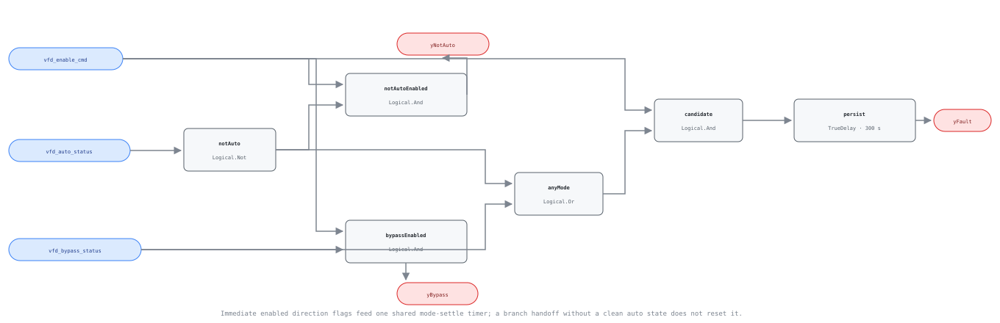

## Description

The BAS expects to regulate a running motor, but the drive is not accepting that
authority or the motor has been transferred around the drive. Either state can
defeat pressure/temperature reset, force an unintended fixed or full-line speed,
and make otherwise useful command, saturation, and hunting diagnostics
meaningless. The finding is operational rather than electrical: it says where
control authority is, not why the operator or drive put it there.

## Detection Logic

```text
not_auto = NOT vfd_auto_status

yNotAuto = vfd_enable_cmd AND not_auto
yBypass  = vfd_enable_cmd AND vfd_bypass_status
yFault   = TrueDelay(yNotAuto OR yBypass, mode_settle_time)
```

The CXF uses an equivalent factored candidate, `vfd_enable_cmd AND (not_auto OR
vfd_bypass_status)`, so the final enable has one meaning throughout.

Block graph (`rule.cxf.jsonld`):



The direction outputs are immediate and enable-gated; they normally precede the
fault by five minutes. A direct handoff from local mode to bypass does not reset
the timer because the candidate OR never becomes false. Clearing enable or the
last active mode branch drops every applicable output immediately.

## Possible Diagnoses

1. HOA/keypad selector left in hand/local after service.
2. Drive command source configured for keypad, terminals, fieldbus, or internal
   PID instead of the commissioned BAS source.
3. Active bypass contactor or integrated bypass mode left engaged.
4. BAS mode mapping inverted or bound to an availability/command point rather
   than authoritative status.
5. Normal emergency, fire/smoke, commissioning, or maintenance operation that
   the host failed to exclude.

## Energy Impact

EXCESS_CONSUMPTION, HIGH confidence in the state when direct commissioned
telemetry is present, QUALITATIVE_ONLY for magnitude. Bypass commonly applies
full line voltage and local mode may defeat resets, but neither Boolean reports
motor kW or load. Downgrade confidence or report NO_EVAL when the point binding
cannot prove control authority and active power path.

## Emissions Impact

Scope 2, qualitative. Any additional runtime or speed becomes purchased motor
electricity. Use metered drive/motor energy during the verified state to size
emissions; do not infer full-load kW from bypass alone.

## Deviations

- **This is a library-authored watchdog.** PNNL supports BAS drive monitoring
  and documents bypass consequences but publishes neither this Boolean equation
  nor a universal five-minute delay.
- **Automatic is not synonymous with remote BAS authority.** Brick's exact
  `Manual_Auto_Status` class does not distinguish local automatic control from
  remote BAS control, so `vfd_auto_status` remains provisional and deployment
  must verify the value mapping.
- **Brick has no exact bypass-status class in 1.4.4.** `Bypass_Command` is not
  used because a request is not active-path proof. The point is provisional and
  may be backed by authoritative drive mode or bypass-contactor telemetry.
- **Diagnostics are enable-gated.** Both flags are false while disabled; that
  means not applicable, not proof of healthy auto mode or an open bypass path.
- **One shared delay follows the OR.** A local-to-bypass handoff without a clean
  automatic tick preserves accumulated time. That is intentional because
  remote authority never returned.
- **Approved operation is host-gated.** Maintenance/emergency bypass has the
  same raw signature and the vectors pin that it alarms unless the host reports
  NO_EVAL.
- **Suppression is broader than the roadmap's VFD-0004 example.** VFD-0002 and
  VFD-0003 also require an active automatic loop, so this rule suppresses all
  three same-drive inferences. Raw mode gates should apply immediately rather
  than waiting for this rule's delayed `yFault`.
- `persist.delayOnInit = true`, so a drive already in local/bypass at engine
  start waits the full configured settle time.
- No replay validation is claimed: the harness exposes no real auto-authority
  or bypass-path telemetry, and neither may be synthesized from speed.

## Notes

Check this rule before tuning or chasing capacity. If `yNotAuto` is true, confirm
the selector position and configured command source; if `yBypass` is true,
confirm the contactor/power path and why it transferred. Restore authority only
through the site's approved sequence and safety procedure. Once the mode finding
is resolved, VFD-0001 through VFD-0004 become interpretable again.
