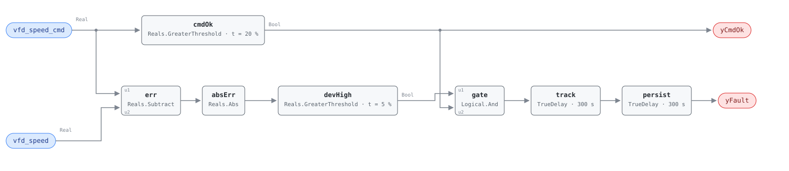

## Description

A variable frequency drive is asked for a speed and reports back the speed it is
running. When those two numbers separate and stay separated, something between
the control loop and the shaft has stopped working. The drive may be derating
itself because its heatsink is hot, the motor may be loading up on a failing
bearing, a belt may be slipping so the driven equipment never reaches the speed
the motor does, or the command may not be arriving at all.

The rule is deliberately indifferent to which. Two points, one subtraction, and
a tolerance — this is the cheapest possible watchdog on a drive, and it works on
any application the drive serves, which is why the VFD family is
application-agnostic and the same rule covers fan and pump drives without
change. What it buys is early warning on a component whose failures are
progressive: a drive that has begun derating on temperature, or a belt that has
begun slipping, deteriorates for weeks before it stops. Severity 2 and the
PROTECTIVE category follow from that — the alarm is about the equipment, not
about a quantifiable energy number.

What the rule cannot do is tell you the cause, and the reference's own diagnosis
list runs from a $50 belt to a $2,000 drive replacement. The
`vfd-pump-faults` playbook's step 1 is the disambiguation procedure: drive
efficiency from input versus output power, harmonic distortion, heatsink and
cooling fan, then the drive's own fault-code display, which usually answers the
question in one look.

## Detection Logic

```
deviation = |vfd_speed_cmd − vfd_speed|

yCmdOk = vfd_speed_cmd > min_cmd_for_eval        (false ⇒ host reports NO_EVAL)
yFault = (deviation > speed_error_threshold AND yCmdOk)
         sustained for deviation_duration, then held a further alarm_delay
```

Block graph (`rule.cxf.jsonld`):



`err` and `absErr` form the unsigned deviation, so the test is symmetric: a
drive falling short of its command and a drive overrunning it are both faults
and both alarm. That symmetry is not decoration — belt slip and a failing
tachometer sit on opposite sides of the same comparison, and the vectors pin
both directions (`feedback_below_command`, `feedback_above_command`).

`vfd_speed_cmd` fans out a second time into `cmdOk`, the evaluability branch.
Its output is both the boundary output `yCmdOk` and the second input of `gate`,
so a drive commanded below its minimum speed holds `yFault` down — and that
false means *unknown*, not *healthy*. The branch exists because below its own
minimum speed a drive is under no obligation to track: a loop output of 10% on a
drive whose minimum is 20% leaves the machine stopped, and the resulting
10-point "deviation" is correct behavior. Without the gate, every drive in the
building would alarm every time its loop backed off to nothing.

`track` and `persist` are two delays in series (the AHU-FC-061 pattern, also
used by VAV-FC-053). `track` implements the reference's `sustained for
deviation_duration` — five minutes, long enough that a drive ramping to a new
command is not a fault — and `persist` adds the reference's separate five-minute
`AlarmDelay`, for ten minutes total at the defaults. They stay independently
tunable even though a single 600 s delay would behave identically as shipped.
Any moment of tracking drops both timers and discards the accumulated time, so
the alarm always describes one continuous deviation; `deviation_shorter_than_both_delays`
is the vector that pins it.

Both comparisons are strict. A deviation sitting at exactly 5.0 points is not a
fault, and a command sitting at exactly 20.0% is not evaluable; the vectors pin
all four sides.

## Possible Diagnoses

1. VFD internal fault — overcurrent, overvoltage, or overtemperature, the last
   of which shows first as quiet derating rather than a trip
2. Motor bearing failure increasing the load until the drive can no longer hold
   commanded speed
3. Belt slip on fan applications: the motor reaches its speed, the driven
   equipment does not, and which of the two the feedback point reports decides
   whether this rule can see it at all
4. Communication fault between the BAS and the drive, leaving the drive running
   on its last received command or a local setpoint
5. Speed sensor or tachometer failure — the drive is fine and the measurement is
   wrong, which is why the point dictionary prefers the drive-reported speed
   where both are trended

## Energy Impact

PROTECTIVE, MEDIUM confidence, QUALITATIVE_ONLY. There is no per-fault energy
model and the reference does not offer one; it points to the Energy Impact
Reference §4.4 framework, which can only be applied once the failing component
is known. The direction of the waste depends on the cause: a derating drive on a
pressure-controlled loop makes the loop work longer for the same result, a
slipping belt turns shaft power into heat in the belt, and a failed tachometer
costs nothing at all until someone acts on its reading. Climate sensitivity is
neutral — a drive fault costs the same in January and July.

The number worth quoting to an owner is the repair, not the energy: the playbook
puts a drive replacement at $500-$2,000 depending on motor horsepower, against a
failure mode that takes the driven equipment out of service when it completes.

## Emissions Impact

Scope 2, QUALITATIVE_EMISSIONS, MEDIUM confidence, basis N/A. VFD-driven
equipment is electric, so whatever additional draw the fault produces is
purchased electricity. The reference declines to give a range — "protective;
indirect via motor/VFD damage" — and that is the honest reading: the emissions
consequence is dominated by the replacement hardware and the runtime of whatever
the drive serves, neither of which this rule measures.

## Deviations

- **`min_cmd_for_eval` is an adopted addition; the reference has no such
  parameter.** Its equation is the bare deviation test. The gate is added
  because the bare test misfires wherever a drive is commanded below the speed
  it can physically hold: the drive sits stopped, the command sits at 10%, and
  the rule reads a 10-point fault on a machine behaving exactly as designed.
  The 20.0% default is adopted from VFD-FC-051's `min_speed` — the nearest
  in-document authority, the same chapter, the same family, and the same
  quantity — and hosts whose drives carry a different minimum should retune it
  to match the drive, not to taste. It is exposed as `yCmdOk` per SCHEMA.md so
  the host can tell NO_EVAL from healthy rather than inferring it.
- **The gate creates a blind spot, and it is not a small one.** A drive running
  while commanded off — a welded contactor, a hand-off-auto switch left in
  hand, or the stuck last-command case of diagnosis 4 — has a command of 0% and
  is therefore never evaluated, at any positive value of `min_cmd_for_eval`.
  This rule cannot see it. The check that would is a run-status-versus-command
  comparison at the equipment level, and this library has none for drives today:
  AHU-FC-052 and RTU-FC-055 ask the nearest available question — whether a fan
  is running outside its schedule — which catches the after-hours version of the
  same failure and not a drive running against an active zero command. Until
  such a rule exists, read `yCmdOk = false` as this rule standing down, not as
  an idle drive being fine.
- **Two delays in series rather than one.** The reference lists
  `deviation_duration` (5 min) and `AlarmDelay` (5 min) as separate tunables for
  the same condition, so both are kept and chained — ten minutes to alarm at the
  defaults. A single 600 s delay would be indistinguishable as shipped, but a
  site that wants a two-minute deviation window and a ten-minute alarm hold can
  have it. Precedent: VAV-FC-053, whose reference tunables have the identical
  shape.
- **Strict `>` at the deviation threshold.** The reference writes `>` too, so
  nothing is lost, but CDL Reals has no `GreaterEqual` and could not have
  expressed the inclusive form in any case. A deviation of exactly 5.0 points
  reads healthy; the disagreement is measure-zero on a real-valued signal and
  both sides are pinned (`deviation_exactly_at_threshold`,
  `deviation_just_above_threshold`).
- **`suppresses: [VFD-FC-051]` is an authored relationship, not the
  reference's.** The reference declares no suppression for either card. It is
  added because VFD-FC-051 reads the same `vfd_speed` feedback and asks whether
  the drive is parked at minimum: a drive whose feedback is not tracking its
  command cannot support that premise, so a live VFD-FC-050 makes VFD-FC-051's
  verdict unreliable rather than merely co-occurring. The two cards are kept
  consistent — VFD-FC-051 carries the matching `suppressed_by`.
- **Both points are percent of rated speed, and the rule converts nothing.**
  The point dictionary declares `%` for both; a drive trended in Hz must be
  scaled before binding. This is stated in the preconditions because the failure
  mode is a permanent, plausible-looking deviation rather than an obvious error.
- `delayOnInit = true` on both delays (CDL default is `false`): a drive already
  deviating when the controller starts waits out the full ten minutes rather
  than alarming on the first tick.
- Frontmatter `clusters` is empty — the reference defines no cluster containing
  a VFD rule, and this card does not edit the cluster set.
- Frontmatter `g36` is null: a research-backed 050-range rule, sourced to Ali et
  al. 2020 and engineering best practice rather than to a G36 clause.

## Notes

The reference publishes no test vectors for this card, so every scenario in
`vectors.json` is library-authored. `command_drops_below_floor_after_alarm` is
the one to read if you are deciding how to consume this rule: an alarming drive
goes quiet not because it recovered but because the loop backed its command off
below the evaluation floor. `yFault` and `yCmdOk` both go false on the same
tick, and only the pair distinguishes that from
`drive_recovers_after_alarm`, where the drive genuinely came back.

Step 3.1 of the [vfd-pump-faults](../../../playbooks/vfd-pump-faults.md)
playbook — "verify that the VFD output tracks the command signal within 5%" — is
this rule's threshold read as an acceptance test, which is a useful coincidence:
the same number that raises the alarm closes the work order.

VFD-FC-051 is the other half of the family and asks a different question of the
same drive: not whether it follows its command, but whether the command has run
out of room. Clear this fault first when both are firing.
