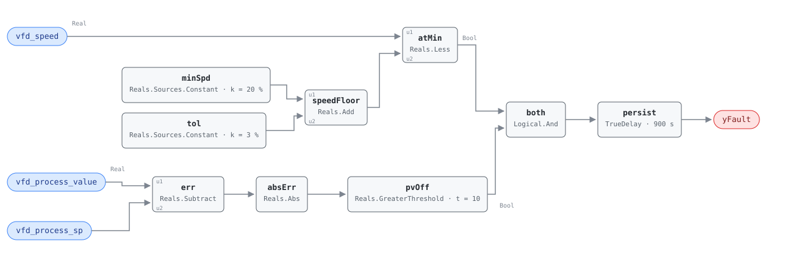

## Description

A drive sitting on its minimum speed is a loop with no downward room left. That
is normal at light load — the whole point of a minimum is to keep the machine
above the speed where it stops cooling itself — and it becomes a finding only
when the process variable it is supposed to control is nowhere near setpoint at
the same time. Then the loop is pinned against a limit while the thing it
controls is wrong, and no amount of further control action will fix it.

Which direction the process variable misses in tells you which fault you have,
and the rule reports both because the reference's absolute value asks it to.
Below setpoint at minimum speed means the loop wants more and the drive will not
give it: an obstruction, an undersized machine, or a torque limit. Above
setpoint at minimum speed means the loop wants less and cannot get it: the
minimum is set too high for the load it is serving, which is the reference's
diagnosis 1 read backwards and is the more common finding on a lightly loaded
pump. The distinction is one subtraction away in the host, from points it
already has.

This is the family's warning-severity card. LOW confidence and a
QUALITATIVE_ONLY estimation method are the reference's own ratings, and they are
right: a sensor error on the process variable (diagnosis 4) produces the
identical signature, and the rule has nothing to cross-check it against.

## Detection Logic

```
speed_floor = min_speed + speed_tolerance        (20.0 + 3.0 = 23.0 %)
at_min      = vfd_speed < speed_floor
pv_error    = |vfd_process_value − vfd_process_sp|

yFault = (at_min AND pv_error > pv_error_threshold)
         sustained continuously for sustained_duration
```

Block graph (`rule.cxf.jsonld`):



`minSpd` and `tol` carry the reference's two speed tunables as constants and
`speedFloor` adds them, so the composite trip point is assembled in the graph
rather than folded into a single threshold. That costs two blocks and buys
independent retuning: a site with a 30% minimum changes `minSpd.k` alone and the
tolerance keeps its own meaning (VAV-FC-050 assembles its trip point the same
way). `atMin` is a `Reals.Less` against that sum.

`err`, `absErr`, and `pvOff` form the load term. Taking the absolute value
before the comparison is what makes the rule symmetric, and the symmetry is
load-bearing here rather than incidental — over-delivery at minimum speed is a
real and distinct finding, pinned by `pv_above_setpoint_at_minimum`.

`both` conjoins the two terms and a single `persist` measures the duration. The
reference states one `sustained for sustained_duration` over the whole
conjunction, unlike VFD-FC-050 where a deviation window and an alarm delay are
listed separately, so this card uses one delay rather than the two-in-series
idiom. Any moment where either term releases drops the timer and discards the
accumulated time, so the alarm always describes one continuous episode; the two
recovery vectors pin each term's release independently.

Both comparisons are strict, which is where this rule differs from what the
reference wrote — see Deviations on the `<=`. A drive sitting at exactly 23.0%
is not at minimum by this rule's reckoning, and a process variable exactly
10.0 units off setpoint is not unsatisfied. The speed boundary is pinned three
ways: exactly on it, one tenth inside, one tenth outside.

## Possible Diagnoses

1. Minimum speed set too low — the reference's own first diagnosis, which
   applies when the process variable is *below* setpoint: the loop is at a
   minimum that cannot deliver the load. Read the other way, a minimum set too
   *high* is what produces the over-delivery case
2. Mechanical obstruction reducing output: a closed isolation valve, a blocked
   strainer, a clogged filter bank, or a damper someone shut
3. System undersized for the actual load, which makes this a design finding
   rather than an operating one and usually shows up seasonally
4. Sensor error on the process variable — the loop is satisfying a setpoint that
   the measurement is misreporting, and this rule cannot tell that from a real
   miss
5. VFD torque limit reached: the drive is holding speed down to protect itself,
   which reads as minimum speed from outside

## Energy Impact

COMFORT_ENERGY, LOW confidence, QUALITATIVE_ONLY. The reference offers no model
and this card does not invent one — the waste depends entirely on which
diagnosis holds. An obstruction means the machine is spending its full minimum
draw to deliver less than it should. An oversized minimum on a lightly loaded
pump means real, continuous over-pumping, and it is the case where the cube law
bites in the owner's favour once it is fixed: the `vfd-pump-faults` playbook
notes that dropping pump speed by 20% drops pump power by 49%. A sensor error
means the energy is being spent chasing a number that was never wrong.

Comfort is the primary impact in the under-delivery direction, which is what the
COMFORT_ENERGY category records: a loop that cannot reach setpoint is a warm
zone, a starved coil, or a branch short of pressure long before it is an energy
figure.

## Emissions Impact

Scope 2, QUALITATIVE_EMISSIONS, LOW confidence, basis N/A. VFD-driven equipment
is electric, so the whole consequence is purchased electricity, and the
reference's own range is "context-dependent; equipment undersized or
obstructed". The one case worth quantifying after diagnosis is the oversized
minimum, where the avoided draw is continuous and computable from the cube law
once the corrected minimum is known.

## Deviations

- **`sustained_duration` has no published default.** The reference's tunables
  line for this card ends mid-sentence — "min_speed = 20%, speed_tolerance = 3%,
  pv_error_threshold = 10%," — in both the chapter extract and the full
  reference text; whatever followed the comma did not survive. This card adopts
  900 s (15 min), the value the reference itself publishes for VAV-FC-053's
  structurally identical `tracking_duration` — a loop failing to reach setpoint,
  sustained. The sibling VFD-FC-050's 5-minute `deviation_duration` was the
  other candidate and was rejected: five minutes is a drive-response window,
  while a loop pinned at minimum after a load step can take longer than that to
  answer legitimately. Hosts should retune to their loop's time constant.
- **`pv_error_threshold` ships with a placeholder default and no site
  authority.** The reference writes the default as "10%" while its equation is
  an absolute difference, `|process_variable − setpoint| > pv_error_threshold`.
  The point dictionary resolves the ambiguity and is canonical: the PV pair is
  "the controlled variable in its own units", and this threshold "is set in
  those same units". So `pvOff.t = 10.0` means ten units of whatever the host
  binds — reasonable on a duct-static loop trended in pascals, meaningless on
  one trended in inches of water, where 10.0 disables the rule outright.
  **Hosts MUST set it per loop.** Implementing the percentage reading instead
  would mean dividing by the setpoint and adding a setpoint-evaluability gate
  (VAV-FC-053's shape), which the reference's equation does not ask for.
  Placeholder-default precedent: VAV-FC-050's `ventilation_requirement`.
- **`<=` becomes strict `<`.** The reference writes
  `vfd_speed <= min_speed + speed_tolerance`; CDL Reals has no `LessEqual`, so
  the strict form is the one that is expressible and a drive reporting exactly
  23.0% reads as off-minimum. The disagreement is measure-zero on a real-valued
  signal, and the composite boundary is pinned from three sides —
  `speed_exactly_at_floor`, `speed_just_below_floor`, `speed_just_above_floor` —
  because the trip point is a sum of two tunables and a host that retunes either
  one moves it.
- **The floor is assembled in the graph, not folded into a threshold.** A single
  `LessThreshold` with `t = 23.0` would be one block instead of four and would
  behave identically as shipped, but it would collapse two of the reference's
  four tunables into one number and force a host retuning the minimum to
  recompute the sum by hand.
- **Canonical point names replace the reference's.** Its required points are
  `vfd_speed, process_variable, setpoint`; the library binds
  `vfd_process_value` and `vfd_process_sp` per `points/vfd.points.json`, which
  marks both provisional and deliberately untyped — the semantic tags belong on
  the application-specific point (duct static pressure, differential pressure,
  supply temperature) that the host binds underneath.
- **No evaluability output.** Both terms are direct comparisons on bound inputs;
  there is no computed data-quality condition that the host cannot see for
  itself, so nothing is exposed beyond `yFault`. Contrast VFD-FC-050's `yCmdOk`
  and ERV-FC-050's `yTempDeltaOk`, which are derived quantities. The host-side
  exclusions that matter here — drive disabled, loop in hand, setpoint still
  ramping — are operating-state gating and live in the frontmatter per the
  library's design stance.
- **`suppressed_by: [VFD-FC-050]` is an authored relationship, not the
  reference's.** This rule reads `vfd_speed`, the drive's feedback, and infers
  from it that the loop is pinned at its floor. A drive that is not tracking its
  command (VFD-FC-050) breaks that inference in the worst way — a feedback point
  reading low while the machine runs fast produces exactly this rule's signature
  — so the deviation fault silences this one. VFD-FC-050 carries the matching
  `suppresses`.
- **A stopped drive satisfies the speed term trivially, and nothing in the graph
  stops it.** Feedback of 0% is below any positive floor, so a stopped machine
  under a loop that is off setpoint alarms — and since a stopped machine is
  usually *why* the loop is off setpoint, the alarm is nearly guaranteed. The
  reference's equation has exactly the same property; no run status appears in
  its required points, and this card does not invent one. The exclusion is a
  host precondition, and `stopped_drive_reads_as_at_minimum` pins the behaviour
  so it cannot change silently: any future in-graph run gate has to rewrite that
  vector deliberately.
- **The over-delivery direction is a deliberate keep.** The reference's absolute
  value admits it and this card implements it rather than narrowing the test to
  under-delivery, because "minimum set too high" is a genuine and common finding
  that the same three points already detect. Hosts that only want the
  under-delivery case can read the sign from `vfd_process_value` and
  `vfd_process_sp` directly.
- `persist.delayOnInit = true` (CDL default is `false`): a drive already pinned
  at minimum with an unsatisfied load when the controller starts waits out the
  full 15 minutes rather than alarming on the first tick.
- **The reference's playbook Applies-To line does not name this card.** The
  reference lists only VFD-FC-050 and the two future PMP rules; the family
  README assigns the playbook to both VFD rules, and that is what the
  frontmatter follows. `playbooks/vfd-pump-faults.md` now carries VFD-FC-051
  as an explicitly marked library addition to its Applies-To row.
- Frontmatter `clusters` is empty and `g36` is null: no cluster in the reference
  contains a VFD rule, and this is a research-backed 050-range card sourced to
  engineering best practice.

## Notes

The reference publishes no test vectors for this card, so every scenario in
`vectors.json` is library-authored. The pair that carries the most meaning is
`at_minimum_with_load_unsatisfied` and `modulating_above_minimum`: the same
15-unit setpoint miss, the same points, opposite verdicts, because a loop with
headroom left is not this fault. If the second one ever passes while the first
fails, the speed floor has been wired backwards.

Diagnosis order in practice starts with the cheapest disambiguation, which is
the sign of the error rather than anything in the field. Below setpoint: check
for obstruction before touching the minimum, because raising the minimum on an
obstructed loop hides the fault and pays for it forever. Above setpoint: the
minimum is the first thing to look at, and lowering it to what the drive and the
driven equipment can actually tolerate is a BAS change with no capital cost. In
both directions, confirm the process-variable sensor against a second reading
before acting — diagnosis 4 costs nothing to rule out and invalidates everything
downstream of it.
